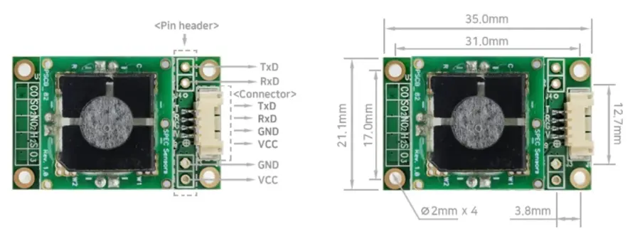

# AGSM user manual

## Description

The Allsensing Gas Sensor Module (AGSM) provides an easy way to add gas detectors to the Internet of Things. Here are some key features and specifications:

* Gas Calibration: Once the gas calibration is complete, the AGSM sends sensor concentration values (in ppb) using UART communication.
* Response Time: It is not suitable for environments that require a fast response time (T90<30Sec). It is designed for long-term environmental change monitoring.
* Sensor Stabilization Time: A minimum of 30 minutes to 1 hour of sensor stabilization time is required. Temperature Compensation & Gas Sensor Calibration Algorithm: The module applies a temperature compensation and gas sensor calibration algorithm.
* Sensor Signal Value: The sensor signal value (raw data) output from the sensor driving circuit can be checked (23bit adc). Compatibility: The AGSM product can be applied in conjunction with Arduino and compatible products.
* Integration: It can be easily integrated and applied to small, lightweight, high-performance, low-power wireless gas detectors, portable and network solutions.
* Gas Sensors: The AGSM is supplied in a form applied with individual gas sensors for CO, H2S, SO2, NO2, O3.
* Sensor Calibration:
  * If the user has calibration gas and a test environment, Zero calibration and Span Calibration can be performed using communication commands.
  * It is recommended to calibrate the gas sensor (Span Calibration) every six months.
  *   The AGSM product was calibrated using a small chamber of 400mL.

      <figure><figcaption><p>AGSM Module</p></figcaption></figure>

## Specifications and Connection Methods

### Module Specifications

| Item                       | Specification                                                     |
| -------------------------- | ----------------------------------------------------------------- |
| Measured Gases             | CO, H2S, SO2, NO2, O3 (individual measurements)                   |
| Operating Principle        | Solid electrolyte electrochemical (3 electrodes)                  |
| Measurement Range          | ### Sensor Specifications                                         |
| Accuracy                   | <5% @ Full Range                                                  |
| Communication Output       | UART (TTL 3.3V, 5.0V)                                             |
| Expected Operating Life    | > 5 years (10 years @ 25± 10C; 60 ± 30% RH)                       |
| Electrical Characteristics |                                                                   |
| Operating Voltage          | DC 3.3V \~ 5.0V                                                   |
| Operating Current          | Max 13mA (3.3VDC)                                                 |
| Power Consumption          | ≤43mW                                                             |
| Environment                |                                                                   |
| Operating Temperature      | -20 to 40 °C                                                      |
| Operating Humidity         | 15 to 95% (Based on Standard Conditions: 25 ºC, 50% RH and 1 atm) |

### Sensor Specifications

| Gas                    | Range     | Resolution | Accuracy         | T90 Response Time |
| ---------------------- | --------- | ---------- | ---------------- | ----------------- |
| Carbon Monoxide (CO)   | 0\~100ppm | 0.1ppm     | 5% of Full range | <30 sec           |
| Hydrogen Sulfide (H2S) | 0\~10ppm  | 10ppb      | 5% of Full range | <30 sec           |
| Sulfur Dioxide (SO2)   | 0\~20ppm  | 50ppb      | 5% of Full range | <30 sec           |
| Nitrogen Dioxide (NO2) | 0\~5ppm   | 20ppb      | 5% of Full range | <30 min           |
| Ozone (O3)             | 0\~5ppm   | 20ppb      | 5% of Full range | <30 sec           |

### Pin Connection

* Connector(default): Molex 53261, Yeonho 12505WR
* Pin header(option): 2.54 pitch(V:VCC, G:GND, R: Rxd, T: TxD)

<figure><figcaption><p>AGSM PIN Connection</p></figcaption></figure>

### Dimension

* Size: L X W (33 x 21 mm)

<figure><figcaption><p>AGSM Module Size</p></figcaption></figure>

## Communication protocols

### Defaults

```
+ Voltage level: DC 3.3 V or 5.0V
+ Baud: 9600 
+ Data bits: 8 
+ Stop bits: 1 
+ Parity: None 
+ Flow Control: None
```

### Commands

| Command        | Function                                                                                                                                  |
| -------------- | ----------------------------------------------------------------------------------------------------------------------------------------- |
| `<CR>,`        | Single data output. Output: SN \[XXXXXXXXXXXX], PPB \[0 : 999999], TEMP \[-99 : 99], RH \[0 : 99], ADC\[ADCCount], TempDigital, RHDigital |
| `C<cr>, c<cr>` | Continuous data output. Resets upon reboot and does not store status level in internal memory.                                            |
| `Z`            | Zero user calibration. Recalculates and calibrates the sensor value to output 0ppm.                                                       |
| `B`            | Barcode entry. Inputs the barcode information recorded on the sensor.                                                                     |
| `S`            | Span user calibration. Recalculates and calibrates the sensor's measurement sensitivity by injecting calibration gas (based on PPM).      |
| `e`            | Internal memory readout. Checks the configuration information values stored inside the module.                                            |
| `D<cr>`        | LED ON/OFF. Status information is not stored in internal memory.                                                                          |
| `r<cr>`        | System reset.                                                                                                                             |

### Command Examples

```
\r
    081821011255, 212, 23, 18, 2194921, 23490, 18665
```

```
c\r
     081821011255, 212, 23, 18, 2194921, 23490, 18665
```

```
S 
    Enter span gas value in PPM:
    Setting span...
    done
```

```
Z
    Setting zero...
    done
```

```
B
    Remove Sensor and Scan:
    Setting OC...done
```

```
e 
    Serial Number= 112020010530
    Barcode= 081821011255 110507 NO2 2108 -28.57
    ADC Zero= 2165186
    ADC_SpanCalValue=  1890818
    Temperature Zero(x1000)= 24366
    Humidity Zero(x1000)= 16797
    Temperature Span(x1000)= 24205
    Humidity Span(x1000)= 17139
    Calibration GAS(x100)(ppm)=  250
    Calibration InA(x100)=  -2857
    Max Range(ppm)= 5
    NoneSensorADC Zero= 2165186
    Firmware Version= 2022-03-23B-04”
```

```
r\r
    reset
```

```
D\r
    LED OFF
    LED ON
```

## Precautions

* Please use within the specified standards and be careful with connections.
* Use in the vicinity of excessive chemicals may damage the sensor.
* Prolonged exposure to high temperatures and humidity may cause the sensor to malfunction.
* Impacts above a certain threshold may cause temporary malfunctions.
* Failure to follow these instructions may result in product damage.
* It is recommended to use as a safety device or supplementary device for safety reasons.

## Manufacturer / Contact (A/S)

* Manufacturer: ㈜ 올센싱 [https://www.allsensing.com/](https://www.allsensing.com/)
* Address: A2214, 184, Jungbu-daero, Giheung-gu, Yongin-si, Gyeonggi-do, Republic of Korea
* Contact: E-MAIL: [support@allsensing.com](mailto:support@allsensing.com)

I hope this information is helpful! If you have any other questions, feel free to ask.
