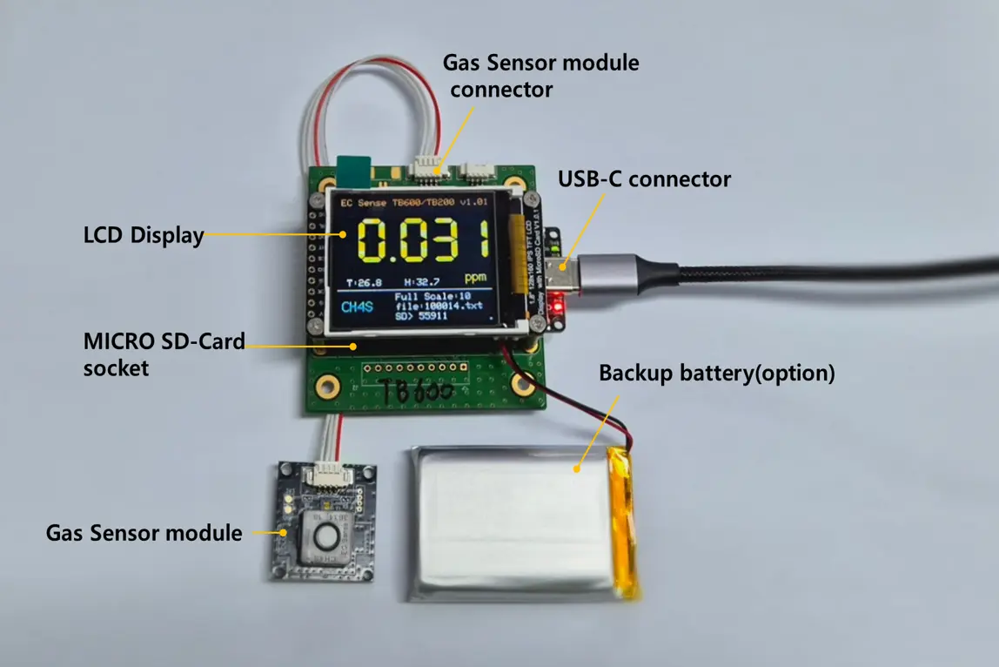
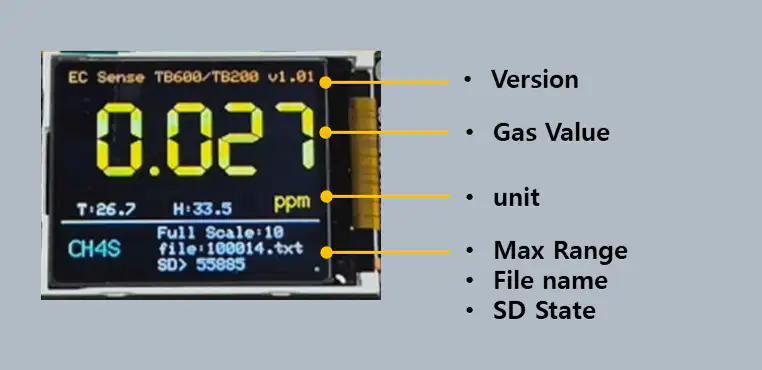

# Gas Sensor Module

## Module Specifications

* Specifications

| Item          | Specification                                                                                             |
| ------------- | --------------------------------------------------------------------------------------------------------- |
| Input Power   | 
USB C Connector: +5.0VDC Backup Battery: 3.7V Lithium Polymer (supports charging via USB power)
 |
| Display       | LCD Display                                                                                               |
| Sensor Module | Varies according to the sensor manufacturer's model (inquiries requested)                                 |
| Data Storage  | SD Card (16GB recommended), up to 32GB                                                                    |

* Product name

<figure><figcaption>
Allsensing Sensor Module
</figcaption></figure>

## Application methods

> ⚠️ 확인 사항
>
> * 장착되는 가스 센서 모듈의 사양에 따라 온도, 습도는 표시 및 저장 되지 않을 수 있습니다.
> * 가스명은 제품명으로 표시 될수 있습니다.
> * SD 카드 데이터 저장 내용에 시간 값은 표시되지 않으며 1초 카운터 값으로 표시됩니다.
> * 백업 배터리는 옵션 사항입니다.

* 조립 순서
  * 가스센서 모듈을 가스 센서 모듈 커넥터에 연결
  * Micro SD Card 소켓에 Micro SD Cad 장착(16gb 권장(32GB까지 사용 가능), FAT32 포맷 지원)
    * 가스 센서 커넥터 연결 후 USB-C 커넥터 및 백업 배터리를 연결 하여 장치 구동
* 화면 구성

<figure><figcaption>
Allsensing Sensor Module
</figcaption></figure>
