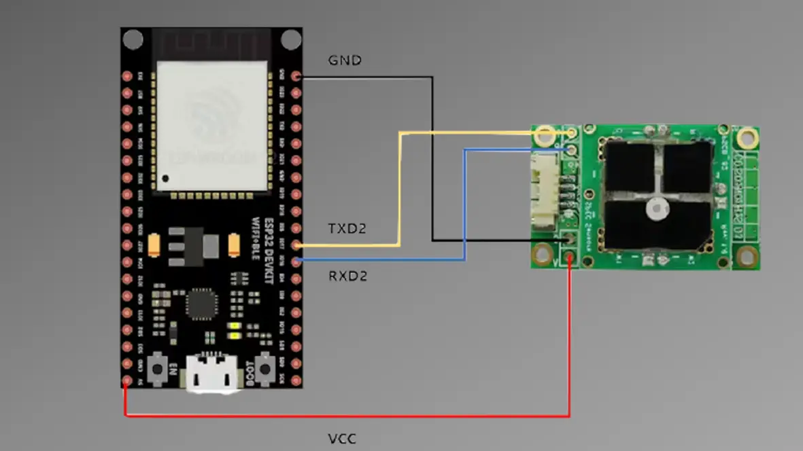

# AGSM IoT 활용(ESP32)

<!-- 메인 이미지 
<figure><figcaption><p>AGSM ESP32</p></figcaption></figure>
-->

## Description

+ In this project, we discuss how to send sensor readings from an ESP32 to ThingSpeak.
+ While the project uses the AGSM sensor, the example can be easily modified to use other sensors.

+ Using ThingSpeak allows you to post sensor readings to a website and display them on timestamped charts.
+ You can also visualize graphs using MATLAB visualization and access readings from anywhere in the world.

+ There are several ways to send sensor readings to ThingSpeak. This project uses the [thingspeak-arduino](https://github.com/mathworks/thingspeak-arduino) library. You can see library examples on the GitHub page.

<br>
<br>

> [hackster.io detail document](https://www.hackster.io/allsensingdoc/agsm-co-gas-with-esp32-and-thingspeak-1b6d8b)
<br>

## Item

1. ESP32-DevKitC
2. AGSM\_CO

<figure><figcaption><p>AGSM ESP32 Connection</p></figcaption></figure>

## Arduino Example code

```c

#include <Arduino.h>
#include <WiFi.h>
#include "ThingSpeak.h"
// WIFI Settings
#define WIFI_SSID                "your wifi ssid"       
#define WIFI_PASSWORD            "your wifi pass"

//---UART2--------
#define RXD2 16
#define TXD2 17
int Uart2ReceiveLength = 0;


WiFiClient client;

// Thingspeak Timer variables
unsigned long lastTime = 0;
unsigned long timerDelay = 30000;

int AGSM_gas_value[8]={0}; 

// Thingspeak interface
const char* myWriteAPIKey = "your write apikey"; 
unsigned long myChannelNumber = "your channelnumber";  

#define ContinueMode 1
#define PollingMode 0
const int BUFFER_SIZE = 100;
char buf[BUFFER_SIZE];
int inByte = 0;
char tempChars[100];    
int ppb=0;
float ppm=0.000;
float temp=0;
float rh=0;
int Serial_number=0;
int ADC_value; // AGSM Module adc value

void setup()
{
  Serial.begin(115200);  
  Serial2.begin(9600, SERIAL_8N1, RXD2, TXD2); // Sensor connection port

  #if ContinueMode
  Serial.println("Continuous Mode");
  #else if PollingMode
  Serial.println("Polling Mode");
  #endif
  Serial.println("Serial, Conc.(PPB), Temp.(C), Rh(%), Adc.(Counts), Temp.(Counts), Rh(%Counts)");
  #if ContinueMode
  Serial2.write('c');
  Serial2.write('\r');
  #endif
  ThingSpeak.begin(client);  // Initialize ThingSpeak
}

void parseData() 
{      // split the data into its parts

    char * strtokIndx; // this is used by strtok() as an index
    //SN [XXXXXXXXXXXX], PPB [0 : 999999], TEMP [-99 : 99], RH [0 : 99], RawSensor[ADCCount], TempDigital, RHDigital, Day [0 : 99], Hour [0 : 23], Minute [0 : 59], Second [0 : 59]

    //length is variable LEN= 50 DATA= 071421030446, 875, 23, 19, 2111737, 23956, 19605
        strtokIndx = strtok(buf,",");      // get the first part - the string
        Serial_number = atoi(strtokIndx); 

        strtokIndx = strtok(NULL,",");     
        ppb = atoi(strtokIndx); 
        
        strtokIndx = strtok(NULL, ","); 
        temp = atoi(strtokIndx);  

        strtokIndx = strtok(NULL, ","); 
        rh = atoi(strtokIndx);  

        strtokIndx = strtok(NULL, ",");
        ADC_value = atoi(strtokIndx); 
	
        AGSM_gas_value[0]=(float)(ppb);
	
   	// AGSM Module data
        Serial.print("   ppb= ");
        Serial.print(ppb);
        Serial.print("  Temperature= ");
        Serial.print(temp);
        Serial.print("  Humidity= ");
        Serial.print(rh);
        Serial.print("  ADC= ");
        Serial.print(ADC_value);
        Serial.println(" ");

    for(int i=0; i<inByte;i++)
		buf[i]=0;
}
void loop()
{
   while (Serial2.available()) // read from AGSM port, send to Serial port to interupt continuous output send 'c''/r' without line ending, may have to send more than once.
  {
        inByte = Serial2.readBytesUntil('\n', buf, BUFFER_SIZE);
        parseData(); 
  }
  if ((millis() - lastTime) > timerDelay) 
  {
    // Connect or reconnect to WiFi
    if(WiFi.status() != WL_CONNECTED){
      Serial.print("Attempting to connect");
      while(WiFi.status() != WL_CONNECTED){
        WiFi.begin(WIFI_SSID, WIFI_PASSWORD); 
        delay(5000);     
      } 
      Serial.println("\nConnected.");
    }
    if((AGSM_gas_value[0]>=0) && (AGSM_gas_value[0] < 50000))
    { 
       // set the fields with the values
      ThingSpeak.setField(1, AGSM_gas_value[0]);
      int x = ThingSpeak.writeFields(myChannelNumber, myWriteAPIKey);
      if(x == 200){
      Serial.println("Channel update successful.");
      }
      else{
      Serial.println("Problem updating channel. HTTP error code " + String(x));
      }
      lastTime = millis();
      }
    }
}
```
