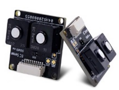
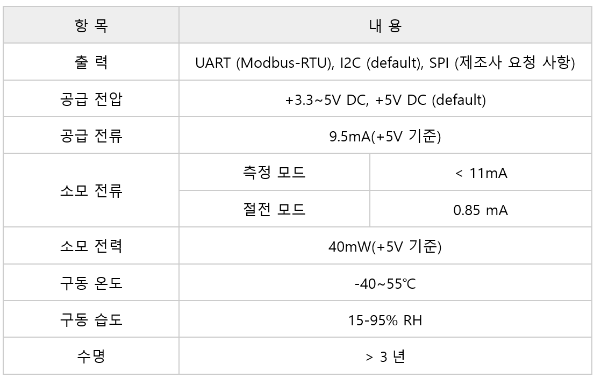
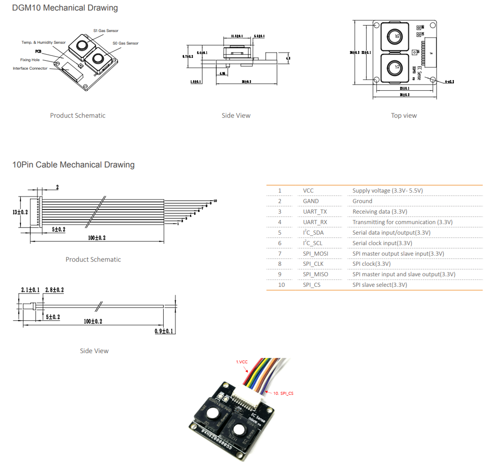
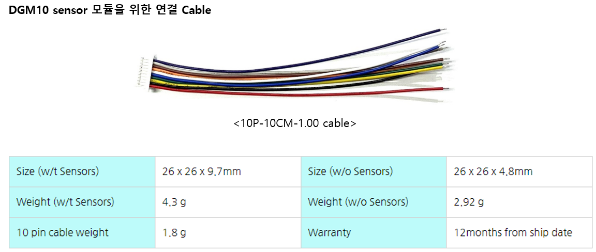
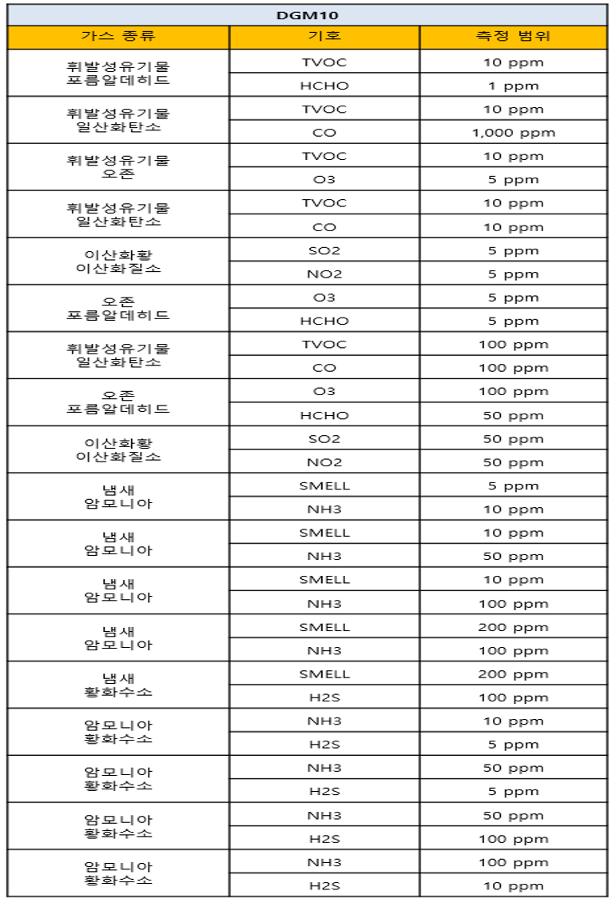
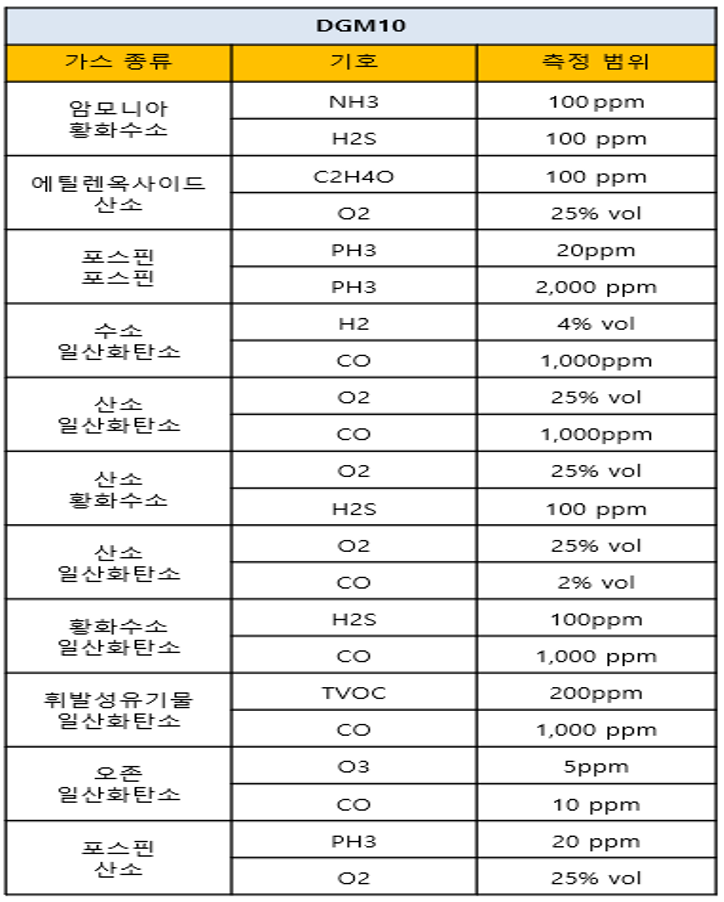

# DGM10

<figure><figcaption></figcaption></figure>

* Digital Type
* 전기 화학식 더블 가스센서 모듈

## 특징

* 지능형 알고리즘 계산
* 두 가지 가스 + 온도 + 습도 측정
* 실내 및 실외 환경에 적합하며 센서는 -40 \~ 55℃에서 동작
* I2C, UART(Modbus-RTUl), SPI 출력 인터페이스
* 공장에서 보정됨
* 센서 성능 및 수명 테스트 출력
* 응답시간이 빠르고 편차가 없는 안정된 영점
* 저전력 IoT 애플리케이션에 적합한 저전력 소비 및 절전 모드
* 센서 데이터 교정 인터페이스를 제공하여 사용자가 직접 개발하거나 센서 재교정을 할 때 편리합니다.
* 장수명 가스 센서, 중독 방지
* EMC 승인, 전자 회로 기판은 방진 및 부식 방지 코팅 보호 기능
* RoHS 승인
* 소형 26 x 26mm

## 애플리케이션

* 산업 안전 가스 측정
* 실내 공기질 모니터링
* 실외 환경 오염 모니터링
* 공기 교환 시스템 및 공기 청정기
* 음식 산업
* 의료 및 건강 관리
* 전문 가스 측정 기기

## 사양

<figure><figcaption></figcaption></figure>

## 제품 크기 및 핀 특성

<figure><figcaption></figcaption></figure>

<figure><figcaption>
&#x3C;10P-10CM-1.00 cable>
</figcaption></figure>

## 측정 가스 종류 및 측정 범위

<figure><figcaption></figcaption></figure>

<figure><figcaption></figcaption></figure>
