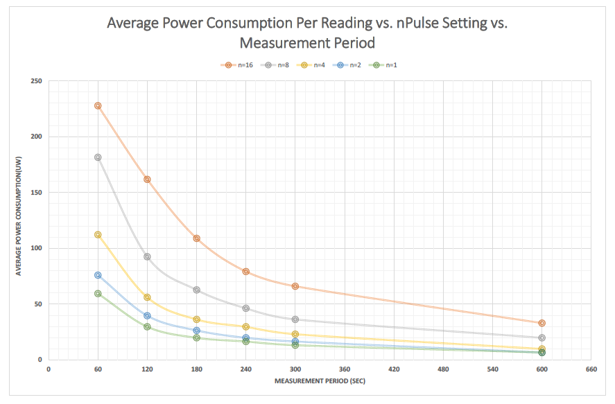
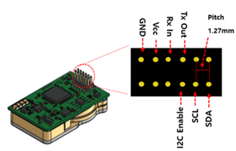
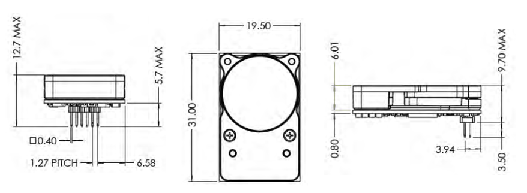

# CozIR-Blink

<figure><figcaption></figcaption></figure>

## CozIR-LP Series와 차이점 

* CozIR-Blink는 전원을 키고 co2 값을 측정 후 전원을 꺼서 전력 소비를 크게 줄일 수 있음

## 측정 주기 설정

* 측정 주기( nPULSE= pulses 당 읽는 횟수) 조절 하여 전력 소비를 크게 줄일 수 있음
* 측정 주기가 줄어들수록 전력 소비가 줄어듬
* 측정 주기가 늘어날수록 노이즈가 줄어들고 Resolution이 증가함
* 측정 주기 범위: 1\~ 32 (default = 16)

<figure><figcaption>
&#x3C; npulse 설정에 따른 전력 소비 변화 >
</figcaption></figure>

측정 주기 Uart Command

| Command | Description   | Response |
| ------- | ------------- | -------- |
| A ###   | 측정 주기 설정      | A 00016  |
| a       | 측정 주기 설정 값 읽기 | a 00016  |

## 특징

* 매우 낮은 전력 및 에너지 소비
* 최첨단 Solid-State LED 광학 기술 이용한 초 저전력 NDIR CO2 센서
* 디지털(UART) 및 I2C 출력
* 높은 CO2 측정 정확도 유지하면서 전력 소비 줄일 수 있음
* 내장형 자동 영점 조정
* 긴 수명, 낮은 유지 보수
* RoHS 준수
* 무선, 휴대용, 웨어러블 및 배터리에 이상적
* 에너지 효율적인 스마트 홈 환경 지원
* 진동 및 충격에 강하고 비가열성
* 솔리드 스테이트, 움직이는 부품 없음, 가열된 필라멘트 없음
* 30 ppm(일반) 측정 정확도

## 애플리케이션

* 난방, 환기 및 공기 조절(HVAC)
* 건물 관리 시스템(BMS)
* 환기 조절 시스템(DCV)
* 차량 내 공기 질
* 무선 장비를 이용한 IoT 및 Smart Technology
* 실내 공기 질(IAQ)
* 계측
* 농업
* 항공우주

## 사양

<table><thead><tr><th align="center">항목</th><th align="center">내용</th><th data-hidden align="center"></th><th data-hidden></th><th data-hidden></th></tr></thead><tbody><tr><td align="center">측정 범위</td><td align="center">
CozIR-blink-2000: 0-2000ppm

CozIR-blink-5000 0-5000ppm CozIR-blink-1: 0-10,000ppm (1%)
</td><td align="center"></td><td></td><td></td></tr><tr><td align="center">센서 내부</td><td align="center">Solid-State, 가열된 필라멘트 없음</td><td align="center"></td><td></td><td></td></tr><tr><td align="center">통신 방식</td><td align="center">UART 또는 I²C</td><td align="center"></td><td></td><td></td></tr><tr><td align="center">전원 전압</td><td align="center">3.25-5.5V</td><td align="center"></td><td></td><td></td></tr><tr><td align="center">소모 전류</td><td align="center">측정 모드: 15mA 절전 모드: 0.01mA</td><td align="center"></td><td></td><td></td></tr><tr><td align="center">응답 시간</td><td align="center">30.5ms</td><td align="center"></td><td></td><td></td></tr><tr><td align="center">센서 치수 및 무게</td><td align="center">L x W x H(31mm x 19.5mm x 8.7mm), Weight(2.5g)</td><td align="center"></td><td></td><td></td></tr><tr><td align="center">센서 내구성</td><td align="center">진동 및 충격에 강하고 비가열성</td><td align="center"></td><td></td><td></td></tr><tr><td align="center">센서 교정</td><td align="center">자동 영점교정 기능 내장</td><td align="center"></td><td></td><td></td></tr><tr><td align="center">센서 수명</td><td align="center">15년</td><td align="center"></td><td></td><td></td></tr><tr><td align="center">헤더 핀 크기</td><td align="center">1.27mm</td><td align="center"></td><td></td><td></td></tr></tbody></table>

## 제품 크기 및 핀 특성

<figure><figcaption></figcaption></figure>

<table><thead><tr><th align="center">PIN</th><th align="center">Function</th><th data-hidden></th></tr></thead><tbody><tr><td align="center">GND</td><td align="center">VSS</td><td></td></tr><tr><td align="center">VDD</td><td align="center">Positive Supply</td><td></td></tr><tr><td align="center">Rx_ In</td><td align="center">Digital Input</td><td></td></tr><tr><td align="center">Tx_out</td><td align="center">Digital Output</td><td></td></tr><tr><td align="center">I2C_ENABLE</td><td align="center">Digital Input</td><td></td></tr><tr><td align="center">I2C_SCL</td><td align="center">I2C clock</td><td></td></tr><tr><td align="center">I2C_SDA</td><td align="center">I2C data</td><td></td></tr></tbody></table>

<figure><figcaption></figcaption></figure>

## 디바이스 연결 방법


[https://github.com/allsensing-docs/Document-Center/blob/main/product-document/gss/broken-reference/README.md](https://github.com/allsensing-docs/Document-Center/blob/main/product-document/gss/broken-reference/README.md)


## 통신 프로토콜


[undefined-1](undefined-1/)

