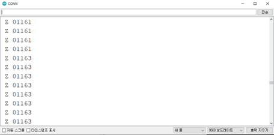
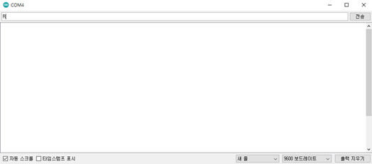
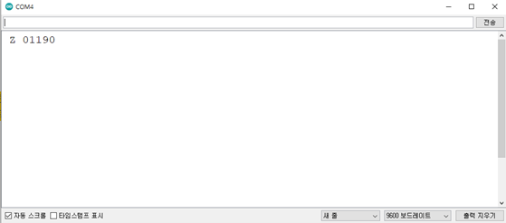

# 모드 설정 및 CO2 값 읽기

## 모드

#### 1. COMMAND 모드

\- COMMAND를 기다리는 상태, 측정 X

#### 2. Streaming 모드(default)

\- 연속적으로 값을 측정함(초당 2회 측정), 측정 외 다른 Command시 100ms delay가 필요함

#### 3. Polling 모드

\- 센서 값 요청 시에만 응답, 센서 값 요청하지 않을 때에는 백그라운드에서 계속 측정을 수행함

<table><thead><tr><th align="center">Mode</th><th width="160" align="center">Command</th><th align="center">Description</th><th align="center">Response</th></tr></thead><tbody><tr><td align="center">Command</td><td align="center">K 0</td><td align="center">명령어 기다리는 상태</td><td align="center">K 00000</td></tr><tr><td align="center">Streaming</td><td align="center">K 1</td><td align="center">연속적으로 값 측정</td><td align="center">K 00001</td></tr><tr><td align="center">Polling</td><td align="center">K 2</td><td align="center">센서 값 요청 시 에만 응답</td><td align="center">K 00002</td></tr></tbody></table>

## 소스 코드

* Streaming mode에서 CO2 값 읽기

```cpp
#include <SoftwareSerial.h>
SoftwareSerial mySerial(12, 13); //Uno Rx Tx (12 13) = SoftwareSerial
const char* Polling_mode = "K 2\r\n";
const char* Stream_mode = "K 1\r\n";
const char* Standby_mode = "K 0\r\n";  
bool tx_ready;
bool rx_ready; 
String str;
void setup() {
  Serial.begin(9600); //시리얼 통신 초기화
  mySerial.begin(9600); 
  while(!mySerial){} //시리얼 통신 포트가 연결되기 전까지 대기
  delay(14); // power on data ready
  mySerial.print(Stream_mode); //Polling 모드로 변경
  mySerial.print("Z\r\n");  //CO2값 읽기 명령
}                              
 
void loop() 
{
 if(rx_ready == 0) // overflow 처리
 {
   delay(31); // Measurement data ready
   if(mySerial.available()>0) //수신받은 데이터가 0 초과, 즉 데이터가 존재한다면
   { //버퍼에서 읽어드린 char의 데이터를 String 형태로 반환
    str = "";
    str = mySerial.readStringUntil('\n'); 
    Serial.println(str);
    rx_ready = 1;   
    tx_ready = 1;
   }
 }
 else if(tx_ready == 1)
  {
     mySerial.print("Z\r\n"); //CO2값 읽기 명령
     tx_ready = 0;
     rx_ready = 0;
  }
}
```

### 시리얼 모니터

<figure><figcaption></figcaption></figure>

* Polling mode에서 CO2값 읽기

```cpp
#include <SoftwareSerial.h>
SoftwareSerial mySerial(12, 13); //Uno Rx Tx (12 13) = SoftwareSerial
const char* Polling_mode = "K 2\r\n";
const char* Stream_mode = "K 1\r\n";
const char* Standby_mode = "K 0\r\n";   
String str;
void setup() {
  Serial.begin(9600); //시리얼 통신 초기화
  mySerial.begin(9600); 
  while(!mySerial){} //시리얼 통신 포트가 연결되기 전까지 대기
  delay(14); // power on data ready
  mySerial.print(Polling_mode); //Polling 모드로 변경
}                              
 
void loop() 
{
 if(Serial.read() == 'R') 
 {
  mySerial.print("Z\r\n"); //CO2값 읽기 명령
 }
  if(mySerial.available()>0) //수신받은 데이터가 0 초과, 즉 데이터가 존재한다면
   { //버퍼에서 읽어드린 char의 데이터를 String 형태로 반환
    str = "";
    str = mySerial.readStringUntil('\n'); 
    Serial.println(str);
   }
}
```

### 시리얼 모니터

* 시리얼 모니터에 'R' 입력 후 엔터

<figure><figcaption></figcaption></figure>

* 응답

<figure><figcaption></figcaption></figure>
