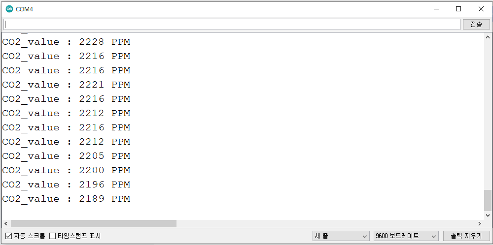
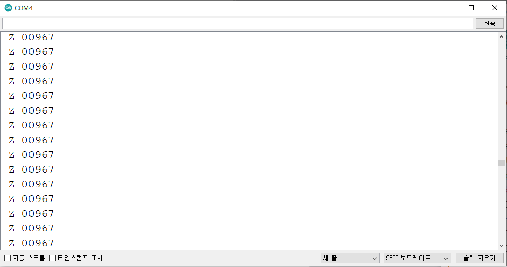

# 인터페이스 유형별(UART,I2C) CO2값 읽기

* I2C

```cpp
#include <Wire.h>
#define Slave_adddress 0x41
#define CO2_READ_command 0x34
#define CO2_READ_and_test_command 0x02

void setup() {
  Wire.begin();
  Serial.begin(9600);   
}
void loop() {    
int CO2_value = 0;
 Wire.beginTransmission(Slave_adddress); // transmit to slave address
 Wire.write(CO2_READ_and_test_command);  // transmit to register address
 Wire.endTransmission();    // stop transmitting
 Wire.requestFrom(Slave_adddress, 3); //from slave request 2byte  
  while ( Wire.available()) {
    int CO2_high_value = Wire.read();
    int CO2_low_value = Wire.read();
   /* CO2_Self_test value = 85(DEC) : Sensor is nominal , 
   CO2_Self_test value = 170(DEC): Sensor error */
    int CO2_self_test = Wire.read(); 
    CO2_high_value = CO2_high_value <<8;
    CO2_value = CO2_high_value + CO2_low_value;
    Serial.print("CO2_value : ");
    Serial.print(CO2_value);   //reading CO2 value  
    Serial.println(" PPM ");
  }   
  delay(1000);
}
```

* UART

```cpp
#include <SoftwareSerial.h>
SoftwareSerial mySerial(12, 13); //Uno Rx Tx (12 13) = SoftwareSerial
const char* Polling_mode = "K 2\r\n";
const char* Stream_mode = "K 1\r\n";
const char* Standby_mode = "K 0\r\n";  
bool tx_ready;
bool rx_ready; 
String str;
void setup() {
  Serial.begin(9600); //시리얼 통신 초기화
  mySerial.begin(9600); 
  while(!mySerial){} //시리얼 통신 포트가 연결되기 전까지 대기
  delay(14); // power on data ready
  mySerial.print(Stream_mode); //Polling 모드로 변경
  mySerial.print("Z\r\n");  //CO2값 읽기 명령
}                              
 
void loop() 
{
 if(rx_ready == 0) // overflow 처리
 {
   delay(31); // Measurement data ready
   if(mySerial.available()>0) //수신받은 데이터가 0 초과, 즉 데이터가 존재한다면
   { //버퍼에서 읽어드린 char의 데이터를 String 형태로 반환
    str = "";
    str = mySerial.readStringUntil('\n'); 
    Serial.println(str);
    rx_ready = 1;   
    tx_ready = 1;
   }
 }
 else if(tx_ready == 1)
  {
     mySerial.print("Z\r\n"); //CO2값 읽기 명령
     tx_ready = 0;
     rx_ready = 0;
  }
}
```

**Serial Monitor**

* I2C

<figure><figcaption></figcaption></figure>

* UART

<figure><figcaption></figcaption></figure>
