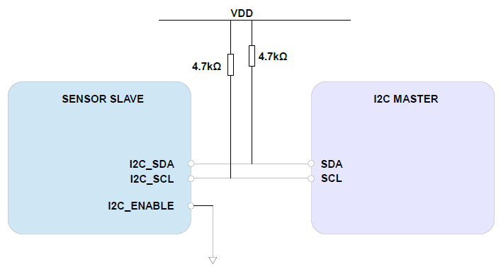
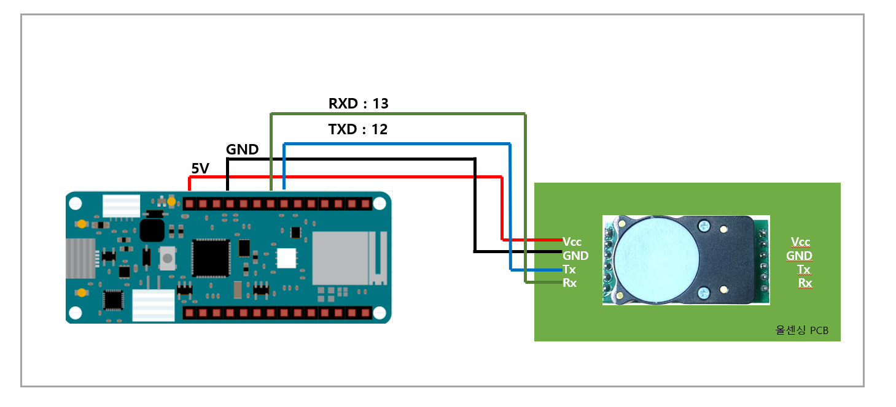
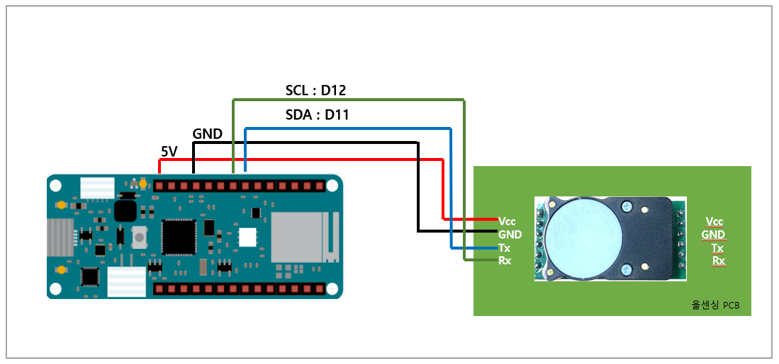
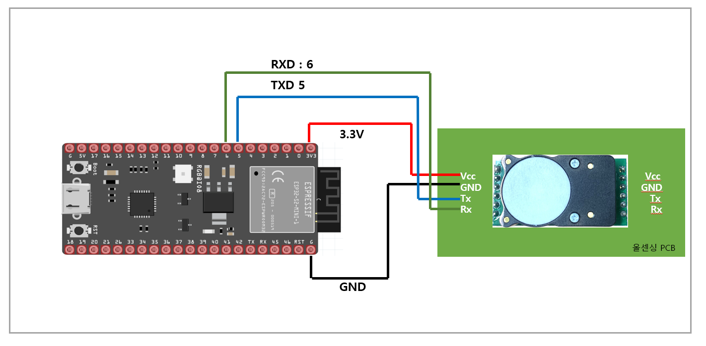
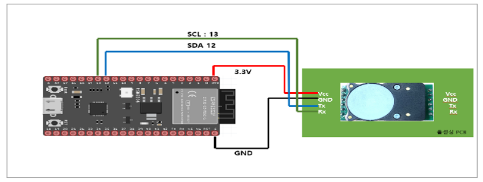
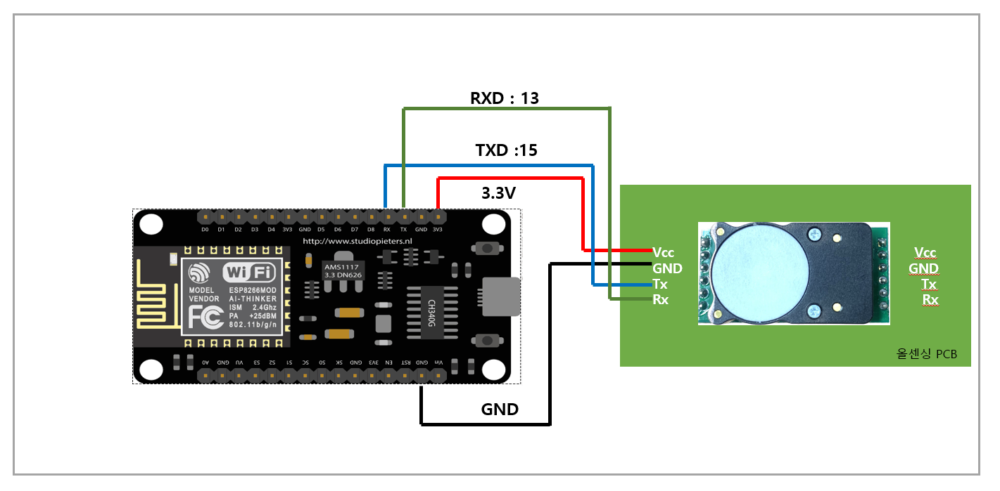
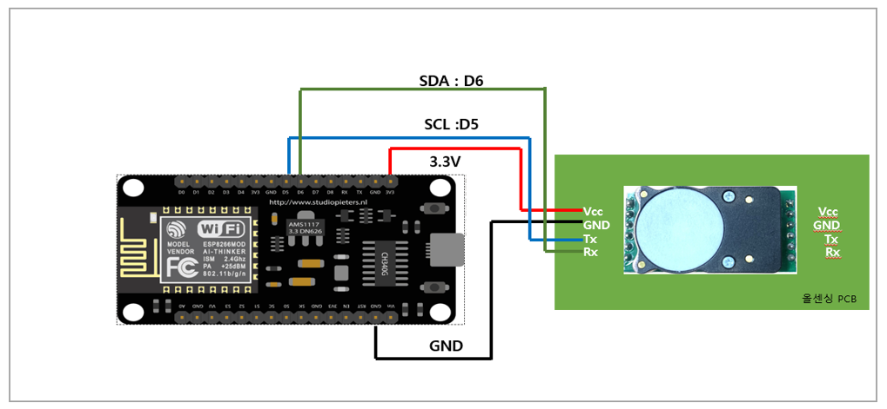
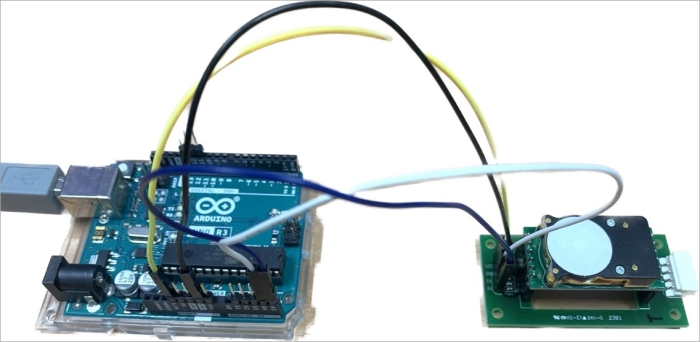

# 디바이스 연결 방법

## Connection DIAGRAM (UART)

<figure><figcaption></figcaption></figure>

## Connection DIAGRAM (I2C)

<figure><figcaption></figcaption></figure>



<figure><figcaption></figcaption></figure>

|  항목 | Arduino Uno | Cozir-LP3 |
| :-: | :---------: | :-------: |
| VCC |  5V or 3.3V |    VCC    |
| GND |     GND     |    GND    |
|  TX |      13     |     RX    |
|  RX |      12     |     TX    |



<figure><figcaption></figcaption></figure>

<table><thead><tr><th width="140" align="center">항목</th><th align="center">Arduino Uno</th><th align="center">Cozir-LP3</th></tr></thead><tbody><tr><td align="center">VCC</td><td align="center">5V or 3.3V</td><td align="center">VCC</td></tr><tr><td align="center">GND</td><td align="center">GND</td><td align="center">GND</td></tr><tr><td align="center">TX</td><td align="center">A5</td><td align="center">SCL</td></tr><tr><td align="center">RX</td><td align="center">A4</td><td align="center">SDA</td></tr></tbody></table>



<figure><figcaption></figcaption></figure>

|  항목 | Arduino MKR | Cozir-LP3 |
| :-: | :---------: | :-------: |
| VCC |  5V or 3.3V |    VCC    |
| GND |     GND     |    GND    |
|  TX |      13     |     RX    |
|  RX |      12     |     TX    |



<figure><figcaption></figcaption></figure>

<table><thead><tr><th width="140" align="center">항목</th><th align="center">Arduino MKR</th><th align="center">Cozir-LP3</th></tr></thead><tbody><tr><td align="center">VCC</td><td align="center">5V or 3.3V</td><td align="center">VCC</td></tr><tr><td align="center">GND</td><td align="center">GND</td><td align="center">GND</td></tr><tr><td align="center">TX</td><td align="center">D11</td><td align="center">SCL</td></tr><tr><td align="center">RX</td><td align="center">D12</td><td align="center">SDA</td></tr></tbody></table>



<figure><figcaption></figcaption></figure>

|  항목 |    ESP32   | Cozir-LP3 |
| :-: | :--------: | :-------: |
| VCC | 5V or 3.3V |    VCC    |
| GND |     GND    |    GND    |
|  TX |      5     |     RX    |
|  RX |      6     |     TX    |



<figure><figcaption></figcaption></figure>

<table><thead><tr><th width="140" align="center">항목</th><th align="center">ESP32</th><th align="center">Cozir-LP3</th></tr></thead><tbody><tr><td align="center">VCC</td><td align="center">5V or 3.3V</td><td align="center">VCC</td></tr><tr><td align="center">GND</td><td align="center">GND</td><td align="center">GND</td></tr><tr><td align="center">TX</td><td align="center">13</td><td align="center">SCL</td></tr><tr><td align="center">RX</td><td align="center">12</td><td align="center">SDA</td></tr></tbody></table>



<figure><figcaption></figcaption></figure>

|  항목 | ESP8266 | Cozir-LP3 |
| :-: | :-----: | :-------: |
| VCC |   3.3V  |    VCC    |
| GND |   GND   |    GND    |
|  TX |    15   |     RX    |
|  RX |    13   |     TX    |



<figure><figcaption></figcaption></figure>

<table><thead><tr><th width="140" align="center">항목</th><th align="center">ESP8266</th><th align="center">Cozir-LP3</th></tr></thead><tbody><tr><td align="center">VCC</td><td align="center">5V or 3.3V</td><td align="center">VCC</td></tr><tr><td align="center">GND</td><td align="center">GND</td><td align="center">GND</td></tr><tr><td align="center">TX</td><td align="center">D5</td><td align="center">SCL</td></tr><tr><td align="center">RX</td><td align="center">D6</td><td align="center">SDA</td></tr></tbody></table>



<figure><figcaption></figcaption></figure>
