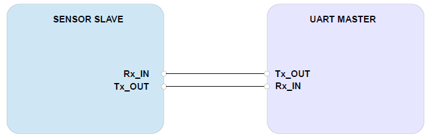

# 디바이스 연결 방법

## Connection DIAGRAM (UART)

<figure><figcaption></figcaption></figure>

## Arudino uno와 SprintIR 연결

* Arduino Uno

|  항목 | Arduino Uno | SprintIR |
| :-: | :---------: | :------: |
| VCC |  5V or 3.3V |    VCC   |
| GND |     GND     |    GND   |
|  TX |      13     |    RX    |
|  RX |      12     |    TX    |

<figure><figcaption></figcaption></figure>

* Arduino Due

<figure><figcaption></figcaption></figure>

<figure><figcaption></figcaption></figure>

###
