# 통신프로토콜

* UART 설정

|     PARAMETER     |    TYP    |
| :---------------: | :-------: |
| Baud Rate (Fixed) | 38400 bps |
|     Data Bits     |     8     |
|       Parity      |    None   |
|     Stop Bits     |     1     |
|    Flow Control   |    None   |

* MPS Sensor Data Format 방식 : IEEE 754 Format ( 부동소수점), Little Endian 형식(최하위 바이트(LSB)가 먼저 전송)

## 전체 요청(Request) Command

<figure><figcaption><p>요청_커맨드_전체</p></figcaption></figure>

* Payload는 사용에 있어서 전송되는 데이터 자체를 의미함(Header, Checksum, parity bit, 등 제외)
* 요청(Request) Command Packet 구조

<figure><figcaption><p>요청_커맨드_세부</p></figcaption></figure>

* ex) 현재 센서 상태 요청 Command

<figure><figcaption><p>요청_커맨드_예시</p></figcaption></figure>

## 응답(Reply) Command Packet 구조

<figure><figcaption><p>응답_프로토콜</p></figcaption></figure>

* ex) 현재 센서 상태 응답(정상일 경우만)

<figure><figcaption><p>응답_커맨드</p></figcaption></figure>

* ex) 응답 Command 예시(정상일 경우만)

<figure><figcaption><p>응답_커맨드</p></figcaption></figure>

* 센서 Status(상태)값이 변하면 Checksum값이 변함

## Command rely Status 표

<figure><figcaption><p>센서_상태_커맨드</p></figcaption></figure>

<figure><figcaption><p>센서_상태_커맨드</p></figcaption></figure>

* 가장 빈번하게 발생하는 Command reply Status :
* 1\. 0x26(센서 초기화): 센서 초기화 시간 최대 20초까지 나타남
* 2\. 0x35( 호흡 or 습도 급증): 센서를 사람의 호흡이나 습도가 급증하는 환경에 노출되면 센서 값이 정확하게 나오지 않을 수 있음

## Checksum 알고리즘: 16bit CRC CCITT 알고리즘

* Checksum이란 데이터의 오류를 검사하는데 사용되는 일련의 숫자와 문자
* 다항식 0x1021 (x^(16)+x^(12)+x^5+x )
* 시작 바이트 : 0Xffff
* 전체 패킷(헤더 및 페이로드)에 대해 계산됨, 페이로드가 없으면 헤더만으로 계산
* Checksum을 계산하기 전에 Checksum값은 0x00으로 초기화
* 참고: Checksum 계산하는 [사이트](http://www.sunshine2k.de/coding/javascript/crc/crc\_js.html)
* Ex) 현재 상태 응답 Checksum 계산

<figure><figcaption><p>CRC_계산_사이트_예시</p></figcaption></figure>

* Checksum 예제 코드

> [Sample code 다운로드](https://nevadanano.com/wp-content/uploads/2022/10/EN-TN-0002-04-MPS-Flammable-Gas-Sensor-Sample-Code.tar.gz)

<details>

<summary>CRC Table Sample code</summary>

```cpp
#include <stdlib.h>
#include <stdint.h>

static uint16_t crc_table[256] = {
  0x0000, 0x1021, 0x2042, 0x3063, 0x4084, 0x50a5, 0x60c6, 0x70e7,
  0x8108, 0x9129, 0xa14a, 0xb16b, 0xc18c, 0xd1ad, 0xe1ce, 0xf1ef,
  0x1231, 0x0210, 0x3273, 0x2252, 0x52b5, 0x4294, 0x72f7, 0x62d6,
  0x9339, 0x8318, 0xb37b, 0xa35a, 0xd3bd, 0xc39c, 0xf3ff, 0xe3de,
  0x2462, 0x3443, 0x0420, 0x1401, 0x64e6, 0x74c7, 0x44a4, 0x5485,
  0xa56a, 0xb54b, 0x8528, 0x9509, 0xe5ee, 0xf5cf, 0xc5ac, 0xd58d,
  0x3653, 0x2672, 0x1611, 0x0630, 0x76d7, 0x66f6, 0x5695, 0x46b4,
  0xb75b, 0xa77a, 0x9719, 0x8738, 0xf7df, 0xe7fe, 0xd79d, 0xc7bc,
  0x48c4, 0x58e5, 0x6886, 0x78a7, 0x0840, 0x1861, 0x2802, 0x3823,
  0xc9cc, 0xd9ed, 0xe98e, 0xf9af, 0x8948, 0x9969, 0xa90a, 0xb92b,
  0x5af5, 0x4ad4, 0x7ab7, 0x6a96, 0x1a71, 0x0a50, 0x3a33, 0x2a12,
  0xdbfd, 0xcbdc, 0xfbbf, 0xeb9e, 0x9b79, 0x8b58, 0xbb3b, 0xab1a,
  0x6ca6, 0x7c87, 0x4ce4, 0x5cc5, 0x2c22, 0x3c03, 0x0c60, 0x1c41,
  0xedae, 0xfd8f, 0xcdec, 0xddcd, 0xad2a, 0xbd0b, 0x8d68, 0x9d49,
  0x7e97, 0x6eb6, 0x5ed5, 0x4ef4, 0x3e13, 0x2e32, 0x1e51, 0x0e70,
  0xff9f, 0xefbe, 0xdfdd, 0xcffc, 0xbf1b, 0xaf3a, 0x9f59, 0x8f78,
  0x9188, 0x81a9, 0xb1ca, 0xa1eb, 0xd10c, 0xc12d, 0xf14e, 0xe16f,
  0x1080, 0x00a1, 0x30c2, 0x20e3, 0x5004, 0x4025, 0x7046, 0x6067,
  0x83b9, 0x9398, 0xa3fb, 0xb3da, 0xc33d, 0xd31c, 0xe37f, 0xf35e,
  0x02b1, 0x1290, 0x22f3, 0x32d2, 0x4235, 0x5214, 0x6277, 0x7256,
  0xb5ea, 0xa5cb, 0x95a8, 0x8589, 0xf56e, 0xe54f, 0xd52c, 0xc50d,
  0x34e2, 0x24c3, 0x14a0, 0x0481, 0x7466, 0x6447, 0x5424, 0x4405,
  0xa7db, 0xb7fa, 0x8799, 0x97b8, 0xe75f, 0xf77e, 0xc71d, 0xd73c,
  0x26d3, 0x36f2, 0x0691, 0x16b0, 0x6657, 0x7676, 0x4615, 0x5634,
  0xd94c, 0xc96d, 0xf90e, 0xe92f, 0x99c8, 0x89e9, 0xb98a, 0xa9ab,
  0x5844, 0x4865, 0x7806, 0x6827, 0x18c0, 0x08e1, 0x3882, 0x28a3,
  0xcb7d, 0xdb5c, 0xeb3f, 0xfb1e, 0x8bf9, 0x9bd8, 0xabbb, 0xbb9a,
  0x4a75, 0x5a54, 0x6a37, 0x7a16, 0x0af1, 0x1ad0, 0x2ab3, 0x3a92,
  0xfd2e, 0xed0f, 0xdd6c, 0xcd4d, 0xbdaa, 0xad8b, 0x9de8, 0x8dc9,
  0x7c26, 0x6c07, 0x5c64, 0x4c45, 0x3ca2, 0x2c83, 0x1ce0, 0x0cc1,
  0xef1f, 0xff3e, 0xcf5d, 0xdf7c, 0xaf9b, 0xbfba, 0x8fd9, 0x9ff8,
  0x6e17, 0x7e36, 0x4e55, 0x5e74, 0x2e93, 0x3eb2, 0x0ed1, 0x1ef0,
};

uint16_t crc_generate(uint8_t *buffer, size_t length, uint16_t startValue ) {
  uint16_t crc;
  uint8_t *p;
  int ii;

  crc = startValue;

  for(p = buffer, ii = 0; ii < length; ii++) {
    crc = (crc << 8) ^ crc_table[(crc >> 8) ^ *p];
    p++;
  }

  return crc;

}
```

</details>

## 초기화 및 측정 Sequence

1\. 센서 전원은 켠 후 센서가 부팅될 때까지 기다림(\~3초)

2\. 센서 상태 확인(0x41 Command) – 초기화 완료(0x00)

3\. 센서 상태 확인이 완료되면 연속 측정 모드로 설정(0x61 Command ISO 규격 권장)

4\. 첫번째 측정이 완료될 때까지 2초 기다림

<figure>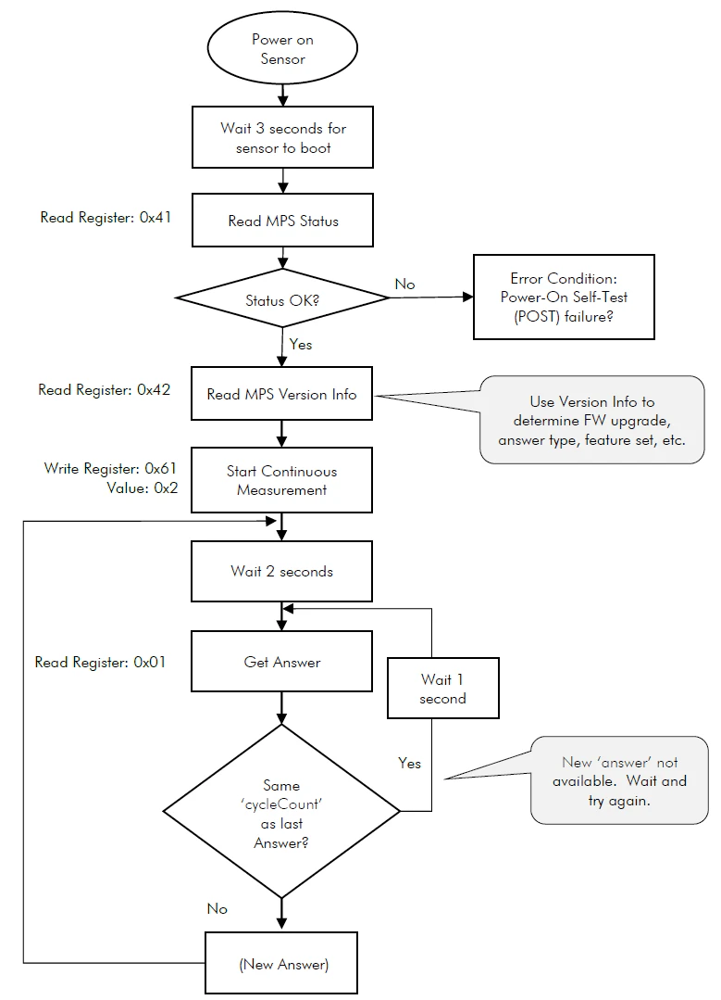<figcaption><p>동작_Sequence</p></figcaption></figure>

## 센서 버전 확인

* Command 버전 정보 요청

<figure>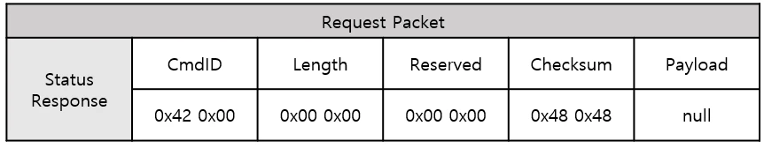<figcaption><p>요청</p></figcaption></figure>

* Command 버전 정보 응답 예제

<figure>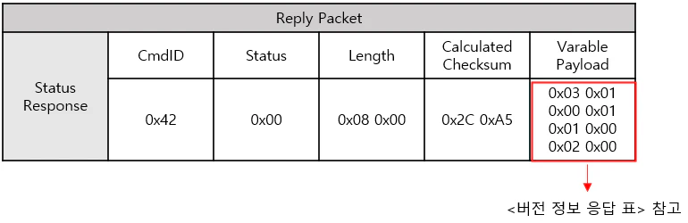<figcaption><p>버전 정보 응답 예제</p></figcaption></figure>

* Payload 설명: 총 64 bit, S/W Version \[1:32], H/W Version \[33:48], Protocol Version \[49:64]

<figure>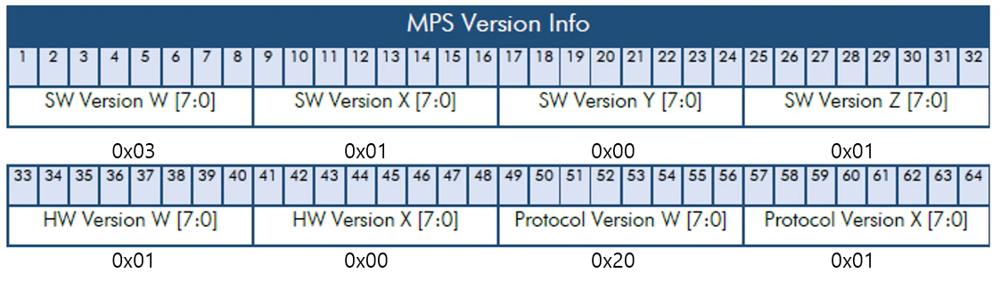<figcaption><p>payload 설명</p></figcaption></figure>

* S/W Version: 3.1.0.1
* H/W Version: 1.0
* Protocol Version: 32.1
* Nevadanano PC Serial program과 비교

<figure>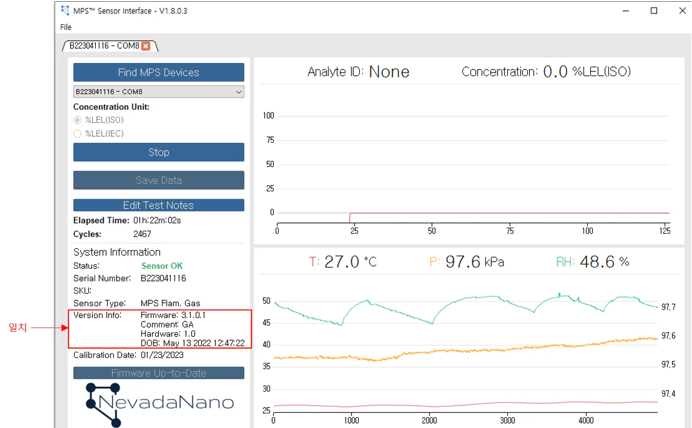<figcaption><p>serial_프로그램비교</p></figcaption></figure>

## 감지 가스 확인

* 감지 가스 요청

<figure>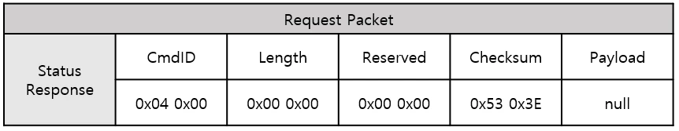<figcaption><p>요청</p></figcaption></figure>

* 감지 가스 응답 예제

<figure>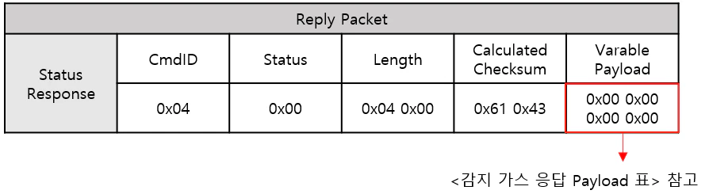<figcaption><p>가스감지응답예제</p></figcaption></figure>

* 감지 가스 응답 Payload Packet 값: 0\~255

<figure>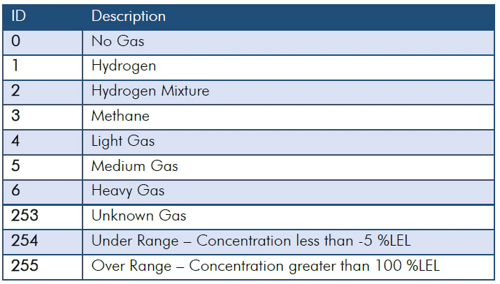<figcaption><p>감지 가스 응답 Payload 표</p></figcaption></figure>

## 가스 농도 값 읽기

1\. 센서 전원은 켠 후 센서가 부팅될 때까지 기다림(\~3초)

2\. 센서 상태 확인(0x41 Command) – 초기화 완료(0x00)

3\. 연속 측정 모드로 설정(0x61 Command)

4\. 가스 농도 값 요청(0x03 Command)

<figure>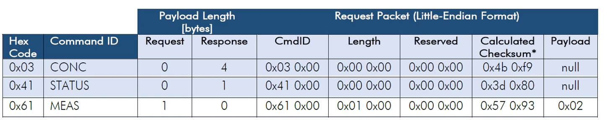<figcaption><p>요청 Command ( 상태 확인, 측정 모드 설정, 가스 농도 요청)</p></figcaption></figure>

## 가스 농도 값 읽기 응답 예시

<figure>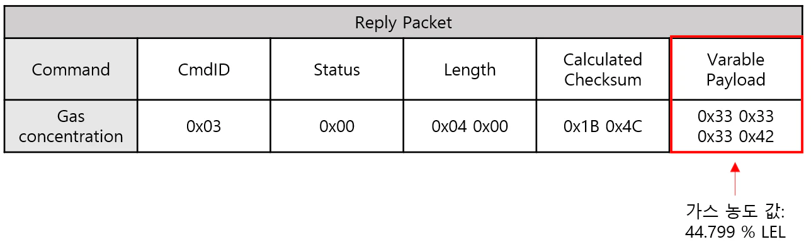<figcaption><p>응답_커맨드</p></figcaption></figure>

* Data Format 방식 : IEEE 754 Format ( 부동소수점), Little Endian 형식(최하위 바이트(LSB)가 먼저 전송)
* 부동소수점: 컴퓨터에서 실수를 표현하는 방법 ( 2진수(0,1)로 표현)

<figure>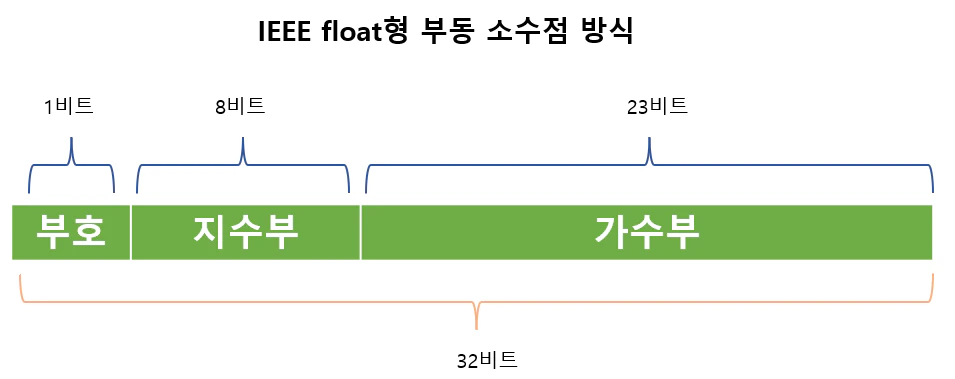<figcaption><p>IEEE_754_Main</p></figcaption></figure>

* 부호: 양수일 때 0, 음수일때 1
* 지수부: 8비트, 지수를 나타냄
* 가수부: 23비트, 가수를 나타냄

## 가스 농도값 부동 소수점 -> 실수 변환 예시

1\. Variable Payload = 가스 농도 값 = 0x33, 0x33, 0x33, 0x42

2\. Little endian -> 0x42, 0x33, 0x33, 0x33

3\. 이진수로 변환 -> 0100 0010 0011 0011 0011 0011 0011 0011

4\. 이진수 맨앞자리 0이므로 부호는+, 지수값은 10000100(2) = 132, 127을 기준으로 +5이므로 가수부에 2^5 을 곱해야됨

(즉 지수부에 2진수 값을 계산하여 bias인 127을 빼준 값(n)을 가수부에 2^5 을 곱하면 됨)

5\. 1.01100110011001100110011(2) × 2^5 = 101100.110011001100110011(2) = 44.79999923706055

* IEEE 754 부동소수점 변환 [사이트](https://t.hi098123.com/IEEE-754)
* 가스 농도 읽기 code (Arduino uno)
* ※ 아래의 Code는 Sensor의 간단한 통신 Test 목적으로 작성하였음



```cpp
#include <SoftwareSerial.h>
SoftwareSerial mySerial(12, 13); //Uno Rx Tx (13 12) = mySerial
byte ch4_tx_status[9] = {0x41,0x00,0x00,0x00,0x00,0x00,0x3d,0x80,0x00};
byte ch4_tx_mode_set[9] = {0x61,0x00,0x01,0x00,0x00,0x00,0x57,0x93,0x02};
byte ch4_tx_gas_concentration[9] = {0x03,0x00,0x00,0x00,0x00,0x00,0x4b,0xf9,0x00};
void Status_confirm();
void mode_setup();
void gas_concentration_request();
unsigned int ch4_command_step = 0;
void setup() {
  Serial.begin(9600); //시리얼 통신 초기화
  delay(3000); // 센서 초기화 보통 3초, 최대 10cycle(~20초)   
  while(!mySerial){} //시리얼 통신 포트가 연결되기 전까지 대기
  mySerial.begin(38400);  
  delay(50); 
}
void loop() 
{
    switch (ch4_command_step)
    {
    case 0: Status_confirm(); break;
    case 1: mode_setup(); break;
    case 2: gas_concentration_request(); break;
    default:  break;
    }
}
void Status_confirm()
{
  unsigned char Status_data_check[7] = {0}; 
  mySerial.write(ch4_tx_status, 9); // ch4 status request 
  delay(500);
  static int status_flag = 0;
  while(mySerial.available()>0){ //수신받은 데이터가 0 초과, 즉 데이터가 존재한다면 코드수행
  int ch = mySerial.read(); //시리얼 데이터를 정수형 ch에 저장
  Status_data_check[status_flag] = ch;
  Serial.print(ch, HEX); //시리얼 모니터에 입력받은 데이터 출력
  Serial.print(' ');
  status_flag += 1;
    if((Status_data_check[0] == 0x41) && (Status_data_check[1] == 0x00)&& (sta-tus_flag == 7) ) {Serial.println("request sensor Status "); ch4_command_step = 1; }
  }
  delay(1000);
}
void mode_setup()
{
  unsigned char mode_data_check[6] = {0}; 
  mySerial.write(ch4_tx_mode_set, 9); // ch4 mode request 
  delay(500);
  static int mode_flag = 0; 
  while(mySerial.available()>0){ //수신받은 데이터가 0 초과, 즉 데이터가 존재한다면 코드수행
  int ch = mySerial.read(); //시리얼 데이터를 정수형 ch에 저장
  mode_data_check[mode_flag] = ch;
  Serial.print(ch, HEX); //시리얼 모니터에 입력받은 데이터 출력
  Serial.print(' ');
  mode_flag += 1;
  if((mode_data_check[0] == 0x61) && (mode_data_check[1] == 0x00)&&(mode_flag==6) ) {
    ch4_command_step = 2;  Serial.println(" request mode set"); Seri-al.println("request sensor Gas concentration..");delay(2000);}
  }
}
void ch4_sensor_read();
  unsigned char gas_concentration_data_check[10] = {0};
void gas_concentration_request()  
 
{
  mySerial.write(ch4_tx_gas_concentration, 9); // ch4 gas concentration request 
  delay(500);
  static int gas_concentration_flag = 0; 
  while(mySerial.available()>0){ //수신받은 데이터가 0 초과, 즉 데이터가 존재한다면 코드수행
  int ch = mySerial.read(); //시리얼 데이터를 정수형 ch에 저장
  gas_concentration_data_check[gas_concentration_flag] = ch;
  if(gas_concentration_data_check[0] == 0x03){
    gas_concentration_flag += 1;
  if(gas_concentration_flag == 10){
     if(gas_concentration_data_check[1] == 0x00){
      ch4_sensor_read();
    }
    gas_concentration_flag = 0; }
  }
  else{
    gas_concentration_flag = 0;
  }
  delay(100);
  }
}
void ch4_sensor_read()
{
  float ch4_sensor_value_read = 0;
  // IEE 754 floating point
      union {
        char ch4_value_hex[4];
        float ch4_float_value;
    } ch4_read_to_float;

    ch4_read_to_float.ch4_value_hex[3] = gas_concentration_data_check[9];
    ch4_read_to_float.ch4_value_hex[2] = gas_concentration_data_check[8];
    ch4_read_to_float.ch4_value_hex[1] = gas_concentration_data_check[7];
    ch4_read_to_float.ch4_value_hex[0] = gas_concentration_data_check[6];
    ch4_sensor_value_read = ch4_read_to_float.ch4_float_value;
    Serial.print("  ");
    Serial.print(ch4_sensor_value_read);
    Serial.println(" % LEL ");
}
```



<figure>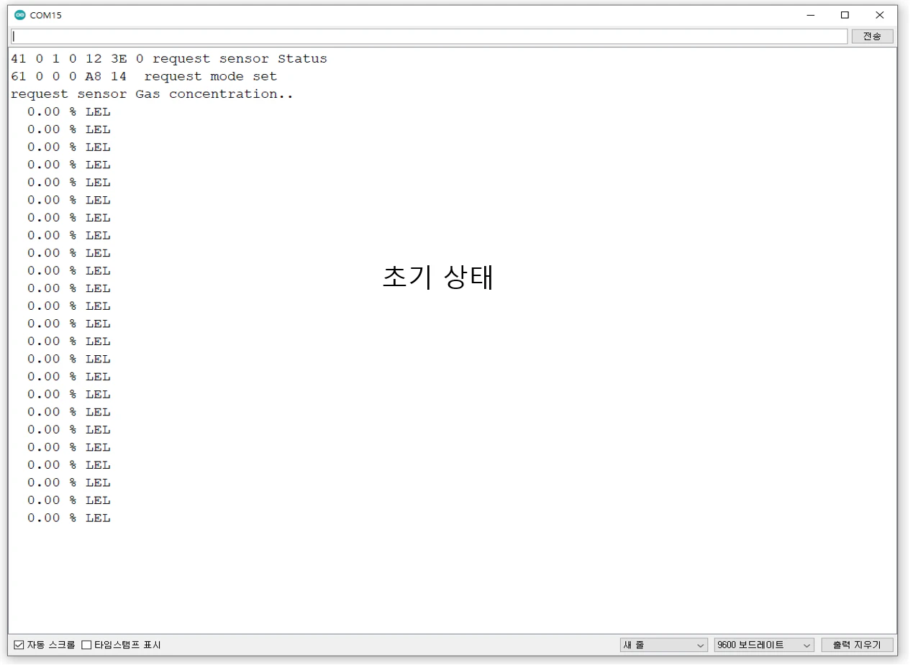<figcaption><p>시리얼_모니터</p></figcaption></figure>

<figure>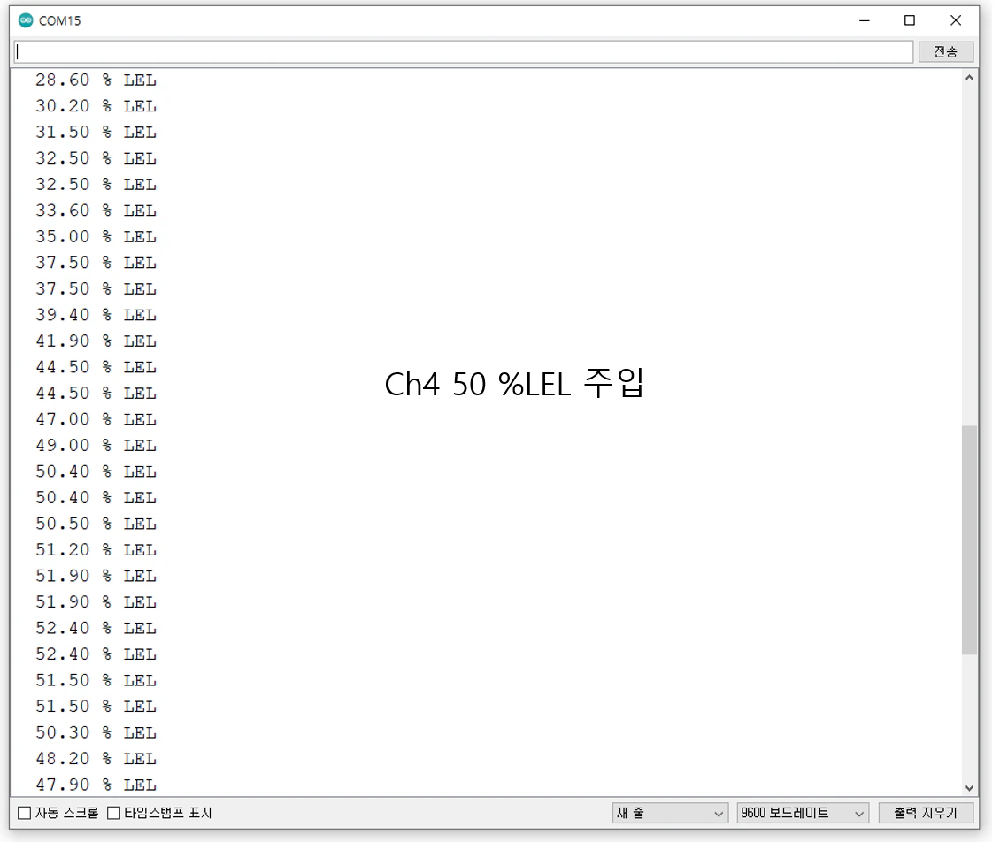<figcaption><p>시리얼_모니터</p></figcaption></figure>



## MPS Sensor 디버깅

### Nevadanano 개발키트 이용

* [MPS Flammable Gas Sensor Evaluation Unit User Manual](https://nevadanano.com/wp-content/uploads/2021/11/SM-UM-0001-06-Flammable-Gas-Sensor-Evaluation-Unit-User-Manual.pdf)

<figure><figcaption><p>개발키트</p></figcaption></figure>

* 그림 1의 PCB에와 mps 센서 연결, Micro usb 연결 후 Micro usb를 pc에 연결 한 뒤 Nevadanano interface Program 실행
* [Download MPS Gas Sensor Interface Installer](https://nevadanano.com/wp-content/uploads/2022/03/MPS-Gas-Sensor-Interface.zip)

<figure><figcaption><p>개발키트</p></figcaption></figure>

### Nevadanano 개발키트

* MPS 센서와 FTDI FT230x series USB-to-serial converter 를 이용하여 Nevadanano interface Program 실행
* [Sensor Testing Without the Evaluation Unit](https://nevadanano.com/wp-content/uploads/2020/06/SM-AN-0014-01-Sensor-Testing-without-the-NNTS-Evaluation-Kit.pdf)
* MPS 센서와 USB-to-serial converter를 이용하여 Serial Program으로 디버깅
