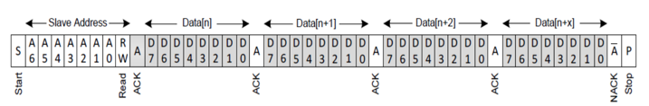
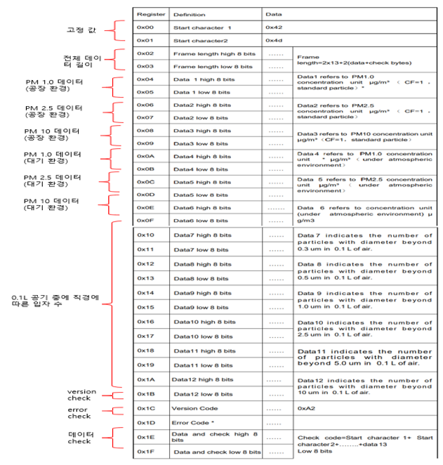

# I2C

* _적용 모델: PMS 5003IB_
* I2C Slave Address: 0x12

※ _PMS 5003IB_ I2C 통신을 사용하기 위해서는 SDA, SCL에 연결된 4.7K 풀업 저항이 필요함

## _PMS 5003IB_ I2C protocol 센서 값 읽기 Command Sequence

<figure><figcaption></figcaption></figure>

* Device에서 i2c Address(0x12)를 PMS 5003IB로 전송 후 32Byte 데이터 요청

## Sensor response interface protocol

<figure><figcaption></figcaption></figure>
