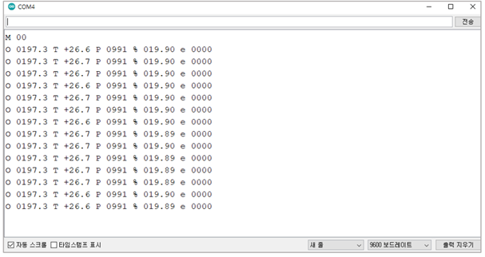
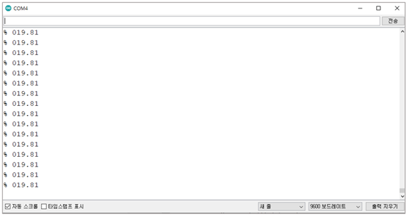

# 모드 설정 및 O₂ 값 읽기

<table><thead><tr><th width="133">Mode</th><th width="147">Command</th><th width="281">Description</th><th>Response</th></tr></thead><tbody><tr><td>Stream</td><td>M 0</td><td>약 1초에 한 번씩 데이터 값을 전송</td><td>K 00000</td></tr><tr><td>Poll</td><td>M 1</td><td>센서 값 요청시에만 데이터 값 전송</td><td>K 00001</td></tr><tr><td>Off</td><td>M 2</td><td>Sleep mode, 측정 X</td><td>K 00002</td></tr></tbody></table>



```cpp
#include <SoftwareSerial.h>
SoftwareSerial mySerial(12, 13); //Uno Rx Tx (12 13) = SoftwareSerial
const char* Stream_mode = "M 00\r\n";
String str;
void setup() {
  Serial.begin(9600); //시리얼 통신 초기화
  Serial.println("SST GAS Sensor");
  mySerial.begin(9600);
  mySerial.print(Stream_mode);
}                              
void loop() 
{
  /* Response 
  ex) O XXX T XXX P XXX % XXX e xxx
      O XXX: PPO2
      T XXX: temperature
      P XXX: barometric pressurec
      % XXX: O2
      e XXX: Sensor Status
  */
   if(mySerial.available()>0) 
   { 
    str = "";
    str = mySerial.readStringUntil('\n'); 
    Serial.println(str);
   }
}

```

시리얼 모니터

<figure><figcaption></figcaption></figure>

Stream Mode(default)에서 O₂ 값 읽기 부연 설명

\* O = 현재 산소분압(PPO₂)값 (mbar)

\* T = 현재 온도값 °C

\* P = 현재 기압값 (mbar)

\* % = 현재 O₂ 퍼센트 값 (%)

\* e = 센서 상태(“e 0000” = 센서상태 좋음, “e xxxx” = [SST sensing](https://sstsensing.com/)에 문의)



```cpp
#include <SoftwareSerial.h>
SoftwareSerial mySerial(12, 13); //Uno Rx Tx (12 13) = SoftwareSerial
const char* Poll_mode = "M 01\r\n";
const char* O2_Read = "%\r\n";
String str;
void setup() {
  Serial.begin(9600); //시리얼 통신 초기화
  mySerial.begin(9600);
  Serial.println("SST GAS Sensor");
  delay(1000);
  mySerial.print(Poll_mode);
}                              
void loop() 
{
  /* Response 
  ex) O XXX T XXX P XXX % XXX e xxx
      O XXX: PPO2
      T XXX: temperature
      P XXX: barometric pressurec
      % XXX: O2
      e XXX: Sensor Status
  */
  mySerial.print(O2_Read);
  delay(1000);
   if(mySerial.available()>0) 
   { 
    str = "";
    str = mySerial.readStringUntil('\n'); 
    Serial.println(str);
   }
}

```

시리얼 모니터

<figure><figcaption></figcaption></figure>


