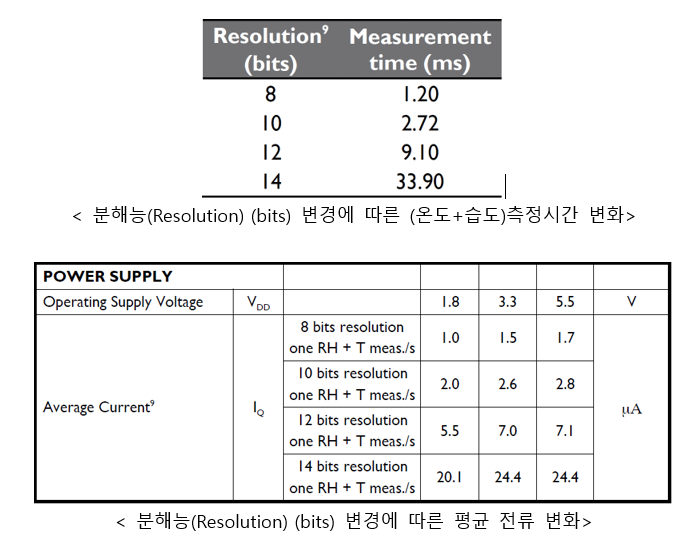
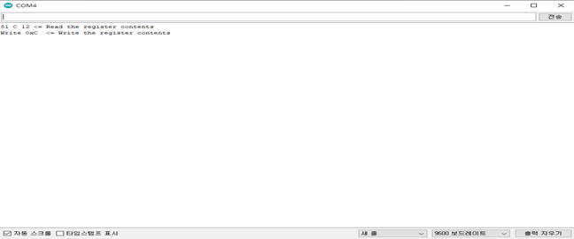

# 온·습도 Resolution 읽기 및 쓰기

ETH-01D 비휘발성 메모리에 온·습도 Resolution, ID가 저장 되어있음

* 분해능(Resolution): 측정값의 변화에 감응하는 정도
* 분해능(Resolution)의 초기값은 14
* 분해능(Resolution)는 8, 10, 12, 14 나누어짐
* 분해능(Resolution) register bits는 총 16bit임
* 분해능(Resolution)를 변경하려면 분해능(Resolution) register bits의 11번째와 10번째 bits를 변경 해야함.
* 분해능(Resolution)이 높을수록 정밀한 값이 표시됨.
* 분해능(Resolution) (bits)가 증가할수록 측정시간, 응답시간이 증가함.
* 분해능(Resolution) (bits)가 증가할수록 전력 소모량이 증가함.

<figure><figcaption></figcaption></figure>

**분해능(Resolution) (bits) 변경에 따른 소비 전력 변화**

* Ex) VDD: 3.3V, 14bits resolution = 3.3V\_24.4µA = 80.52µW\_
* Ex) VDD: 3.3V, 8bits resolution = 3.3V\_1.5µA = 4.95µW
* 80.52µW - 4.95µW = 75.57µW

<figure><figcaption></figcaption></figure>

**Step 1. ETH-01D I2C command 전송**

* Device에서 command(i2c Address(0x44),0xa0,0x00,0x00)를 ETH-01D로 전송

<figure><figcaption></figcaption></figure>

**Step 2. 온·습도 Resolution 요청 Command**

* Device에서 Command ((i2c Address(0x44)), 0x06(습도), 0x00, 0x00)를 ETH-01D로 보낸 뒤 120 μs 기다림(습도 Resolution을 요청 Command)
* 온도 Resolution을 요청 Command는 Register Address 0x06을 0x11으로 변경 해야함

<figure><figcaption></figcaption></figure>

<figure><figcaption></figcaption></figure>

**Step 3. 온·습도 Resolution 응답**

* 온·습도 Resolution Register bits값 \[15:0]을 읽음

<figure><figcaption></figcaption></figure>

**Step 4. 온·습도 Resolution 쓰기 Command**

* Register 비트 \[15:12],\[9:0]은 변경하지 않고 \[11:10]만 변경할 온습도 Resolution으로 변경
* Register 비트 \[15:12],\[9:0]은 변경하지 않으려면 Resolution 읽기를 먼저 수행해야함
* Device에서 Command ((i2c Address(0x44)), 0x46, 0xAC, 0x5A)를 ETH-01D로 전송(습도 Resolu-tion 14)
* 온도에 Resolution을 읽기위해서는 Register Address 0x46을 0x51으로 변경 해야함

<figure><figcaption></figcaption></figure>

<figure><figcaption><p>&#x3C; 분해능(Resolution) Register bits[11:10] 설정 값></p></figcaption></figure>

<figure><figcaption></figcaption></figure>

## 소스 코드



```cpp
#include <Wire.h>
#define slave_address 0x44
#define Sensor_power_port 6 // Arduino uno, Arduino mkr 1010, esp32
// #define Sensor_power_port 16 // esp8266
#define Power_enable digitalWrite(Sensor_power_port, HIGH)
#define Power_disable digitalWrite(Sensor_power_port, LOW)
#define Humidity_Resolution_read_command Wire.write(0x06) //Humidity Sensor Resolution – Read Register (bits [11:10])
#define Temperature_Resolution_read_command Wire.write(0x11) //Temperature Sensor Resolution – Read Register (bits [11:10])
#define Humidity_Resolution_write_command Wire.write(0x46) //Humidity Sensor Resolution – Write Register (bits [11:10])
#define Temperature_Resolution_write_command Wire.write(0x51) //Temperature Sensor Resolution – Write Register (bits [11:10])
void setup()
{
Wire.begin();// arduino uno, Arduino mkr 1010
//Wire.begin(7,8,5000); //esp32
//Wire.begin(4,5,5000); //esp8266
Serial.begin(9600);
pinMode(Sensor_power_port, OUTPUT);
}
void loop()
{
int Status;
int RegisterValueHigh;
int RegisterValueLow;
//===Module Power Reset===
Power_disable; //전원 끔
delay(1);
Power_enable;
delay(2); //10msec 이내에 신호 전송되어야함
// Step 1. ETH-01D I2C command 전송
//프로그래밍 모드로 들어가기 위한 명령, 명령어 처리 시까지 120usec 시간이 소요됨.
Wire.beginTransmission(slave_address);
Wire.write(0xA0);
Wire.write(0x00);
Wire.write(0x00);
Wire.endTransmission();
delayMicroseconds(120);
//Step 2. 온습도 Resolution 요청 Command
Wire.beginTransmission(slave_address);
Humidity_Resolution_read_command;
Wire.write(0x00);
Wire.write(0x00);
Wire.endTransmission();
delay(1);
//Step 3. 온습도 Resolution 응답
Wire.requestFrom(slave_address, 3);
if (Wire.available()) {
Status = Wire.read();
RegisterValueHigh = Wire.read();
RegisterValueLow = Wire.read();
Serial.print(Status, HEX);
Serial.print(" ");
Serial.print(RegisterValueHigh,HEX);
Serial.print(" ");
Serial.print(RegisterValueLow, HEX);
Serial.println(" <= Read the register contents");
}
//Step 4. 온습도 Resolution 쓰기 Command, 데이터 기록시간은 14msec가 필요함
Wire.beginTransmission(slave_address);
Humidity_Resolution_write_command;
Wire.write(0xC); // Sensor Resolution Change high bit
Serial.print("Write 0xC ");
Serial.println(" <= Write the register contents");
Wire.write(0x12); // Sensor Resolution low bit
Wire.endTransmission();
delay(14);
//Step 5. 프로그래밍 모드에서 일반 모드로 전환
Wire.beginTransmission(slave_address);
Wire.write(0x80);
Wire.write(0x00);
Wire.write(0x00);
Wire.endTransmission();
delay(1000);
}
```



* 온·습도 Resolution 읽기 및 쓰기 시리얼 모니터

<figure><figcaption></figcaption></figure>

<figure><figcaption></figcaption></figure>

<figure><figcaption></figcaption></figure>
