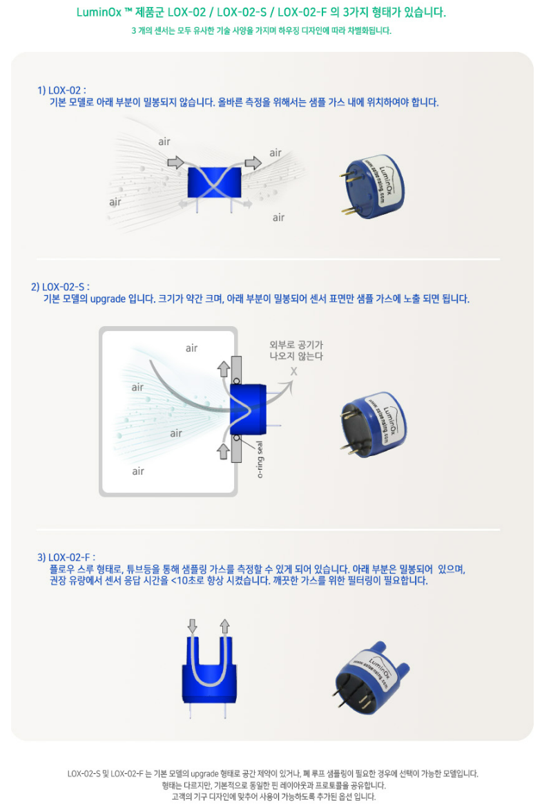
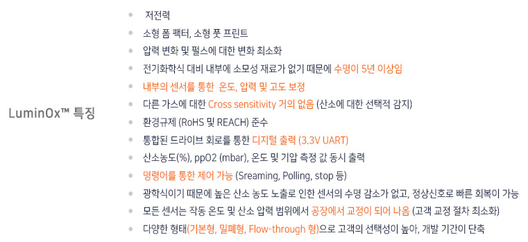
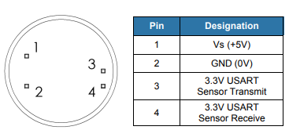

# SST

영국 스코틀랜드에 위치하고 있고 가스 및 액체를 위한 다양한 센서와 시스템을 설계, 제조 및 맞춤제작을 형성하고 있습니다.

SST는 5년 이상의 수명, 디지털 센서, REACH, RoHS를 공통적으로 갖추고 준수하고 있습니다. SST는 각 단계에 대해 새로운 하드웨어 모듈을 생성할 필요 없이 Arduino, PCB, Sensor만 갖추고 있으시다면 신속한 Gas 측정이 가능합니다.

| LOX-O2                                          | LOX-O2-S                                    | LOX-O2-F                                    |
| ----------------------------------------------- | ------------------------------------------- | ------------------------------------------- |
| ​​ | ​​ | ​​ |

<figure><figcaption></figcaption></figure>

## 1.특징

* 내장형 압력 센서, 디지털 출력이 있는 형광 기반의 소형 산소 센서
* 광범위한 환경 범위에서도 산소만 정확한 측정 및 작동
* 크기가 작아 공간이 제한된 애플리케이션에서도 이상적
* RoHS 및 REACH 준수
* 저전력 긴 수명

<figure><figcaption></figcaption></figure>

## 2.애플리케이션

* 교통
* 텔레콤
* 산업
* 비행
* 선박
* 의료

## 3.사양

<figure><figcaption></figcaption></figure>

## 4.제품 크기 및 핀 특성

<figure><figcaption></figcaption></figure>

<figure><figcaption></figcaption></figure>

#### [Datasheet](https://sstsensing.com/wp-content/uploads/2018/01/DS0144rev2\_LOX-02-S.pdf)

## 5. 디바이스 연결 방법

* Connection DIAGRAM (UART)

<figure><figcaption></figcaption></figure>



<figure><figcaption></figcaption></figure>

| 항목  | Arduino Uno | Lox-O2 |
| --- | ----------- | ------ |
| VCC | 5V          | VCC    |
| GND | GND         | GND    |
| TX  | 12          | RX     |
| RX  | 13          | TX     |



<figure><figcaption></figcaption></figure>

| 항목  | Arduino MKR | Lox-O2 |
| --- | ----------- | ------ |
| VCC | 5V          | VCC    |
| GND | GND         | GND    |
| TX  | 14          | RX     |
| RX  | 13          | TX     |



<figure><figcaption></figcaption></figure>

| 항목  | ESP32 | Lox-O2 |
| --- | ----- | ------ |
| VCC | 5V    | VCC    |
| GND | GND   | GND    |
| TX  | 17    | RX     |
| RX  | 18    | TX     |



<figure><figcaption></figcaption></figure>

| 항목  | ESP8266 | Lox-O2 |
| --- | ------- | ------ |
| VCC | 5V      | VCC    |
| GND | GND     | GND    |
| TX  | 13      | RX     |
| RX  | 15      | TX     |



## 6.통신 프로토콜 및 예제 코드

* UART 설정

| PARAMETER         | TYP      |
| ----------------- | -------- |
| Baud Rate (Fixed) | 9600 bps |
| Data Bits         | 8        |
| Parity            | None     |
| Stop Bits         | 1        |
| Flow Control      | None     |

* UART Command

<figure><figcaption></figcaption></figure>

<figure><figcaption></figcaption></figure>

* 모드 설정 및 O₂ 값 읽기

<table><thead><tr><th width="133">Mode</th><th width="147">Command</th><th width="281">Description</th><th>Response</th></tr></thead><tbody><tr><td>Stream</td><td>M 0\r</td><td>약 1초에 한 번씩 데이터 값을 전송</td><td>K 00000\r</td></tr><tr><td>Poll</td><td>M 1\r</td><td>센서 값 요청시에만 데이터 값 전송</td><td>K 00001\r</td></tr><tr><td>Off</td><td>M 2\r</td><td>Sleep mode, 측정 X</td><td>K 00002\r</td></tr></tbody></table>




```cpp
#include <SoftwareSerial.h>
SoftwareSerial mySerial(12, 13); //Uno Rx Tx (12 13) = SoftwareSerial
const char* Stream_mode = "M 00\r\n";
String str;
void setup() {
  Serial.begin(9600); //시리얼 통신 초기화
  Serial.println("SST GAS Sensor");
  mySerial.begin(9600);
  mySerial.print(Stream_mode);
}                              
void loop() 
{
  /* Response 
  ex) O XXX T XXX P XXX % XXX e xxx
      O XXX: PPO2
      T XXX: temperature
      P XXX: barometric pressurec
      % XXX: O2
      e XXX: Sensor Status
  */
   if(mySerial.available()>0) 
   { 
    str = "";
    str = mySerial.readStringUntil('\n'); 
    Serial.println(str);
   }
}

```

<figure><figcaption></figcaption></figure>

Stream Mode(default)에서 O₂ 값 읽기 부연 설명

\* O = 현재 산소분압(PPO₂)값 (mbar)

\* T = 현재 온도값 °C

\* P = 현재 기압값 (mbar)

\* % = 현재 O₂ 퍼센트 값 (%)

\* e = 센서 상태(“e 0000” = 센서상태 좋음, “e xxxx” = [SST sensing](https://sstsensing.com/)에 문의)




```cpp
#include <SoftwareSerial.h>
SoftwareSerial mySerial(12, 13); //Uno Rx Tx (12 13) = SoftwareSerial
const char* Poll_mode = "M 01\r\n";
const char* O2_Read = "%\r\n";
String str;
void setup() {
  Serial.begin(9600); //시리얼 통신 초기화
  mySerial.begin(9600);
  Serial.println("SST GAS Sensor");
  delay(1000);
  mySerial.print(Poll_mode);
}                              
void loop() 
{
  /* Response 
  ex) O XXX T XXX P XXX % XXX e xxx
      O XXX: PPO2
      T XXX: temperature
      P XXX: barometric pressurec
      % XXX: O2
      e XXX: Sensor Status
  */
  mySerial.print(O2_Read);
  delay(1000);
   if(mySerial.available()>0) 
   { 
    str = "";
    str = mySerial.readStringUntil('\n'); 
    Serial.println(str);
   }
}

```

<figure><figcaption></figcaption></figure>



## 7.Thingspeak 활용 방법




Step1. 아두이노 IDE에 Thingspeak 라이브러리 추가


Step2. Wi-Fi ssid, pass 확인 및 변경

* code Thingspeak ssid, password 부분 자신이 사용할 Wi-Fi ssid, pass로 변경

Step3. Thingpeak channelnumber 및 api key 확인

* Thingspeak -> channel -> my channel -> channel setting -> channel id 확인 후 code 변경
* Thingspeak -> channel -> my channel -> Api keys -> Write Api key -> key 확인 후 code 변경

## 소스 코드



```cpp
#include <Arduino.h>
#include "ThingSpeak.h"
#include <Wire.h>
#include <WiFi.h>
const char* Poll_mode = "M 01\r\n";
const char* O2_Read = "%\r\n";
const char* ssid = "your network SSID";   // your network SSID (name) 
const char* password = "your network password";   // your network password
WiFiClient  client;
unsigned long myChannelNumber = your channel number;
const char * myWriteAPIKey = "your channel api key";
// Timer variables
String str;
unsigned long lastTime = 0;
unsigned long timerDelay = 10000;
void setup()
{
Serial.begin(9600);
  WiFi.mode(WIFI_STA);   
  ThingSpeak.begin(client);  // Initialize ThingSpeak
}
void loop()
{
float o2_value_to;
  Serial1.print(O2_Read);
  delay(1000);
   if(Serial1.available()>0) 
   { 
    str = "";
    str = Serial1.readStringUntil('\n'); 
    Serial.println(str);
    int o2_length  = str.length();
    String value_o2 = str.substring(o2_length-6, o2_length);
    o2_value_to = value_o2 .tofloat();
   }

    if ((millis() - lastTime) > timerDelay) 
    {
        // Connect or reconnect to WiFi
        if(WiFi.status() != WL_CONNECTED)
        {
        Serial.print("Attempting to connect");
        while(WiFi.status() != WL_CONNECTED){
            WiFi.begin(ssid, password); 
            delay(2000);     
        } 
        Serial.println("\nConnected.");
        }
        // pieces of information in a channel.  Here, we write to field 1.
        ThingSpeak.setField(1, o2_value_to);
        int x = ThingSpeak.writeFields(myChannelNumber, myWriteAPIKey);
        if(x == 200){
        Serial.println("Channel update successful.");
        }
        else{
        Serial.println("Problem updating channel. HTTP error code " + String(x));
        }
        lastTime = millis();
   }

```


