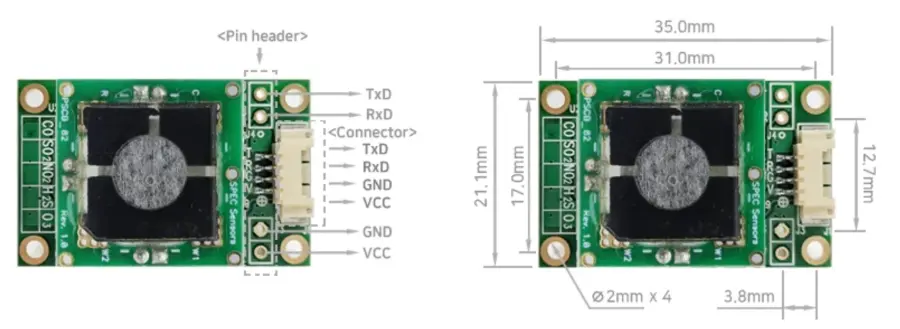

# AGSM 사용 설명서

<!-- 메인 이미지 
<figure><figcaption><p>AGSM Manual</p></figcaption></figure>
-->

## 설명

* 가스 교정(Gas Calibration)이 완료된 AGSM은 센서 농도 값(ppb)을 UART통신을 이용하여 데이터를 전송합니다.
* 빠른 응답 시간(T90<30Sec)을 요구하는 환경에 적용하기에는 적합하지 않으며 장시간 환경 변화 모니터링에 적합하도록 제작되었습니다.
* 최소 30분\~1시간 이상의 센서 안정화 시간이 필요합니다.
* 온도 보정 및 가스 센서 보정 알고리즘에 적용되어 있습니다.
* 센서 구동회로에서 출력된 센서 신호 값(raw data)을 확인 가능(23bit adc)합니다.
* Arduino및 호환 제품과 연동하여 AGSM 제품 적용이 가능합니다.
* 소형, 경량 고성능, 저전력을 요구하는 무선 가스 감지기, 휴대용 및 네트워크 솔루션들에 쉽게 통합하여 적용 가능합니다.
* AGSM은 CO, H2S, SO2, NO2, O3 개별 가스 센서가 적용된 형태로 공급됩니다.
* 센서 교정(Sensor Calibration)
  * 사용자가 교정 가스 및 테스트 환경을 보유하고 있는 경우 통신 명령어를 이용하여 Zero calibration, Span Calibration을 할 수 있습니다.
  * 6개월 주기로 가스 센서 교정(Span Calibration)을 하는 것을 권장합니다.
  *   AGSM 제품은 400mL의 소형 챔버를 이용하여 센서 교정을 하였습니다.

      <figure><figcaption><p>AGSM Module</p></figcaption></figure>

## 사양 및 연결 방법

### 모듈 사양

<table><thead><tr><th width="270">항목</th><th>사양</th></tr></thead><tbody><tr><td>측정 가스</td><td>CO, H2S, SO2, NO2, O3(개별 측정)</td></tr><tr><td>동작방식</td><td>고체 전해질 전기화학식(3전극)</td></tr><tr><td>측정 범위</td><td><a data-mention href="agsm.md#undefined-3">#undefined-3</a></td></tr><tr><td>정확도</td><td>&#x3C;5% @ Full Range</td></tr><tr><td>통신 출력</td><td>UART(TTL 3.3V, 5.0V)</td></tr><tr><td>Expected Operating Life</td><td>> 5 years (10 years @ 25± 10C; 60 ± 30% RH)</td></tr><tr><td>전기적특성</td><td></td></tr><tr><td>구동 전압</td><td>DC 3.3V ~ 5.0V</td></tr><tr><td>구동 전류</td><td>Max 13mA(3.3VDC)</td></tr><tr><td>소모 전력</td><td>≤43mW</td></tr><tr><td>환경</td><td></td></tr><tr><td>구동 온도</td><td>-20 to 40 °C</td></tr><tr><td>구동 습도</td><td>15 to 95% (Based on Standard Conditions: 25 ºC, 50% RH and 1 atm)</td></tr></tbody></table>

### 센서 사양

| 가스         | 범위        | 해상도    | 정확도              | T90 반응 시간 |
| ---------- | --------- | ------ | ---------------- | --------- |
| 일산화탄소(CO)  | 0\~100ppm | 0.1ppm | 5% of Full range | <30 sec   |
| 황화수소(H2S)  | 0\~10ppm  | 10ppb  | 5% of Full range | <30 sec   |
| 이산화황(SO2)  | 0\~20ppm  | 50ppb  | 5% of Full range | <30 sec   |
| 이산화질소(NO2) | 0\~5ppm   | 20ppb  | 5% of Full range | <30 min   |
| 오존(O3)     | 0\~5ppm   | 20ppb  | 5% of Full range | <30 sec   |

### 핀 연결(Pin Connection)

* Connector(default): Molex 53261, Yeonho 12505WR
* Pin header(option): 2.54 pitch(V:VCC, G:GND, R: Rxd, T: TxD)

<figure><figcaption><p>AGSM PIN Connection</p></figcaption></figure>

### 제품 크기

* Size: L X W (33 x 21 mm)

<figure><figcaption><p>AGSM Module Size</p></figcaption></figure>

## 통신 프로토콜

### 기본 설정

```
+ Voltage level: DC 3.3 V or 5.0V
+ Baud: 9600 
+ Data bits: 8 
+ Stop bits: 1 
+ Parity: None 
+ Flow Control: None
```

### 통신 명령어

| Command        | 기능                                                                                                                                                      |
| -------------- | ------------------------------------------------------------------------------------------------------------------------------------------------------- |
| `<CR>,`        | <p>한번의 데이터 출력(Once Data output)<br>Output: SN [XXXXXXXXXXXX], PPB [0 : 999999], TEMP [-99 : 99], RH [0 : 99], ADC[ADCCount], TempDigital, RHDigital</p> |
| `C<cr>, c<cr>` | <p>연속 데이터 출력(CONTINUOUS data output)<br>재 구동 후 초기화 되며 내부 메모리에 상태 정도가 저장되지 않음</p>                                                                        |
| `Z`            | <p>제로 교정(ZERO user calibration)<br>센서 출력이 0ppm이 되도록 센서 값을 다시 계산하여 교정</p>                                                                                |
| `B`            | <p>센서 바코드 정보 입력(Barcode entry)<br>센서에 기록된 바코드 정보를 입력</p>                                                                                                |
| `S`            | <p>스팬 교정( Span user calibration)<br>교정 가스를 주입하여 센서의 측정 감도를 다시 계산하여 교정(PPM기준)</p>                                                                        |
| `e`            | <p>메모리 정보 확인(Internal memory readout)<br>모듈내부에 저장된 설정 정보 값을 확인</p>                                                                                      |
| `D<cr>`        | <p>LED ON/OFF<br>내부 메모리에 상태정보가 저장되지 않음.</p>                                                                                                             |
| `r<cr>`        | System reset                                                                                                                                            |

### 통신 명령어 예시

```
\r
    081821011255, 212, 23, 18, 2194921, 23490, 18665
```

```
c\r
     081821011255, 212, 23, 18, 2194921, 23490, 18665
```

```
S 
    Enter span gas value in PPM:
    Setting span...
    done
```

```
Z
    Setting zero...
    done
```

```
B
    Remove Sensor and Scan:
    Setting OC...done
```

```
e 
    Serial Number= 112020010530
    Barcode= 081821011255 110507 NO2 2108 -28.57
    ADC Zero= 2165186
    ADC_SpanCalValue=  1890818
    Temperature Zero(x1000)= 24366
    Humidity Zero(x1000)= 16797
    Temperature Span(x1000)= 24205
    Humidity Span(x1000)= 17139
    Calibration GAS(x100)(ppm)=  250
    Calibration InA(x100)=  -2857
    Max Range(ppm)= 5
    NoneSensorADC Zero= 2165186
    Firmware Version= 2022-03-23B-04”
```

```
r\r
    reset
```

```
D\r
    LED OFF
    LED ON
```

## 주의 사항

* 정해진 규격내에서 사용하시기 바라며, 연결에 주의하시기 바랍니다.
* 과도한 화학물질 주변에서의 사용은 센서를 손상 시킬 수 있습니다.
* 고온, 고습 등에서 장시간 방치 할 경우 센서의 오동작 가능성이 있습니다.
* 일정 이상의 충격이 발생할 경우 잠시 오작동이 발생할 수 있습니다.
* 이 지침을 준수하지 않으면 제품이 손상될 수 있습니다.
* 안전상 보조장치, 보완장치로 사용을 권유 드립니다

## 제조사 / 연락처 (A/S)

* 제조사: ㈜ 올센싱 [https://www.allsensing.com/](https://www.allsensing.com/)
* 주 소: 경기도 용인시 기흥구 중부대로 184 (영덕동) 기흥힉스유타워 A2214호
* 연락처: T. 070-4285-4018 F. 02-6280-7851 E-MAIL: [support@allsensing.com](mailto:support@allsensing.com)
