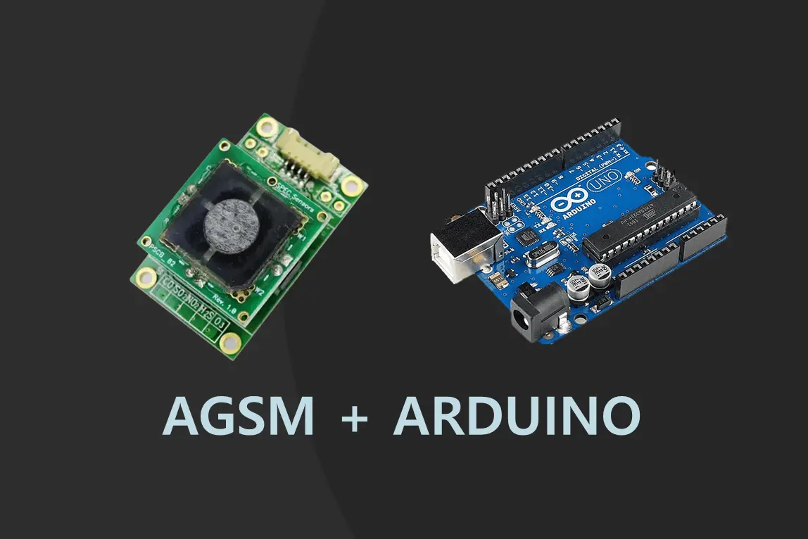
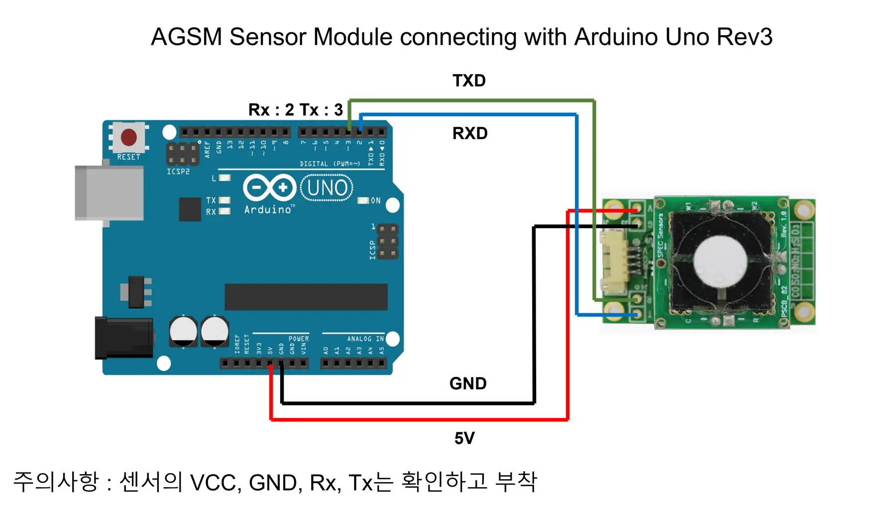
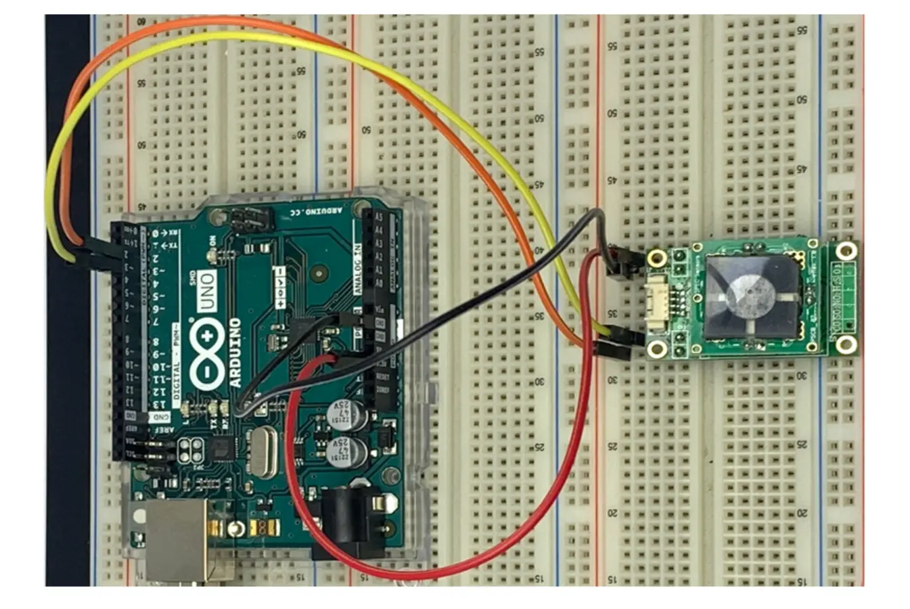
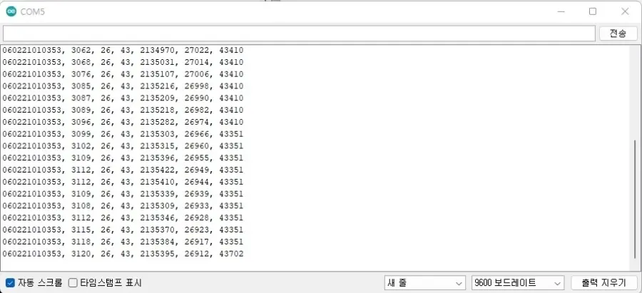

# AGSM 아두이노 활용

<!-- 메인 이미지 
<figure><figcaption><p>AGSM Arduino</p></figcaption></figure>
-->

## 와이어 결선 방법



<figure><figcaption><p>AGSM Arduino</p></figcaption></figure>



<figure><figcaption><p>AGSM Arduino</p></figcaption></figure>



## 아두이노 UNO 예제코드



```c
#include <SoftwareSerial.h>
 
#define ContinueMode 0
#define PollingMode 1
 
const int rxPin = 2;
const int txPin = 3;
SoftwareSerial Serial1(rxPin, txPin);
 
void setup()
{
  Serial.begin(9600);
  Serial1.begin(9600);//AGSM sensor module connection
  delay(1000);
 
  #if ContinueMode
  Serial.println("Continuous Mode");
  #else if PollingMode
  Serial.println("Polling Mode");
  #endif
  Serial.println("Serial, Conc.(PPB), Temp.(C), Rh(%), Adc.(Counts), Temp.(Counts), Rh(%Counts)");
  #if ContinueMode
  Serial1.write('c');
  Serial1.write('\r');
  #endif
}
 
void loop()
{
  #if PollingMode
    Serial1.write('\r');
    delay(1000);
  #else
    delay(100);
  #endif
   while (Serial1.available()) // read from AGSM port, send to Serial port to interupt continuous output send 'c''/r' without line ending, may have to send more than once.
  {
   int inByte = Serial1.read();
   Serial.write(inByte);   
  }
}
```



## 아두이노 시리얼 모니터 출력

<figure><figcaption><p>AGSM Serial Monitor</p></figcaption></figure>
