# 온습도센서(디지털)

<!-- 메인 이미지 
<figure>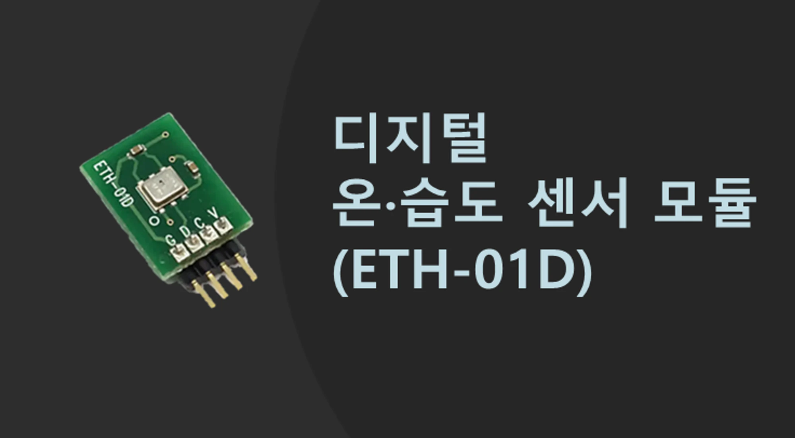<figcaption><p>ETH-01D</p></figcaption></figure>
-->

## 특징

- 저전력으로 사용 가능한 I2C 디지털 출력의 온·습도 센서 모듈
- 가격 대비 빠른 온 습도 측정 응답시간, 우수한 안정성, 높은 정확성(보정 시스템 내장)
- 1.27mm의 작은 헤더 핀이 부착되어 공간이 제한된 애플리케이션에 설치 용이
- 장기적 안정성 및 신뢰성(센서 내부 알고리즘은 정확한 반복 측정을 가능 하게함)

## 어플리케이션

- 기상 관측
- 데이터로거
- 가전제품
- 냉난방 공조 시스템
- 자동차습도계
- 의료자동화기기

## 제품 사양

| 항목 | 내용 |
| --- | --- |
| 측정 범위 | 온도: -40 ~ 125℃<br><br>습도: 0 ~100%RH |
| 습도 정확성(@ 25°C) | ±3.8%RH (20 to 80%RH), ±5.0%RH(Other Range) |
| 온도 정확성 | ±0.3°C (0 to 70°C), ±0.5°C (Other Range) |
| 전원 전압 | 최소 1.8V 평균:3.3V 최대:5.5V |
| 전원 전류 | Typ: 24.4㎂(14bit 분해능 기준) |
| 절전 상태 전류 | Typ: 0.6㎂(-40~80℃기준) |
| 보관 온도 | -40 ~ 150°C |
| 응답 시간 | 34msec < 온 습도 |
| 센서 치수 | L x W x H (14.5mm x 8mm x 3.8mm) |
| 통신 프로토콜 | I2C |
| 헤더 핀 크기 | 1.27mm |

## 제품 크기 및 핀 특성
<figure>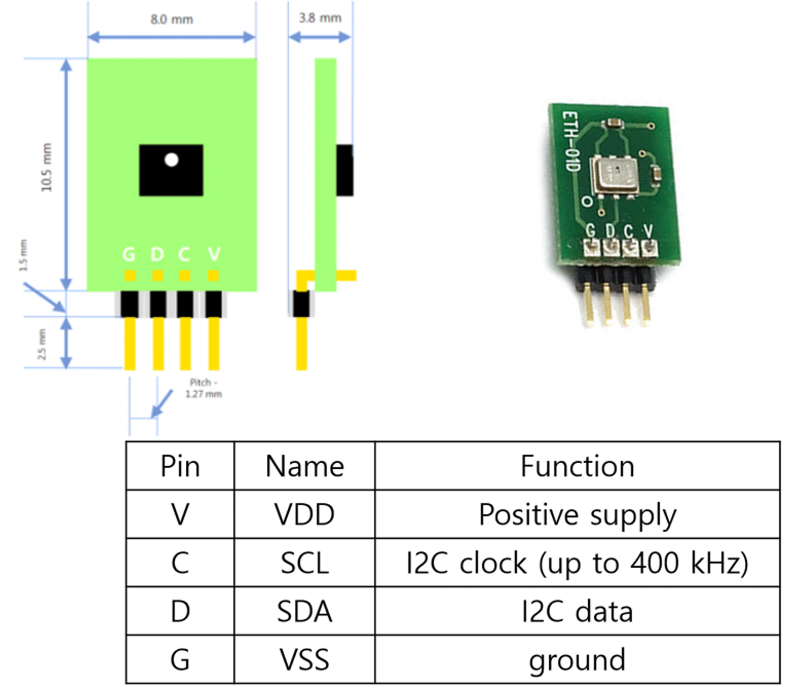<figcaption><p>ETH-01D</p></figcaption></figure>

**온·습도 정확도 허용 오차 범위**
- 온도 0~70°C 범위에서 ETH-01D의 온도의 정확도는 일반적으로 ±0.3°C , 최대 ±0.5°C 오차 허용
- 온도 0~-40°C 범위를 제외한 나머지 범위에서는 정확도 허용 오차 범위가 증가합니다.(최대 2°C)

<figure>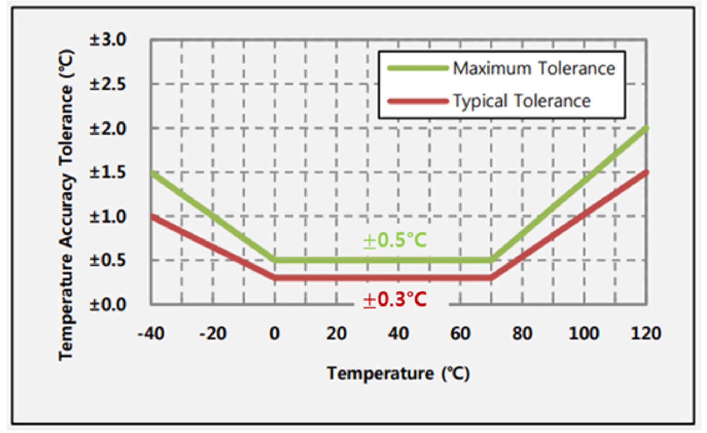<figcaption><p>ETH-01D</p></figcaption></figure>

- 습도 20~80%RH 범위에서 ETH-01D의 습도의 정확도는 일반적으로 3.5% RH , 최대 RH오차 허용
- 습도 20~80%RH 범위를 제외한 나머지 범위에서는 정확도 허용 오차 범위가 증가함 최대 RH오차 허용

<figure>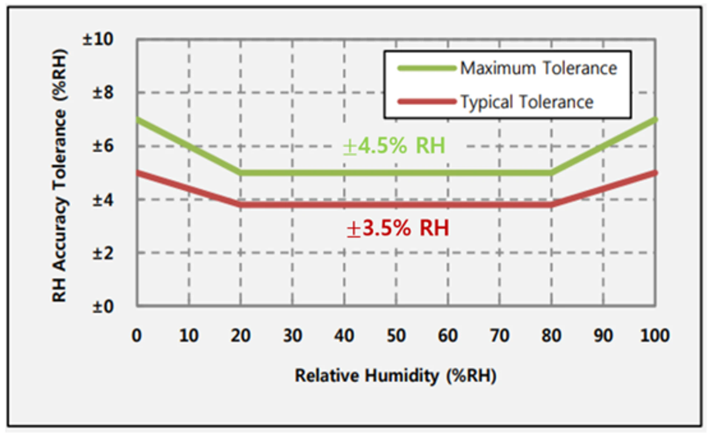<figcaption><p>ETH-01D</p></figcaption></figure>


## 통신 프로토콜

### 온·습도 읽기

<figure>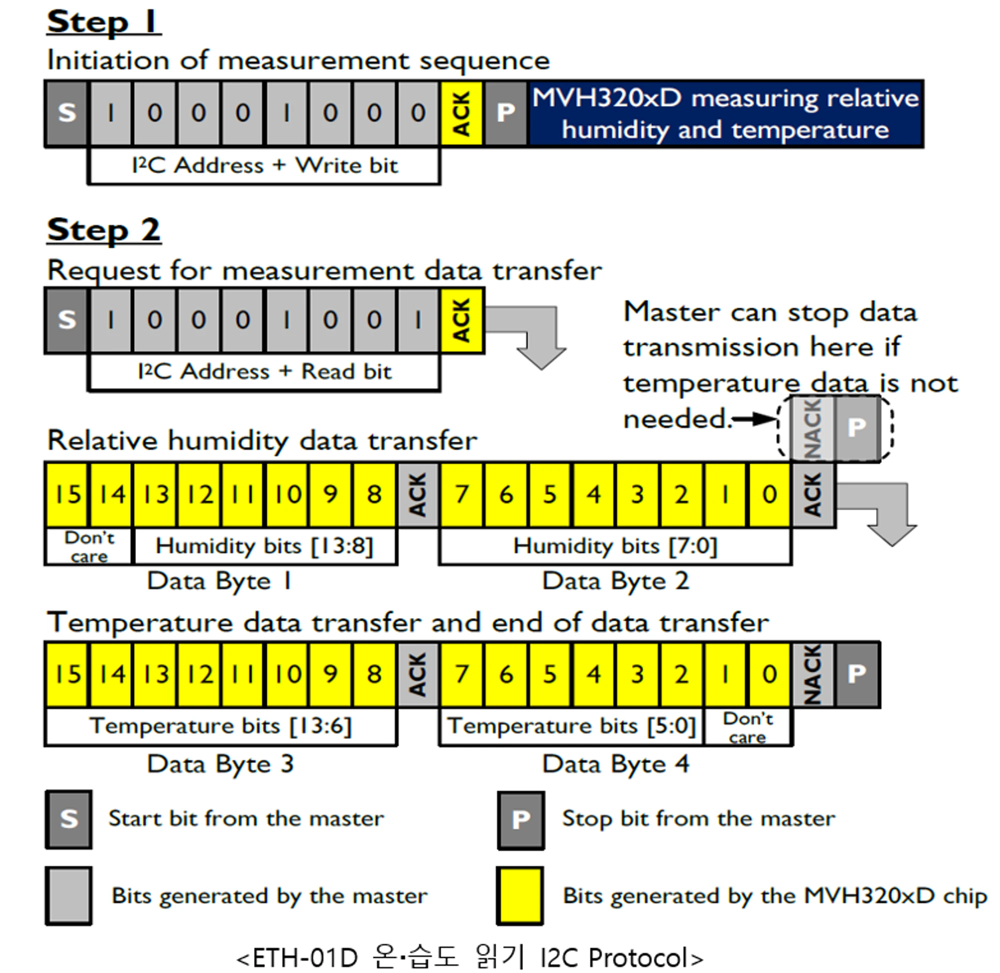<figcaption><p>ETH-01D</p></figcaption></figure>

`i2c Address는 0x44(7bit), Write bit는 0, Read bit는 1`

`Don’t care는 측정 데이터에 포함하지 않으며 사용하지 않음.`

**Step 1. 센서 데이터 요청**

- Device에서 i2c Address(0x44)를 ETH-01D로 전송

<figure>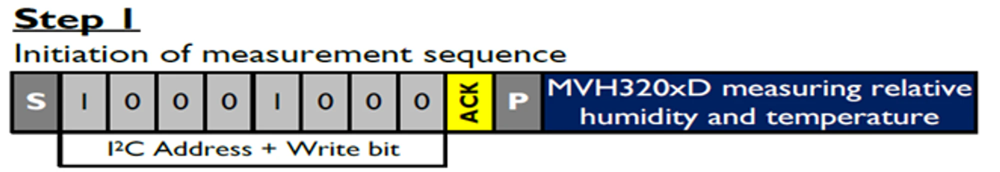<figcaption><p>ETH-01D</p></figcaption></figure>


**Step 2-1. 습도 데이터 응답**

- 데이터 중 상위 1byte 15,14번째 데이터는 Don’t care
- 습도 값 = (습도 데이터 13~0번째)/(2^14-1)*100

**Ex) 습도 데이터 2byte = 0x4ec0**

- Data 상위 1Byte : 13~8번째 데이터: 0x4e & 0x3f(Don’t care 데이터 버림) = 0xe00 = 3584
- Data 상위 1Byte + Data 하위 1Byte = 0xe00+0xc0 = 0xec0 = 3,776
- 습도 값 = 23.04 %RH

<figure>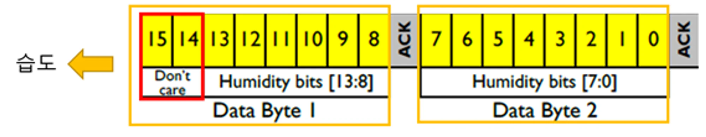<figcaption><p>ETH-01D</p></figcaption></figure>

**Step 2-2. 온도 데이터 응답**

- 데이터 중 하위 1byte 0,1번째 데이터는 Don’t care
- 온도 값 =(온도 데이터 15~2번째 데이터)/(2^14-1)*165-40

**EX) 온도 데이터 2byte = 0x66ed**

- Data 상위 1Byte : 0x6600
- Data 하위 1Byte 7~2번째 데이터 = 0xed & 0xfc(Don’t care 데이터 버림) = 0xec
- Data 상위 1Byte + Data 하위 1Byte = 0x6600 +0xec = 0x66ec
- Data 상위 1Byte + Data 하위 7~2번째 데이터 = 0x66ec >>2(Don’t care bit 수만큼 이동) = 19BB = 6587
- 온도 = 26.34°C

<figure>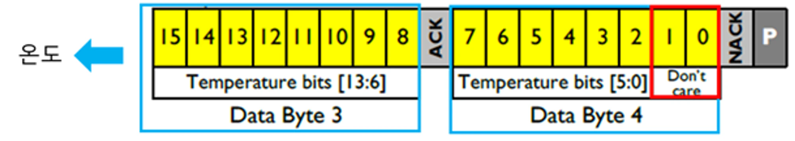<figcaption><p>ETH-01D</p></figcaption></figure>

### 센서 Resolution 읽기/쓰기

ETH-01D 비휘발성 메모리에 온·습도 Resolution, ID가 저장 되어있음

- 분해능(Resolution): 측정값의 변화에 감응하는 정도
- 분해능(Resolution)의 초기값은 14
- 분해능(Resolution)는 8, 10, 12, 14 나누어짐
- 분해능(Resolution) register bits는 총 16bit임
- 분해능(Resolution)를 변경하려면 분해능(Resolution) register bits의 11번째와 10번째 bits를 변경 해야함.
- 분해능(Resolution)이 높을수록 정밀한 값이 표시됨.
- 분해능(Resolution) (bits)가 증가할수록 측정시간, 응답시간이 증가함.
- 분해능(Resolution) (bits)가 증가할수록 전력 소모량이 증가함

<figure>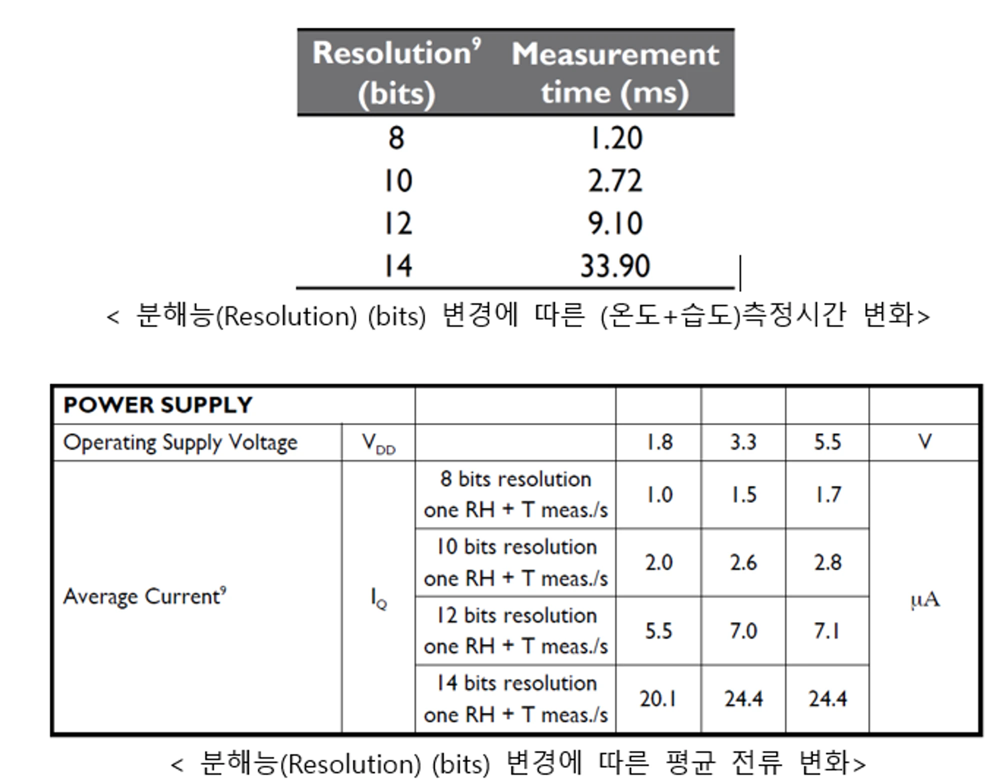<figcaption><p>ETH-01D</p></figcaption></figure>

**분해능(Resolution) (bits) 변경에 따른 소비 전력 변화**

- Ex) VDD: 3.3V, 14bits resolution = 3.3V_24.4µA = 80.52µW
- Ex) VDD: 3.3V, 8bits resolution = 3.3V_1.5µA = 4.95µW
- 80.52µW - 4.95µW = 75.57µW

<figure>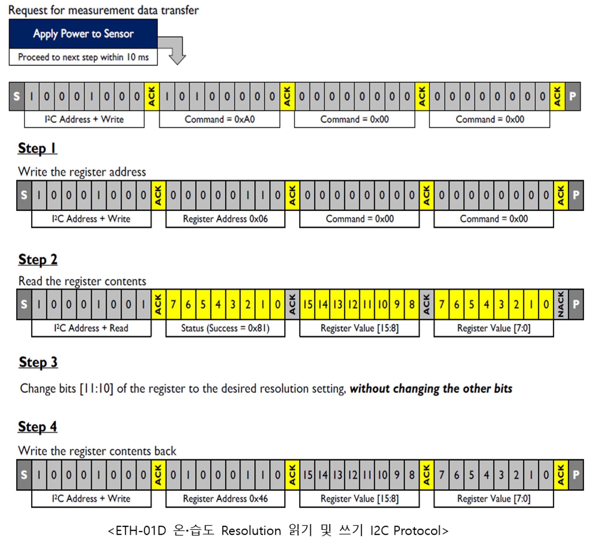<figcaption><p>ETH-01D</p></figcaption></figure>


**Step 1. ETH-01D I2C command 전송**

    Device에서 command(i2c Address(0x44),0xa0,0x00,0x00)를 ETH-01D로 전송

<figure>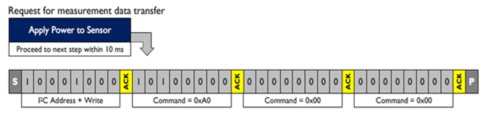<figcaption><p>ETH-01D</p></figcaption></figure>

**Step 2. 온·습도 Resolution 요청 Command**

    Device에서 Command ((i2c Address(0x44)), 0x06(습도), 0x00, 0x00)를 ETH-01D로 보낸 뒤 120 μs 기다림(습도 Resolution을 요청 Command)
    온도 Resolution을 요청 Command는 Register Address 0x06을 0x11으로 변경 해야함

<figure>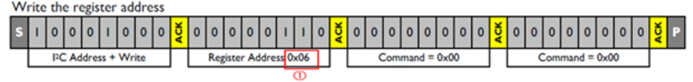<figcaption><p>ETH-01D</p></figcaption></figure>
<figure>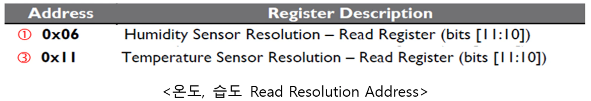<figcaption><p>ETH-01D</p></figcaption></figure>

**Step 3. 온·습도 Resolution 응답**

    온·습도 Resolution Register bits값 [15:0]을 읽음

<figure>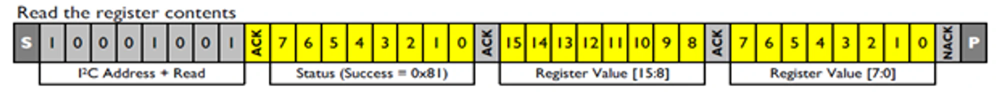<figcaption><p>ETH-01D</p></figcaption></figure>

**Step 4. 온·습도 Resolution 쓰기 Command**

    Register 비트 [15:12],[9:0]은 변경하지 않고 [11:10]만 변경할 온습도 Resolution으로 변경\
    Register 비트 [15:12],[9:0]은 변경하지 않으려면 Resolution 읽기를 먼저 수행해야함\
    Device에서 Command ((i2c Address(0x44)), 0x46, 0xAC, 0x5A)를 ETH-01D로 전송(습도 Resolu-tion 14)\
    온도에 Resolution을 읽기위해서는 Register Address 0x46을 0x51으로 변경 해야함

<figure>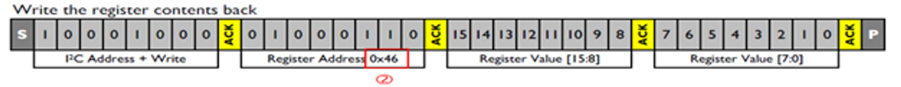<figcaption><p>ETH-01D</p></figcaption></figure>
<figure>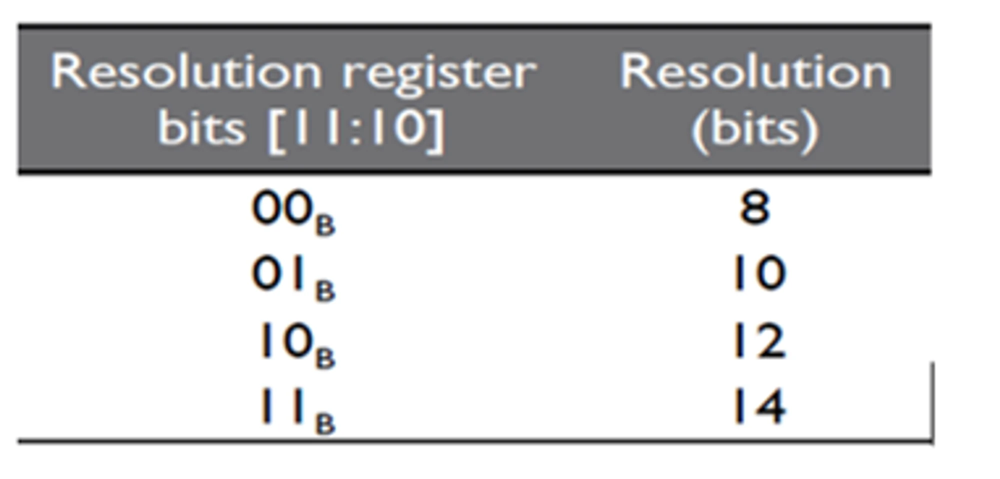<figcaption><p>ETH-01D</p></figcaption></figure>
<figure><figcaption><p>ETH-01D</p></figcaption></figure>


### 센서 ID 읽기

**Step 1. ETH-01D I2C command 전송**

- Device에서 command(i2c Address(0x44),0xa0,0x00,0x00)를 ETH-01D로 전송

<figure>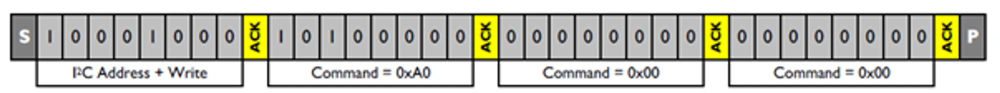<figcaption><p>ETH-01D</p></figcaption></figure>


**Step 2. 상위 Sensor ID 요청 Command**

- Device에서 Command((i2c Address+Write bit),0x1E(ID 상위 바이트), 0x00, 0x00)를 ETH-01D로 전송 후 120 μs 기다림

<figure>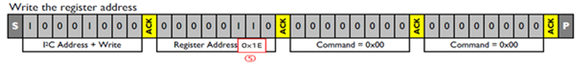<figcaption><p>ETH-01D</p></figcaption></figure>

**상위 Sensor ID 응답**

- Sensor ID 상위 바이트(16bit)를 읽음

<figure><figcaption><p>ETH-01D</p></figcaption></figure>


**Step 3. 하위 Sensor ID 요청 Command**

- Device에서 Command ((i2c Address+Write bit),0x1F(ID 하위 바이트), 0x00, 0x00)를 ETH-01D로 전송 후 120 μs 기다림

<figure>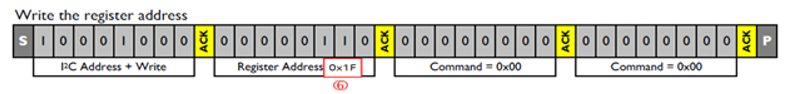<figcaption><p>ETH-01D</p></figcaption></figure>

**하위 Sensor ID 응답**

- Device에서 Command ((i2c Address+Write bit),0x1F(ID 하위 바이트), 0x00, 0x00)를 ETH-01D로 전송 후 120 μs 기다림

<figure>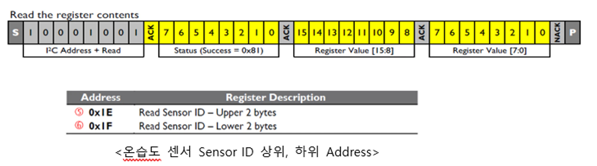<figcaption><p>ETH-01D</p></figcaption></figure>


### Address 읽기 및 쓰기

**Step 0. ETH-01D I2C command 전송**

- Device에서 Command ((i2c Address+Write bit),0xA0, 0x00, 0x00)를 ETH-01D로 전송

<figure><figcaption><p>ETH-01D</p></figcaption></figure>

**Sensor Address 요청 Command**

- Device에서 Command ((i2c Address+Write bit),0x1C, 0x00, 0x00)를 ETH-01D로 전송

<figure>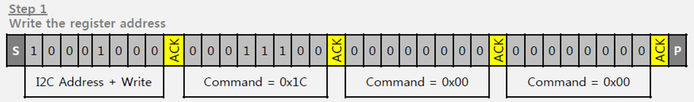<figcaption><p>ETH-01D</p></figcaption></figure>

**Step 2. Address 응답**

- ETH-01D에서 상태 값과 Address 값 응답(3byte)

<figure>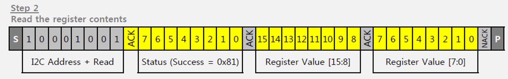<figcaption><p>ETH-01D</p></figcaption></figure>

**Step 3. Sensor Address 쓰기 Command**

- Device에서 Command ((i2c Address+Write bit),0x5C, Register Value[15:8], 변경할 address[7:0]) 를 ETH-01D로 전송
- 변경할 address[7:0] : Register value [6:0] 만 변경

<figure>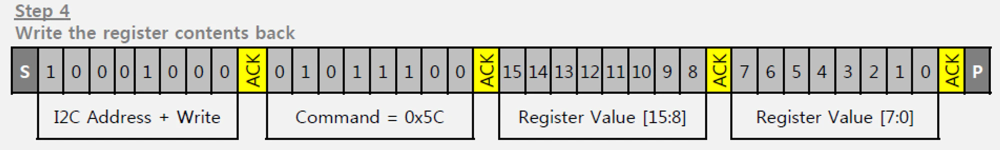<figcaption><p>ETH-01D</p></figcaption></figure>


## 아두이노 연결 및 예제 코드

### 아두이노 연결

<figure>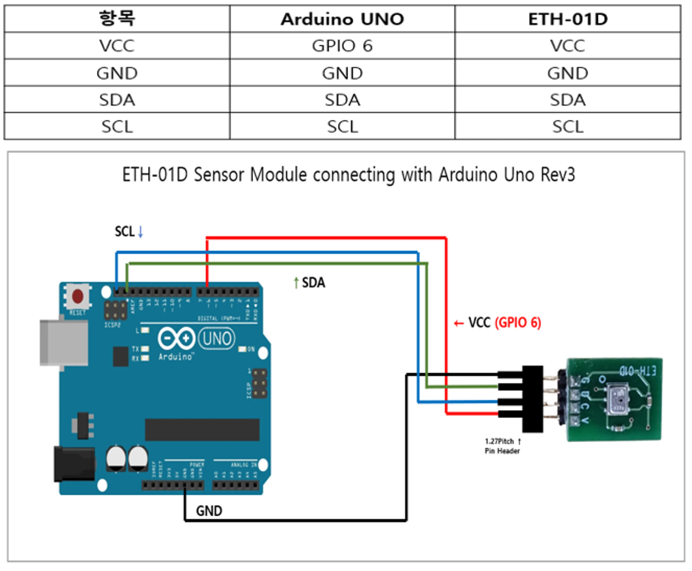<figcaption><p>ETH-01D</p></figcaption></figure>


### 센서 읽기 예제 코드

```c
#include <Arduino.h>
#include <Wire.h>
#define slave_address 0x44
#define Sensor_power_port 6 // Arduino uno, Arduino mkr 1010, esp32
// #define Sensor_power_port 16 // esp8266
#define Power_enable digitalWrite(Sensor_power_port, HIGH)
#define Power_disable digitalWrite(Sensor_power_port, LOW)
void setup()
{
Wire.begin();// arduino uno, Arduino mkr 1010
//Wire.begin(7,8,5000); //esp32
//Wire.begin(4,5,5000); //esp8266
Serial.begin(9600);
pinMode(Sensor_power_port, OUTPUT);
Power_enable;
}
void loop()
{
int HumidH;
int HumidL;
int TemperH;
int TemperL;
Wire.beginTransmission(slave_address);
Wire.endTransmission();
delay(34);
Wire.requestFrom(slave_address, 4);
if(Wire.available())
{
HumidH = Wire.read();
HumidL = Wire.read();
TemperH = Wire.read();
TemperL = Wire.read();
HumidH = HumidH & 0x3f; // Don't care bit mask
// *********** Humidity & Temperature calculation code changed ***************************
double RealH = (double)((HumidH * 256 ) + HumidL ) * 100/16383;
double RealT = (double)(((TemperH * 256) + TemperL)/4) * 165/16383 - 40;
Serial.print("T : "); Serial.print(RealT, 2);
Serial.print(" , ");
Serial.print("RH : "); Serial.println(RealH, 2);
delay(1000);
}
}
```

<figure>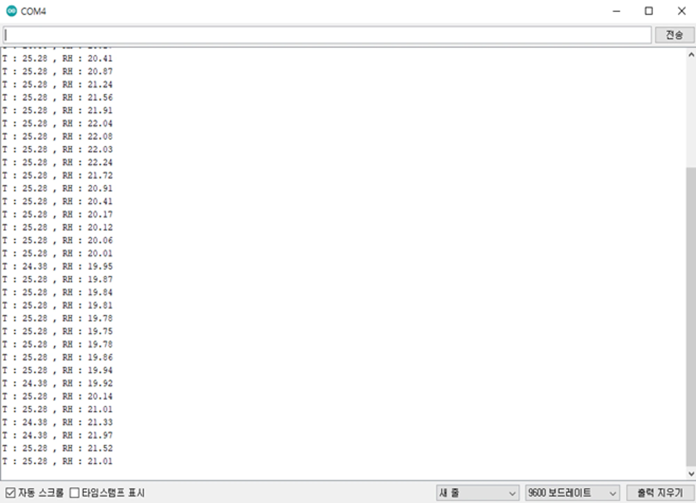<figcaption><p>ETH-01D</p></figcaption></figure>


### 센서 Resolution 읽기/쓰기 예제 코드

```c
#include <Wire.h>
#define slave_address 0x44
#define Sensor_power_port 6 // Arduino uno, Arduino mkr 1010, esp32
// #define Sensor_power_port 16 // esp8266
#define Power_enable digitalWrite(Sensor_power_port, HIGH)
#define Power_disable digitalWrite(Sensor_power_port, LOW)
#define Humidity_Resolution_read_command Wire.write(0x06) //Humidity Sensor Resolution – Read Register (bits [11:10])
#define Temperature_Resolution_read_command Wire.write(0x11) //Temperature Sensor Resolution – Read Register (bits [11:10])
#define Humidity_Resolution_write_command Wire.write(0x46) //Humidity Sensor Resolution – Write Register (bits [11:10])
#define Temperature_Resolution_write_command Wire.write(0x51) //Temperature Sensor Resolution – Write Register (bits [11:10])
void setup()
{
Wire.begin();// arduino uno, Arduino mkr 1010
//Wire.begin(7,8,5000); //esp32
//Wire.begin(4,5,5000); //esp8266
Serial.begin(9600);
pinMode(Sensor_power_port, OUTPUT);
}
void loop()
{
int Status;
int RegisterValueHigh;
int RegisterValueLow;
//===Module Power Reset===
Power_disable; //전원 끔
delay(1);
Power_enable;
delay(2); //10msec 이내에 신호 전송되어야함
// Step 1. ETH-01D I2C command 전송
//프로그래밍 모드로 들어가기 위한 명령, 명령어 처리 시까지 120usec 시간이 소요됨.
Wire.beginTransmission(slave_address);
Wire.write(0xA0);
Wire.write(0x00);
Wire.write(0x00);
Wire.endTransmission();
delayMicroseconds(120);
//Step 2. 온습도 Resolution 요청 Command
Wire.beginTransmission(slave_address);
Humidity_Resolution_read_command;
Wire.write(0x00);
Wire.write(0x00);
Wire.endTransmission();
delay(1);
//Step 3. 온습도 Resolution 응답
Wire.requestFrom(slave_address, 3);
if (Wire.available()) {
Status = Wire.read();
RegisterValueHigh = Wire.read();
RegisterValueLow = Wire.read();
Serial.print(Status, HEX);
Serial.print(" ");
Serial.print(RegisterValueHigh,HEX);
Serial.print(" ");
Serial.print(RegisterValueLow, HEX);
Serial.println(" <= Read the register contents");
}
//Step 4. 온습도 Resolution 쓰기 Command, 데이터 기록시간은 14msec가 필요함
Wire.beginTransmission(slave_address);
Humidity_Resolution_write_command;
Wire.write(0xC); // Sensor Resolution Change high bit
Serial.print("Write 0xC ");
Serial.println(" <= Write the register contents");
Wire.write(0x12); // Sensor Resolution low bit
Wire.endTransmission();
delay(14);
//Step 5. 프로그래밍 모드에서 일반 모드로 전환
Wire.beginTransmission(slave_address);
Wire.write(0x80);
Wire.write(0x00);
Wire.write(0x00);
Wire.endTransmission();
delay(1000);
}
```

<figure>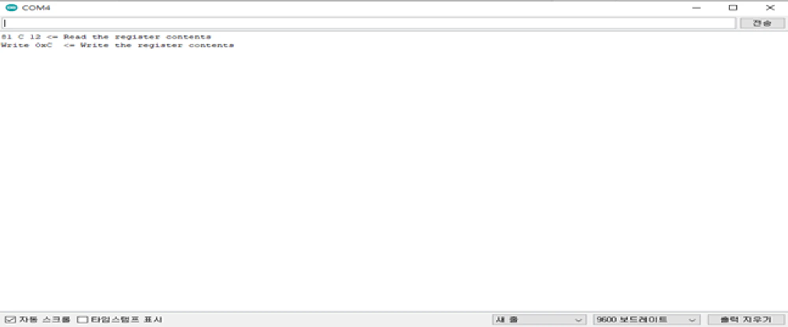<figcaption><p>ETH-01D</p></figcaption></figure>


### 센서 ID 읽기 예제 코드

```c
#include <Wire.h>
#define slave_address 0x44
#define Sensor_power_port 6 // Arduino uno, Arduino mkr 1010, esp32
//#define Sensor_power_port 16 //esp8266
#define Power_enable digitalWrite(Sensor_power_port, HIGH)
#define Power_disable digitalWrite(Sensor_power_port, LOW)
void setup()
{
Wire.begin(); // Arduino uno, Arduino mkr 1010
// Wire.begin(7,8,5000); //esp32
// Wire.begin(4,5,5000); //esp8266
Serial.begin(9600);
pinMode(Sensor_power_port, OUTPUT);
}
void loop()
{
int Status;
int RegisterValueHigh;
int RegisterValueLow;
//===Module Power Reset===
Power_disable;
delay(1);
Power_enable;
delay(2); //10msec 이내에 신호 전송되어야함
// 레지스터 주소 쓰기===
//프로그래밍 모드로 들어가기 위한 명령, 명령어 처리 시까지 120usec 시간이 소요됨.
Wire.beginTransmission(slave_address);
Wire.write(0xA0);
Wire.write(0x00);
Wire.write(0x00);
Wire.endTransmission();
delayMicroseconds(120);
//Sensor 상위 id 요청
Wire.beginTransmission(slave_address);
Wire.write(0x1E);
Wire.write(0x00);
Wire.write(0x00);
Wire.endTransmission();
delay(1);
//Sensor 상위 id 응답
Wire.requestFrom(slave_address, 3);
if (Wire.available()) {
Status = Wire.read();
RegisterValueHigh = Wire.read();
RegisterValueLow = Wire.read();
Serial.print(" Sensor id_high: ");
Serial.print(Status, HEX); // status success = 0x81
Serial.print(" ");
Serial.print(RegisterValueHigh, HEX);
Serial.print(" ");
Serial.println(RegisterValueLow, HEX);
}
//Sensor 하위 id 요청
Wire.beginTransmission(slave_address);
Wire.write(0x1F);
Wire.write(0x00);
Wire.write(0x00);
Wire.endTransmission();
delay(1);
//Sensor 하위 id 응답
Wire.requestFrom(slave_address, 3);
if (Wire.available()) {
Status = Wire.read();
RegisterValueHigh = Wire.read();
RegisterValueLow = Wire.read();
Serial.print(" Sensor id_low: ");
Serial.print(Status, HEX); // status success = 0x81
Serial.print(" ");
Serial.print(RegisterValueHigh, HEX);
Serial.print(" ");
Serial.println(RegisterValueLow, HEX);
}
// 프로그래밍 모드에서 일반 모드로 전환
Wire.beginTransmission(slave_address);
Wire.write(0x80);
Wire.write(0x00);
Wire.write(0x00);
Wire.endTransmission();
delay(1000);
}
```


### Address 읽기 및 쓰기 예제 코드

```c
#include <Wire.h>
#define slave_address 0x44
#define change_slave_address 0x44 // <- This address is subject to change
#define Sensor_power_port 6 // Arduino uno, Arduino mkr 1010, esp32
// #define Sensor_power_port 16   // esp8266
#define Power_enable digitalWrite(Sensor_power_port, HIGH)
#define Power_disable digitalWrite(Sensor_power_port, LOW)
#define Address_read_command  Wire.write(0x1C)
#define Address_write_command  Wire.write(0x5C)   

void setup()
{
  Wire.begin();// arduino uno,  Arduino mkr 1010
  //Wire.begin(7,8,5000); //esp32
  //Wire.begin(4,5,5000); //esp8266
  Serial.begin(9600);
  pinMode(Sensor_power_port, OUTPUT);
}
void loop()
{
  int Status;
  int RegisterValueHigh;
  int RegisterValueLow;

  //===Module Power Reset===
  Power_disable; //전원 끔
  delay(1);  
  Power_enable;
  delay(2);  //10msec 이내에 신호 전송되어야함

  // Step 1. ETH-01D I2C command 전송
  //프로그래밍 모드로 들어가기 위한 명령, 명령어 처리 시까지 120usec 시간이 소요됨.
  Wire.beginTransmission(slave_address);
  Wire.write(0xA0);
  Wire.write(0x00);
  Wire.write(0x00);
  Wire.endTransmission();
  delayMicroseconds(120);

  //Step 2. 온습도 Address 요청 Command
  Wire.beginTransmission(slave_address);
  Address_read_command;
  Wire.write(0x00);
  Wire.write(0x00);
  Wire.endTransmission();
  delay(1);

  //Step 3. 온습도 Address 응답  ex)81 00 44
  Wire.requestFrom(slave_address, 3);

  if (Wire.available()) {
    Status = Wire.read();
    RegisterValueHigh = Wire.read();
    RegisterValueLow = Wire.read();
    Serial.print(Status, HEX); // 0x81 = status succes
    Serial.print(" ");
    Serial.print(RegisterValueHigh,HEX);
    Serial.print(" ");
    Serial.print(RegisterValueLow, HEX);
    Serial.println(" <= Read the register contents");
  }
  // adress 읽은 뒤 [6:0] 비트만 변경 
  #if 0   // adress 읽은 뒤 #if 0 -> #if  1
  //Step 4. 온습도 Address 쓰기 Command, 데이터 기록시간은 14msec가 필요함
  Wire.beginTransmission(slave_address);
  Address_write_command;
  Wire.write(0x00);      
  Wire.write(change_slave_address);     // 변경 할 address write  
  Wire.endTransmission();
  delay(14);
  Serial.print(change_slave_address, HEX);
  Serial.println(" <= Write the register contents");
  #endif
 //Step 5. 프로그래밍 모드에서 일반 모드로 전환
  Wire.beginTransmission(slave_address);
  Wire.write(0x80);
  Wire.write(0x00);
  Wire.write(0x00);
  Wire.endTransmission();
  delay(1000);
}
```

<figure>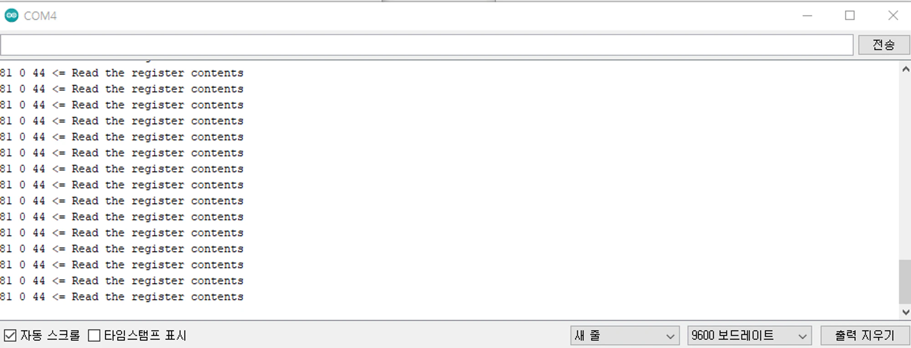<figcaption><p>ETH-01D</p></figcaption></figure>


