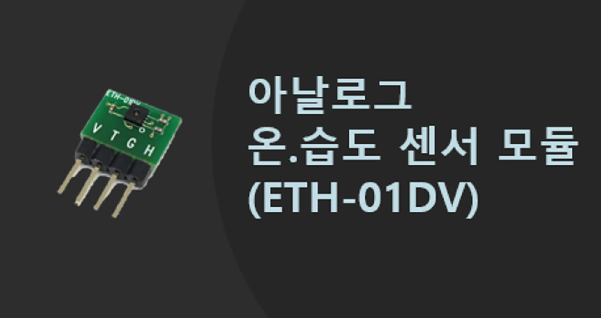
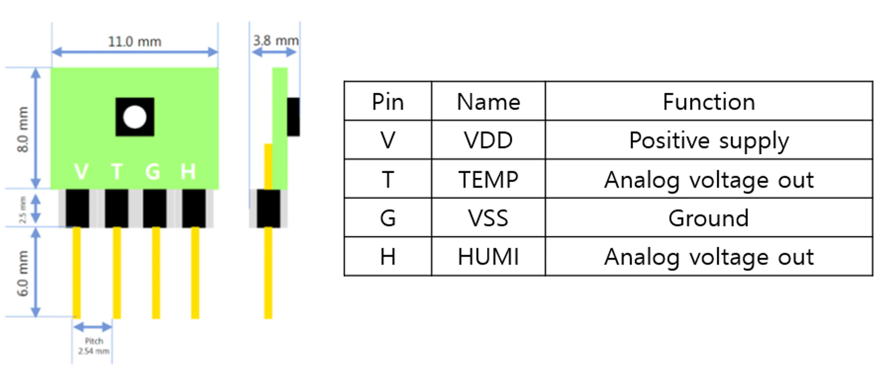
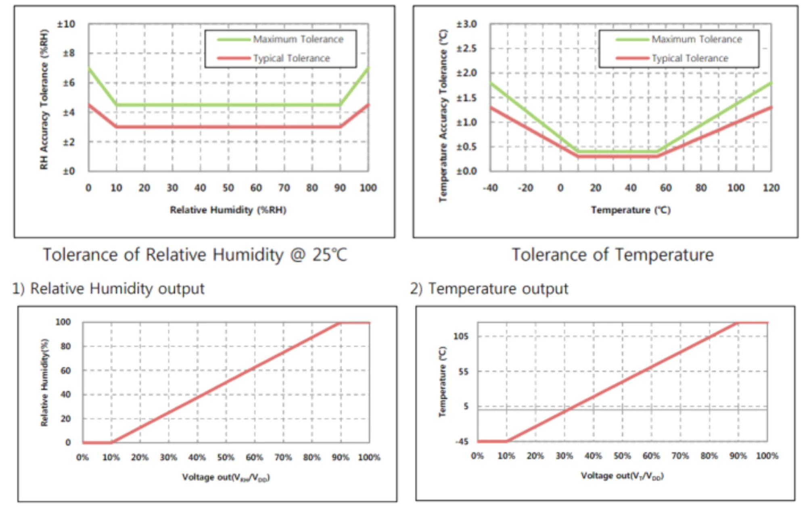
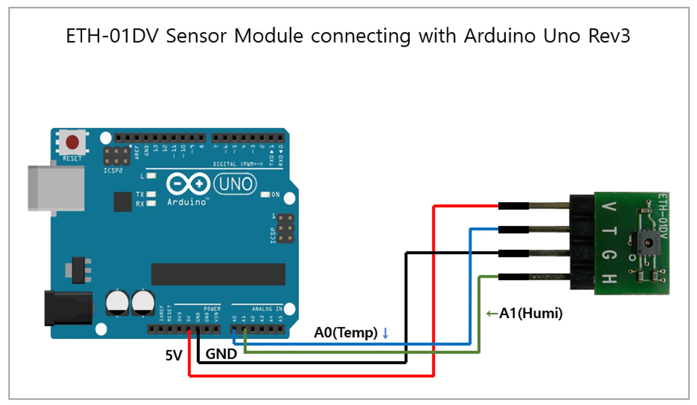
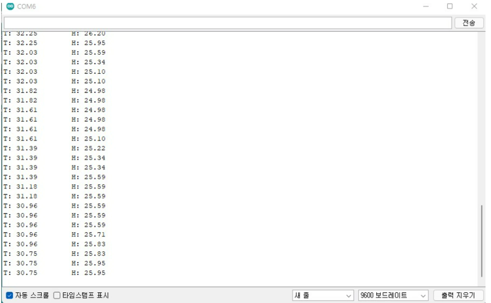

# 온습도센서(아날로그)

<!-- 메인 이미지 
<figure><figcaption><p>ETH-01DV</p></figcaption></figure>
-->

## 어플리케이션

- 기상 관측
- 데이터로거
- 가전제품
- 냉난방 공조 시스템
- 자동차습도계
- 의료자동화기기

## 제품 사양

| 항목 | 내용                                                                            |
| --- | -------------------------------------------------------------------------------- |
| 측정 범위 | 온도: -40~ 125℃<br><br>습도: 0~100%RH |
| 습도 정확성(@ 25°C) | 10 to 90%RH : ±3.0%RH<br><br>< 10 , 90%RH > : 4.5%RH |
| 온도 정확성 | 10 to 55°C: ±0.3°C<br><br>< 10, 55°C> :±1.3°C |
| 전원 전압 | 최소:2.4V 평균:3.3V 최대:5.5V |
| 소모 전류 | 평균: 217㎂ |
| 보관 온도 | -40 ~ 150°C |
| 응답 시간 | 17.3msec < 온 습도 |
| 센서 치수 | L x W x H(16.5mm x 11mm x 3.8mm) |
| 헤더 핀 | 2.54mm |

## 제품 크기 및 핀 특성
<figure><figcaption><p>ETH-01DV Dimension</p></figcaption></figure>
<figure><figcaption><p>ETH-01DV graph</p></figcaption></figure>


## 출력 값 계산 식

> - **Relative Humidity Output**\
>   RH[%] = -10/0.8 + 100/0.8 x VRH/VDD RH : Relative Humidity(%) VRH : Relative Humidity\
>   Voltage Out VDD : Supply Voltage

> - **Temperature Output**\
>   T[°C] = -45 - 17.5/0.8 + 175/0.8 x VT/VDD T : Temperature(°C) VT : Temperature Voltage Output\
>   VDD : Supply Voltage

## 아두이노 연동 예제 코드

### 아두이노 연결
<figure><figcaption><p>ETH-01DV arduino</p></figcaption></figure>

### 소스 코드(10bit adc)

```c
void setup() {
  Serial.begin(9600);
}
 
void loop() {
  float T = analogRead(A0);
  float H = analogRead(A1);
 
  Serial.print("T: ");
  Serial.print( -66.875 + 218.75 * T / 1024);
  Serial.print("\tH: ");
  Serial.println( -12.5 + 125 * H / 1024);
  delay(1000);
}
```
<figure><figcaption><p>ETH-01DV Serial monitor</p></figcaption></figure>
