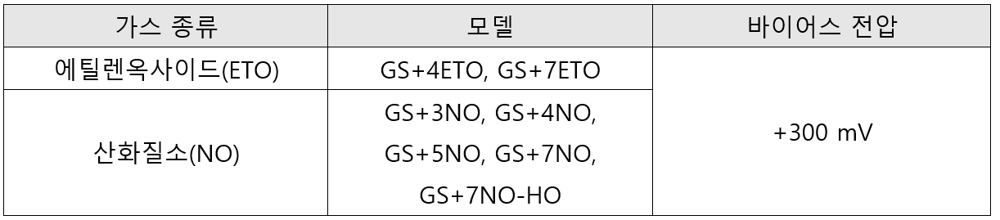

# 바이어스 센서

<figure><figcaption></figcaption></figure>

<figure><figcaption>
&#x3C;GS+4ETO>
</figcaption></figure>

<figure><figcaption></figcaption></figure>

ex) VREF = +2.5V, R3= 22K, R4 = 3K

&#x20;              U1.2(+) V = VREF \*R3/(R3+R4)  = +2.5V \*(22K/22K+3K)  = + 2.2V &#x20;

&#x20;               Vsense = +2.5V, VREF = 2.2V

&#x20;               Biased Voltage = Vsense - VREF = 2.5V – 2.2V = 0.3V = +300mV
