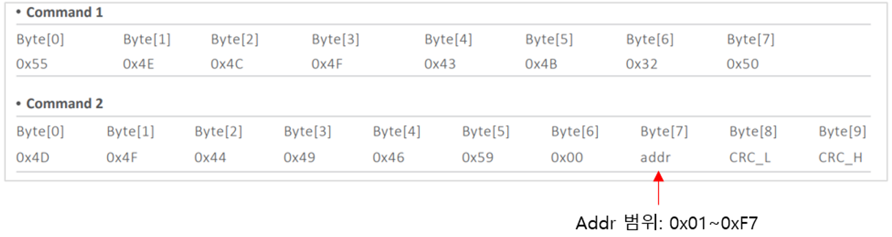
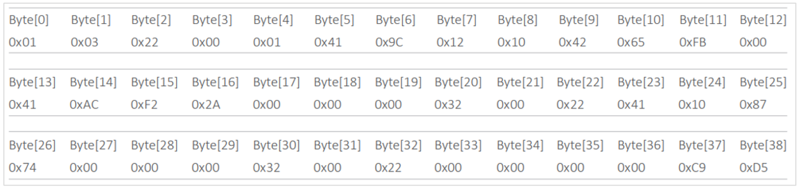
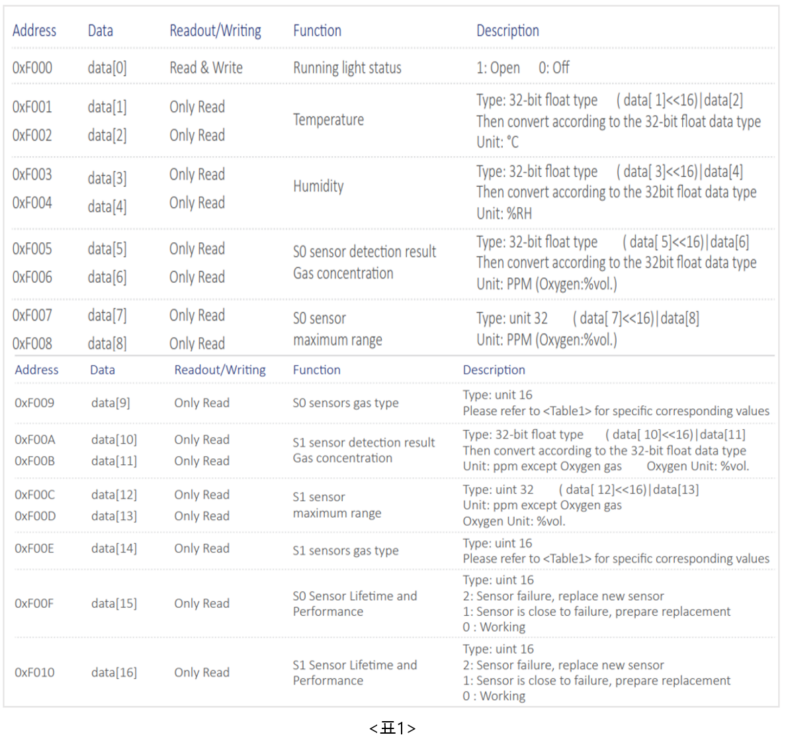
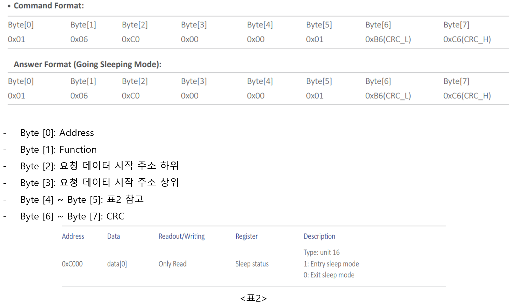
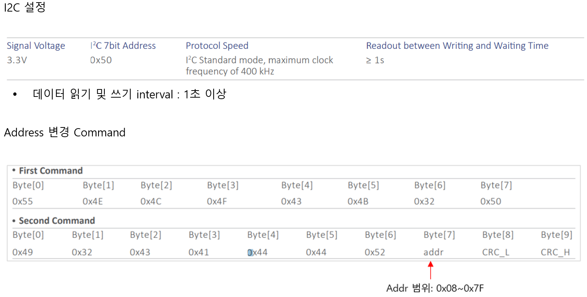
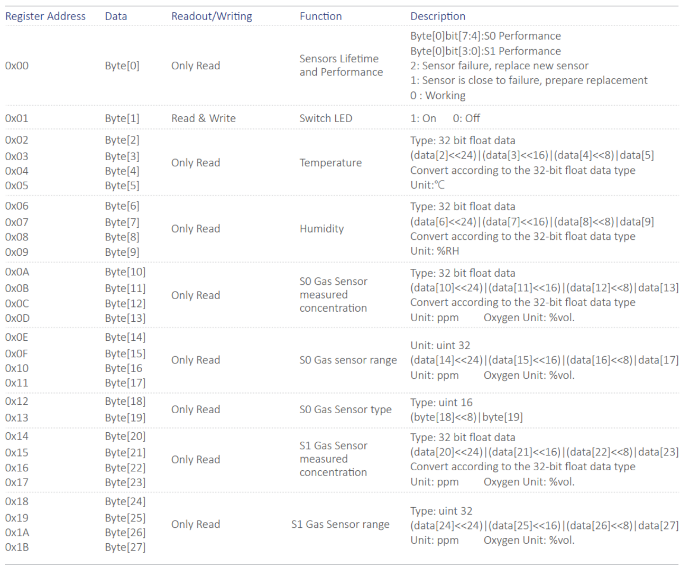
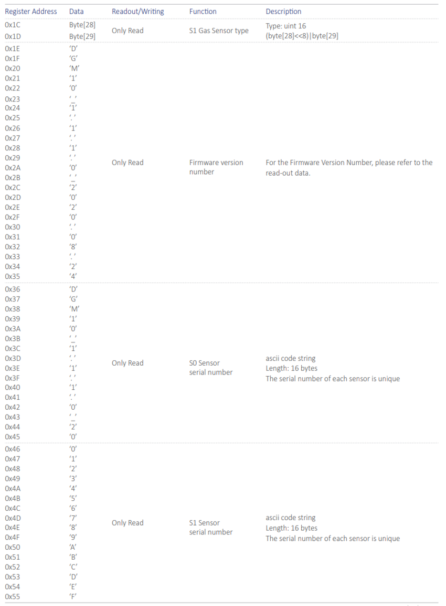
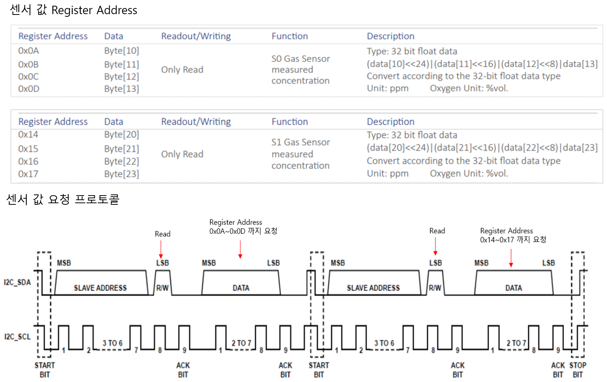

# 통신 프로토콜

## UART Modbus-RTU

* UART 설정

| PARAMETER      | TYP        |
| -------------- | ---------- |
| Signal Voltage | 3.3V       |
| Baud Rate      | 115200 bps |
| Data Bits      | 8          |
| Parity         | None       |
| Stop Bits      | 1          |

* 전송 모드: Modbus-RTU
* Slave address: 01
* 데이터 읽기 및 쓰기 interval : 1초 이상

통신 프로토콜 Function Command

| Function | Description |
| -------- | ----------- |
| 0x03     | 레지스터 읽기     |
| 0x06     | 단일 레지스터 쓰기  |
| 0x10     | 다중 레지스터 쓰기  |

### 모듈 Address 변경

\- 센서의 모듈의 주소를 변경할 경우 단일 제품의 주소를 하나씩 수정해야 됨

<figure><figcaption></figcaption></figure>

### 센서 값 읽기

* 센서 값 요청 Command

<figure><figcaption></figcaption></figure>

\- Byte \[0]: Address

\- Byte \[1]: Function

\- Byte \[2]: 요청 데이터 시작 주소 하위

\- Byte \[3]: 요청 데이터 시작 주소 상위

\- Byte \[4]: 요청 데이터 개수 하위

\- Byte \[5]: 요청 데이터 개수 상위

\- Byte \[6] \~ Byte \[7]: CRC

* 센서 값 요청 응답

<figure><figcaption></figcaption></figure>

\- Byte \[0]: Address

\- Byte \[1]: Function

\- Byte \[2]]: 데이터 개수

\- Byte \[4]\~ Byte \[36] : 하단 표 1 참고

\- Byte \[37] \~ Byte \[38]: CRC

<figure><figcaption></figcaption></figure>

### Sleep Mode

<figure><figcaption></figcaption></figure>

## I2C 통신 프로토콜

<figure><figcaption></figcaption></figure>

### I2C 전체 Register Address

<figure><figcaption></figcaption></figure>

<figure><figcaption></figcaption></figure>

### 센서 값 읽기

<figure><figcaption></figcaption></figure>
