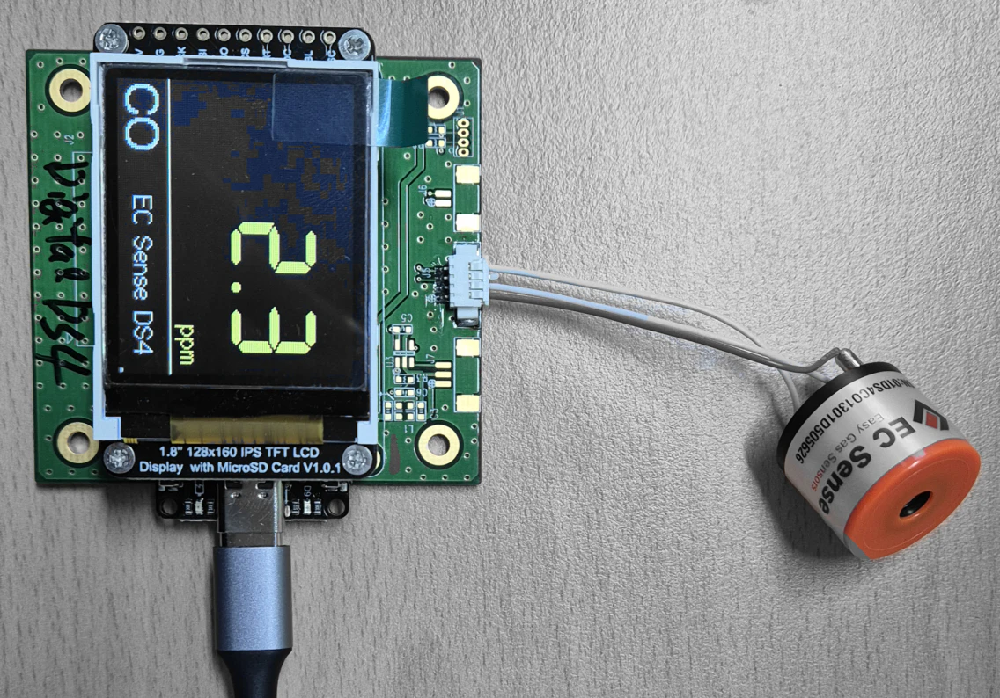
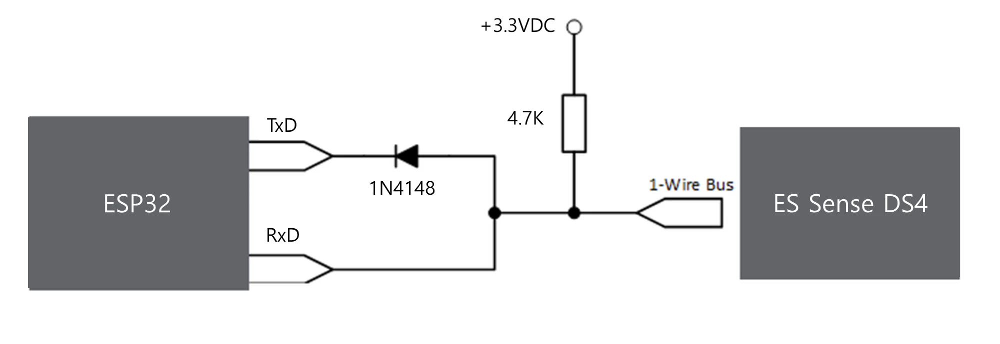
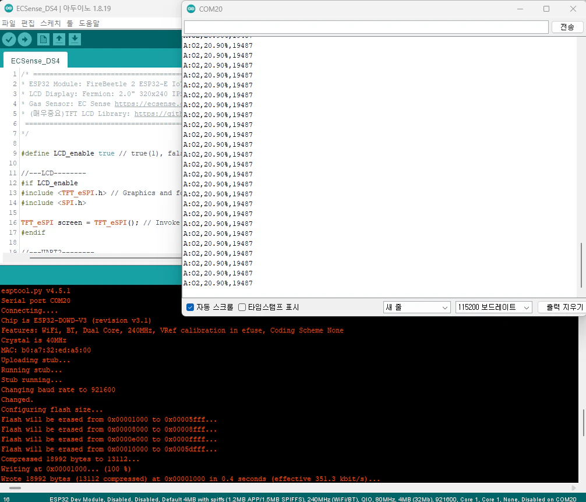

# EC Sense DS4 Series


* 센서의 금속핀에 납땜(솔더링) 금지, 센서 소켓사용 필수


## 1. 테스트 환경

* ESP32 Module: FireBeetle 2 ESP32-E IoT Microcontroller(DFR0654) [https://www.dfrobot.com/product-2195.html](https://www.dfrobot.com/product-2195.html)
*   LCD Display: Fermion: 2.0" 320x240 IPS TFT LCD(DFR0664)

    [https://www.dfrobot.com/product-2071.html](https://www.dfrobot.com/product-2071.html)
*   Gas Sensor: EC Sense DS4 Series

    [https://ecsense.com/](https://ecsense.com/)
*   TFT LCD Library\*\*("User\_setup.h"파일 수정 필요)

    [https://github.com/Bodmer/TFT\_eSPI](https://github.com/Bodmer/TFT\_eSPI)

    <figure><figcaption><p>EC Sense DS4 + LCD</p></figcaption></figure>

## 2. DS4 Datasheet

[4\_DS4-CO Smart Gas Sensor\_Datasheet\_V0.2\_20240202.pdf](ds4image/4\_DS4-CO%20Smart%20Gas%20Sensor\_Datasheet\_V0.2\_20240202.pdf)

[DS4\_UART Interface - AQS Protocol\_V0.1\_20240301.pdf](ds4image/DS4\_UART%20Interface%20-%20AQS%20Protocol\_V0.1\_20240301.pdf)

## 3. UART 통신 하드웨어 구성 방법

<figure><figcaption><p>EC Sense DS4 circuit</p></figcaption></figure>

## 4. 아두이노 코드

> LCD를 사용하지 않을때 #define LCD\_enable true => #define LCD\_enable false로 변경

```cpp
/* ===============================================================================================================
* ESP32 Module: FireBeetle 2 ESP32-E IoT Microcontroller(DFR0654) https://www.dfrobot.com/product-2195.html
* LCD Display: Fermion: 2.0" 320x240 IPS TFT LCD(DFR0664) https://www.dfrobot.com/product-2071.html
* Gas Sensor: EC Sense https://ecsense.com/
* (매우중요)TFT LCD Library: https://github.com/Bodmer/TFT_eSPI ("User_setup.h"파일 수정 후 아두이노 .ZIP 라이브러리 추가)
 ===============================================================================================================
*/

#define LCD_enable true // true(1), false(0)

//---LCD--------
#if LCD_enable
#include <TFT_eSPI.h> // Graphics and font library for ST7735 driver chip
#include <SPI.h>

TFT_eSPI screen = TFT_eSPI(); // Invoke library, pins defined in User_Setup.h
#endif

//---UART2--------
#define RXD2 16
#define TXD2 17
int Uart2ReceiveLength = 0;

//---DS4 SENSOR---------
#define SendCmd_Gas_name_Value_unit 0x41

String DS4_GasSensorName;
String DS4_GasSensorUnit;
float DS4_GasSensorValue;

uint16_t DS4_get_modbus_crc(uint8_t *buffer, uint16_t len) // 수신 data, CRC 계산
{
  uint16_t wcrc = 0XFFFF;
  uint8_t temp;
  uint16_t i = 0, j = 0;

  for (i = 0; i < len; i++)
  {
    temp = *buffer & 0X00FF;
    buffer++;
    wcrc ^= temp;
    for (j = 0; j < 8; j++)
    {
      if (wcrc & 0X0001)
      {
        wcrc >>= 1;
        wcrc ^= 0XA001;
      }
      else
      {
        wcrc >>= 1;
      }
    }
  }

  wcrc = wcrc << 8 | wcrc >> 8; // little endian (LSB fist)

  // Serial.print("** wcrc");
  // Serial.println(wcrc, HEX);
  return wcrc;
}

#if LCD_enable
void Lcdvaluedisplay(void)
{
  char buffer[10];
  static bool blink_icon = 0;
  static bool Display_clear_flag = 0;

  screen.setTextColor(TFT_YELLOW, TFT_BLACK);
  screen.drawRightString(String(DS4_GasSensorValue, 1), 150, 20, 7); // 7 segment Display
  screen.drawRightString(DS4_GasSensorUnit, 155, 82, 2);

  screen.setTextColor(TFT_WHITE, TFT_BLACK);
  screen.drawCentreString(DS4_GasSensorName, 20, 105, 4);

  screen.setTextColor(TFT_WHITE, TFT_BLACK);
  screen.drawRightString("EC Sense DS4", 150, 107, 2);

  if (blink_icon == 0) // ESP32 Active icon(dot)
  {
    screen.setTextColor(TFT_WHITE, TFT_BLACK);
    screen.drawCentreString(".", 159, 115, 2);
    blink_icon = 1;
  }
  else
  {
    screen.setTextColor(TFT_LIGHTGREY, TFT_BLACK);
    screen.drawCentreString(".", 159, 115, 2);
    blink_icon = 0;
  }

}
#endif

void setup()
{
  Serial.begin(115200);
  Serial2.begin(9600, SERIAL_8N1, RXD2, TXD2); // Sensor connection port
  delay(1000);

#if LCD_enable
  screen.init();
  delay(100);
  screen.setRotation(1);

  screen.fillScreen(TFT_BLACK);
  screen.setTextColor(TFT_WHITE);
  screen.drawLine(0, 100, 160, 100, TFT_WHITE);
#endif
}

void loop()
{
  uint8_t i;
  uint8_t ReceiveLength;
  uint16_t ReceiveChecksum, CalChecksum;               // checksum
  uint8_t index0, index1, index2, index3;              // 수신 데이터 위치 확인
  String AllDataString;                                     // 수신데이터 전체 저장
  String CMDString, GasNameString, GasVelueUnitString; // 수신 데이터 개별 저장

  unsigned char ChecksumBufferChar[30] = {0};

#if LCD_enable
  Lcdvaluedisplay();
#endif

  Serial2.write(SendCmd_Gas_name_Value_unit); // 센서 데이터 요청
  delay(500);

  if (Serial2.available())
  {
    // 수신 데이터 예시: A:O2,20.90%,19487\r\n   (전체 길이는 가변됨)
    // 수신 데이터 형식: SendCommand A: Gas name O2, Gas Value 20.90 unit %, checksum CR, LF

    AllDataString = Serial2.readStringUntil('\n');
    Serial.println(AllDataString); // 수신 데이터 출력

    // 수신 데이터 항복별 위치 확인
    index0 = AllDataString.indexOf(':');
    index1 = AllDataString.indexOf(',', index0 + 1);
    index2 = AllDataString.indexOf(',', index1 + 1);
    index3 = AllDataString.indexOf('\r', index2 + 1);
    //Serial.println("Step1: " + String(index0) + " " + String(index1) + " " + String(index2) + " " + String(index3));

    // 수신 데이터 항목별 저장
    CMDString = AllDataString.substring(0, index0);                        // "A"
    GasNameString = AllDataString.substring(index0 + 1, index1);           // 가스명
    GasVelueUnitString = AllDataString.substring(index1 + 1, index2);      // 농도 및 단위값
    ReceiveChecksum = AllDataString.substring(index2 + 1, index3).toInt(); // checksum

    //Serial.print("Step2: " + CMDString + ":" + GasNameString + "," + GasVelueUnitString + "," + String(ReceiveChecksum) + "\r\n");

    strcpy((char *)ChecksumBufferChar, AllDataString.c_str()); // String -> char 버퍼에 담기
    ReceiveLength = strlen((char *)ChecksumBufferChar);   // char 버퍼 데이터 길이 확인

    for (i = 1; i < ReceiveLength; i++)
    {
      ChecksumBufferChar[i - 1] = ChecksumBufferChar[i]; // 왼쪽으로 1바이트 이동,  요청 Command "A" 제거
    }

    CalChecksum = DS4_get_modbus_crc(ChecksumBufferChar, index2); // CRC 값 생성

    //Serial.print("Step3: Calcchecksum " + String(CalChecksum) + " ReceiveChecksum " + String(ReceiveChecksum) + "\r\n");

    if (CalChecksum == ReceiveChecksum) // 수신데이터 CRC와  CRC 계산값이 동일 하면
    {

      DS4_GasSensorName = GasNameString;
      DS4_GasSensorValue = GasVelueUnitString.toFloat();

      if (ChecksumBufferChar[index2 - 2] == 'm') //(%, m, b l)
        DS4_GasSensorUnit = "ppm";
      else if (ChecksumBufferChar[index2 - 2] == '%')
        DS4_GasSensorUnit = "%vol";
      else if (ChecksumBufferChar[index2 - 2] == 'b')
        DS4_GasSensorUnit = "ppb";
      else
        DS4_GasSensorUnit = " ";

     // Serial.println("Step4: name:" + DS4_GasSensorName + " value: " + String(DS4_GasSensorValue, 2) + " unit: " + DS4_GasSensorUnit);
    }
    else
    {
      DS4_GasSensorUnit = "err"; // 단위 표시 위치에 "err" 메시지 표시
    }
  }
}

```

## 5. 동작 화면

<figure><figcaption><p>EC Sense DS4 serial monitor</p></figcaption></figure>

> 참고: 적용 LCD port 설정 파일(User\_setup.h)

```cpp
// ##################################################################################
//
//            LCD라이브러리  User_setup.h
//
// ##################################################################################

#define USER_SETUP_INFO "User_Setup"

#define ST7735_DRIVER // Define additional parameters below for this display

#define TFT_WIDTH 128
#define TFT_HEIGHT 160
#define ST7735_GREENTAB2

#define TFT_MISO 19 // Automatically assigned with ESP8266 if not defined
#define TFT_MOSI 23 // Automatically assigned with ESP8266 if not defined
#define TFT_SCLK 18 // Automatically assigned with ESP8266 if not defined

#define TFT_CS 14  // Chip select control pin D8
#define TFT_DC 25  // Data Command control pin
#define TFT_RST 26 // Reset pin (could connect to NodeMCU RST, see next line)


#define LOAD_GLCD  // Font 1. Original Adafruit 8 pixel font needs ~1820 bytes in FLASH
#define LOAD_FONT2 // Font 2. Small 16 pixel high font, needs ~3534 bytes in FLASH, 96 characters
#define LOAD_FONT4 // Font 4. Medium 26 pixel high font, needs ~5848 bytes in FLASH, 96 characters
#define LOAD_FONT6 // Font 6. Large 48 pixel font, needs ~2666 bytes in FLASH, only characters 1234567890:-.apm
#define LOAD_FONT7 // Font 7. 7 segment 48 pixel font, needs ~2438 bytes in FLASH, only characters 1234567890:-.
#define LOAD_FONT8 // Font 8. Large 75 pixel font needs ~3256 bytes in FLASH, only characters 1234567890:-.
//#define LOAD_FONT8N // Font 8. Alternative to Font 8 above, slightly narrower, so 3 digits fit a 160 pixel TFT
#define LOAD_GFXFF // FreeFonts. Include access to the 48 Adafruit_GFX free fonts FF1 to FF48 and custom fonts

// Comment out the #define below to stop the SPIFFS filing system and smooth font code being loaded
// this will save ~20kbytes of FLASH
#define SMOOTH_FONT

#define SPI_FREQUENCY 20000000
// Optional reduced SPI frequency for reading TFT
#define SPI_READ_FREQUENCY 20000000

// The XPT2046 requires a lower SPI clock rate of 2.5MHz so we define that here:
#define SPI_TOUCH_FREQUENCY 2500000

```
