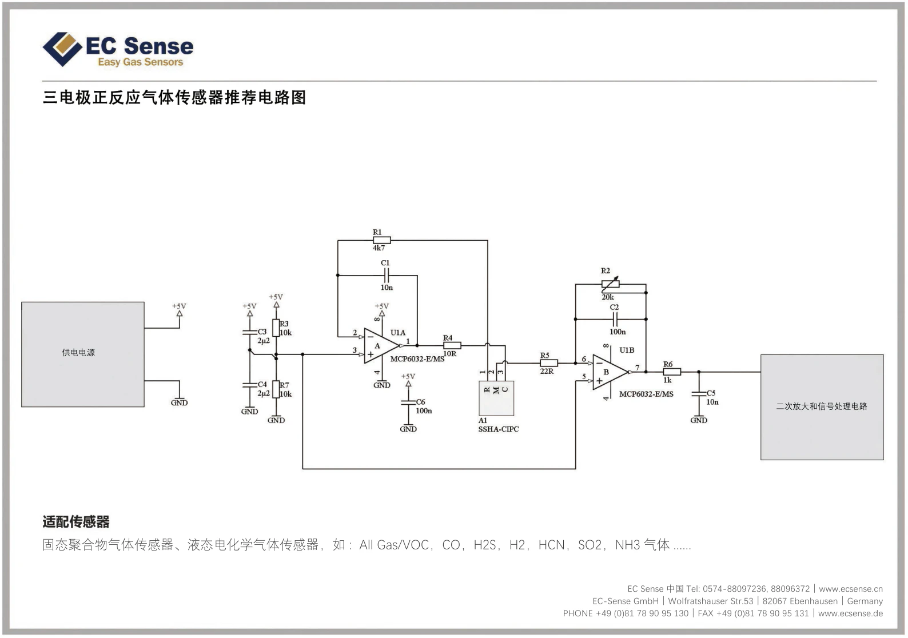
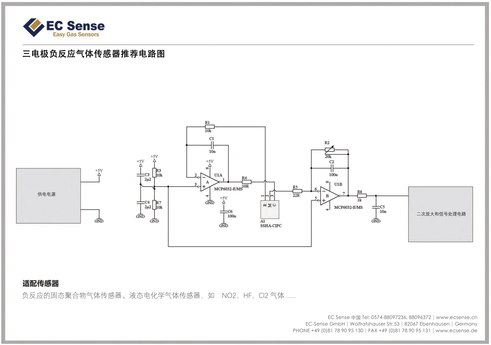
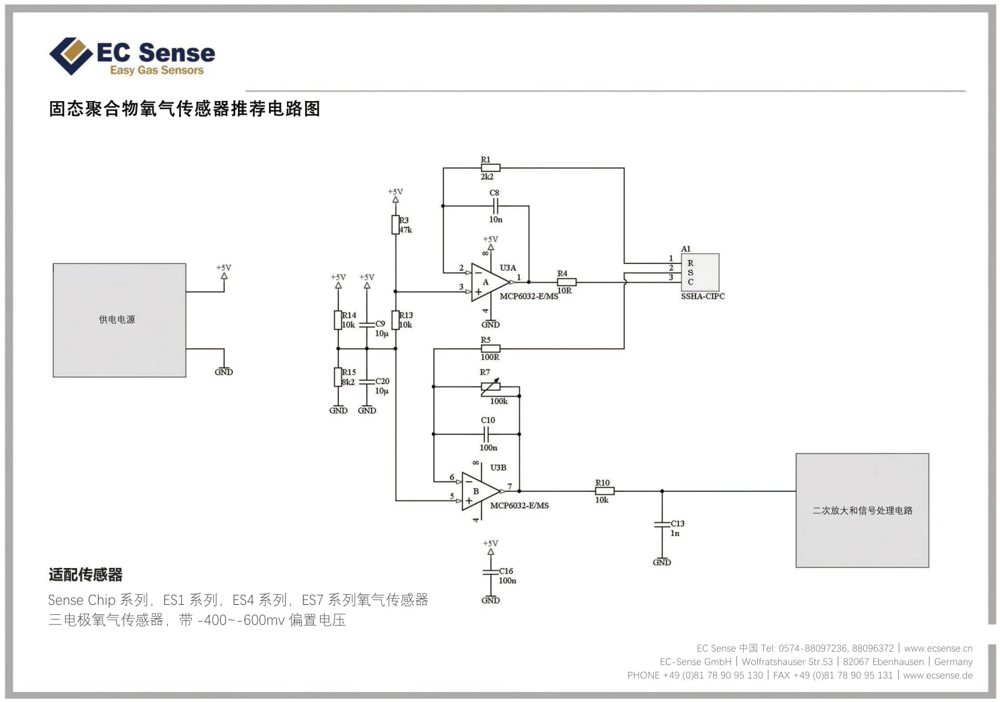

# EC Sense 전기화학식 구동 회로

## 구동 회로

### 3 전극 양극 반응 가스 센서의 권장 회로도

- 적용 센서: 고체 폴리머 가스센서, 액체 전기 화학식 가스 센서

<figure><figcaption>
EC Sense chemical circuit
</figcaption></figure>

### 3 전극 음극 반의 가스 센서의 권장 회로도

- 적용 센서: NO2, HFC2 가스와 같은 액체 전기 화학식 가스 센서

<figure><figcaption>
EC Sense chemical circuit
</figcaption></figure>

### 고체 폴리머 산소 센서의 권장 회로

- 적용 센서: ES1, ES4, ES7 시리즈의 산소 센서
- -400 ~ 600mV 바이어스 전압의 3 전극 가스 센서

<figure><figcaption>
EC Sense chemical circuit
</figcaption></figure>
