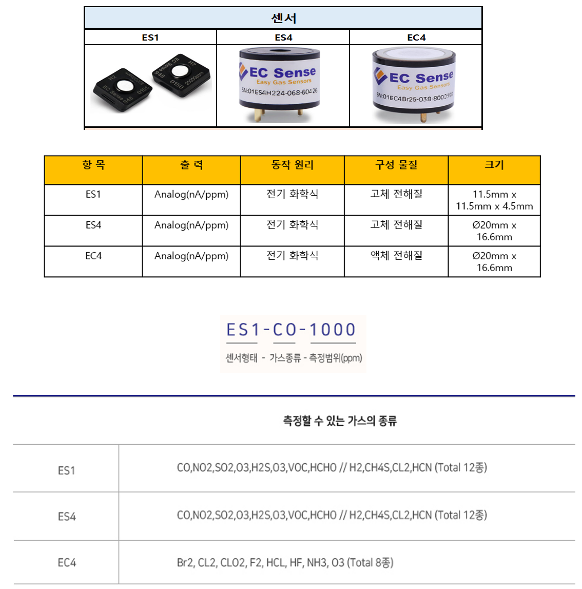

# 센서 종류

**배경지식**

전기화학식 센서:

* 측정된 가스와 화학 반응을 일으키고 기체 농도에 비례하는 전류를 발생시키게 되고 그 전류의 세기를 통해서 가스농도를 측정함
* 출력 선형 성, 저전력 소모, 우수한 분해능, 뛰어난 반복성 및 정확도
* 가스와의 화학반응에 따른 전류 신호를 출력하는 센서 사용할수록 소모되기 때문에 수명이 있음

**전기화학식 센서 주의사항**

* 센서에 직접 Soldering 진행 시 내부의 패턴이 고온으로 끊어질 수 있으므로 Soldering을 하면 안됨
* 전용 Socket을 사용 권장
* 센서에 따른 감도가 차이가 있기 때문에 회로를 구성한 이후 개별 가스 교정이 필요(교정 Cap 필요)
* 가스 교정설비가 없을 경우, 모듈 type의 센서를 사용 권장

<figure><figcaption></figcaption></figure>

## ES1, ES4, EC4(전기화학식 센서)

<figure><figcaption></figcaption></figure>

### 가스 종류 및 측정 범위

<figure><figcaption></figcaption></figure>

※ 감도, 범위, 분해능, 응답시간, 바이어스 전압, Load 저항 등 가스종류 및 측정범위에 따라 달라지므로 센서 선정 후 모델 별 Datasheet 참고

## 특징

* 다양한 가스를 높은 선택도로 감지합니다.
* 긴 수명 > 5년
* 중독 방지
* 빠른 응답 시간과 안정적인 제로 리턴 시간
* 선형 출력
* 누출 없음
* 작음 소음
* 전력 소비 없음
* 작은 크기
* 40° \~ +55°C의 넓은 작동 온도 범위
* RoHS 승인 환경 설계

## 애플리케이션&#x20;

* 보건 의료
* 실내 공기 질(IAQ)
* 스마트 홈
* 산업용 가스 모니터링
* 소방
* IoT 어플리케이션
* 스포츠 과학
* 난방, 환기 및 공기 조절
* 누출 감지

## 제품 크기 및 핀 특성

<figure><figcaption></figcaption></figure>

전기화학식 센서 회로도 및 Diagram

<figure><figcaption></figcaption></figure>

<figure><figcaption></figcaption></figure>

