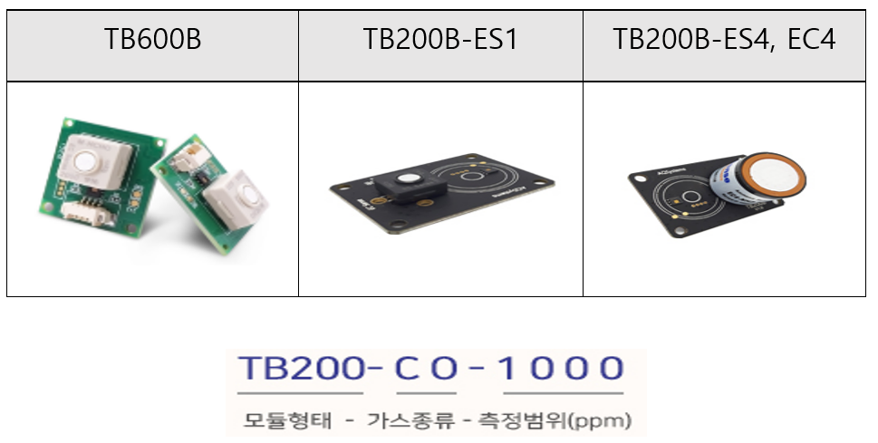
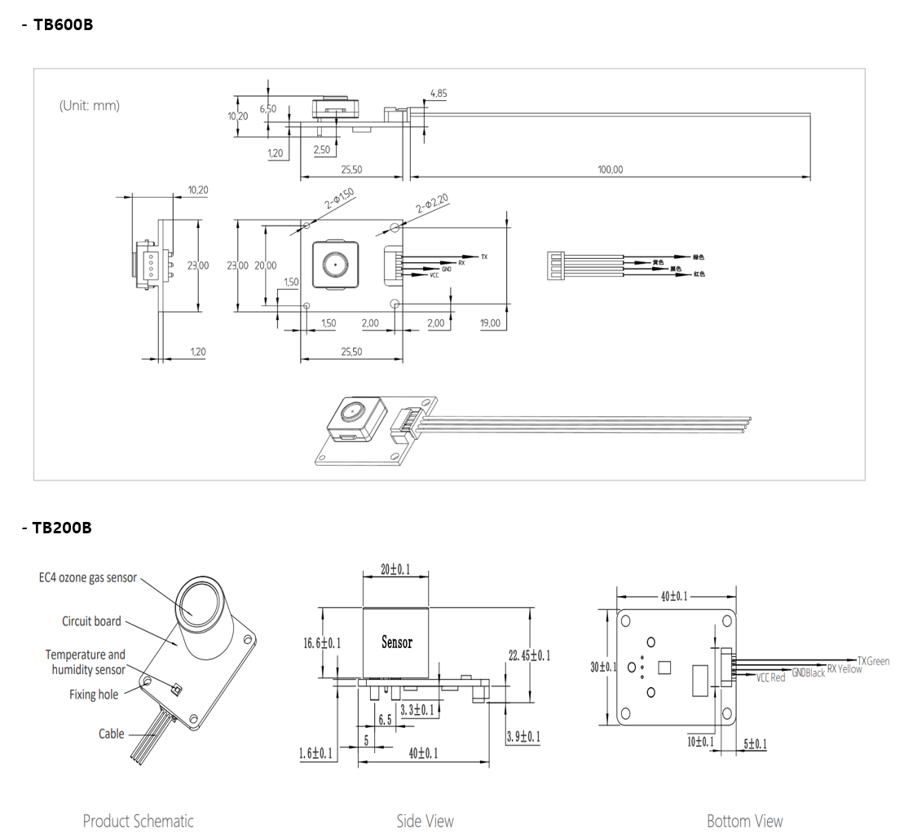
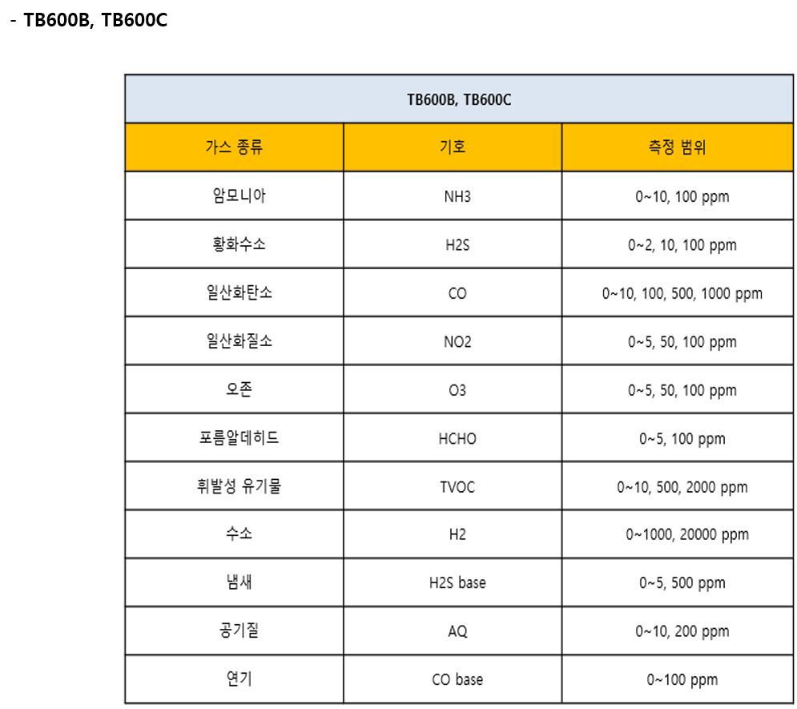
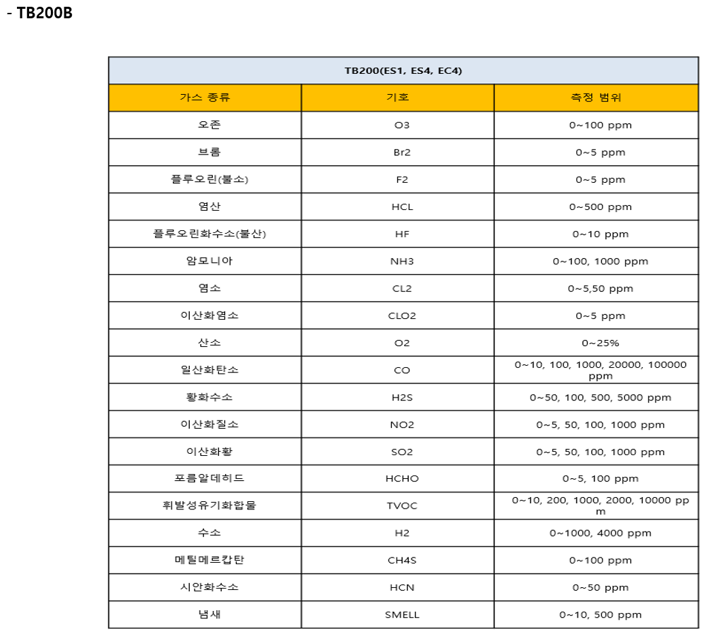

# 가스 센서 모듈

<figure><figcaption></figcaption></figure>

## TB600B, TB600C, TB200B (ES1, ES4, EC4)

Digital Type

<figure><figcaption></figcaption></figure>

&#x20;

## 특징

* 다양한 가스를 높은 선택도로 감지합니다.
* 고정밀 환경 모니터링
* 긴 수명
* 안정적인 측정, 빠른 응답
* 선형 출력
* 누출 없음
* 작음 소음
* 저전력 소비
* 작은 크기
* RoHS 승인 환경 설계

## 애플리케이션

* 보건 의료
* 매립장 및 하수처리장
* 스마트 공중 화장실
* 산업용 가스 모니터링
* 소방
* IoT 어플리케이션
* 스포츠 과학
* 난방, 환기 및 공기 조절
* 누출 감지

## 제품 크기 및 핀 특성

(단위(mm)

<figure><figcaption></figcaption></figure>

_TB200/TB600 sensor 모듈을 위한 연결 Cable_

<figure><figcaption>
<em>&#x3C;04P-10CM-1.25 cable></em>
</figcaption></figure>

## _측정 가스 종류 및 측정 범위_

<figure><figcaption></figcaption></figure>

<figure><figcaption></figcaption></figure>

