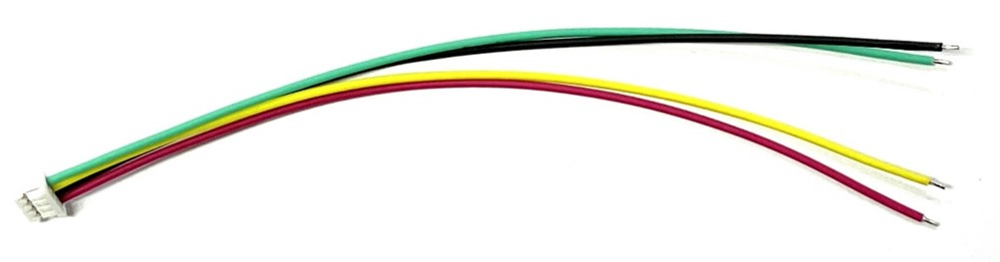
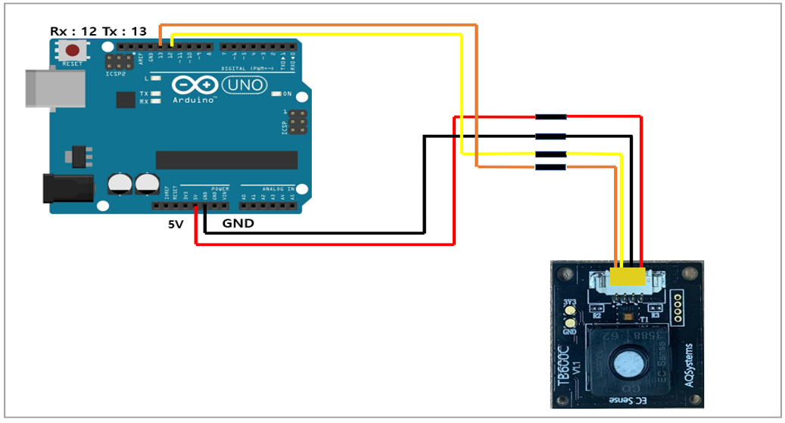
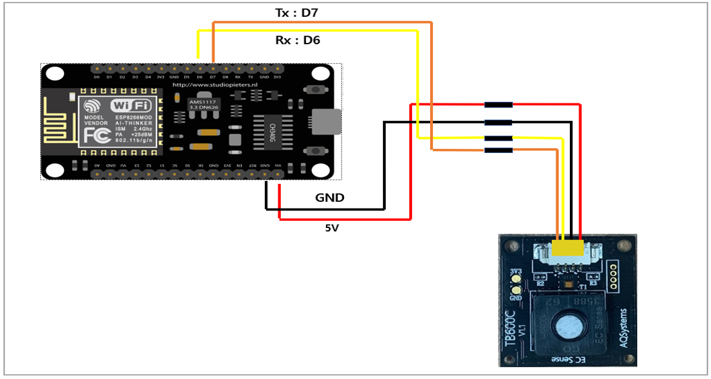
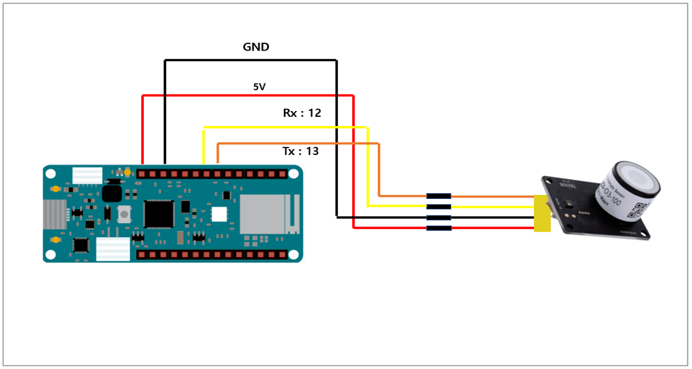
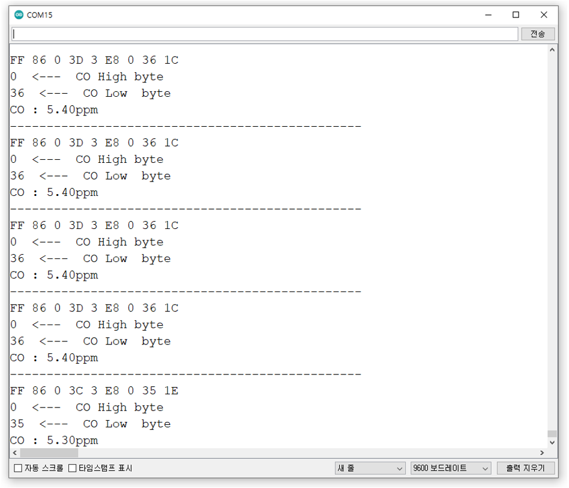

# TB600B(C),TB200B

## 1. 특징

* 다양한 가스를 높은 선택도로 감지합니다.
* 고정밀 환경 모니터링
* 긴 수명
* 안정적인 측정, 빠른 응답
* 선형 출력
* 누출 없음
* 작음 소음
* 저전력 소비
* 작은 크기
* RoHS 승인 환경 설계

## 2. 애플리케이션

* 보건 의료
* 매립장 및 하수처리장
* 스마트 공중 화장실
* 산업용 가스 모니터링
* 소방
* IoT 어플리케이션
* 스포츠 과학
* 난방, 환기 및 공기 조절
* 누출 감지

## 3. 제품 크기 및 핀 특성

<figure><figcaption></figcaption></figure>

+ TB200/TB600 sensor 모듈을 위한 연결 Cable_

<figure><figcaption></figcaption></figure>

+ 측정 가스 종류 및 측정 범위_

<figure><figcaption></figcaption></figure>

<figure><figcaption></figcaption></figure>

<!--- 중간 ------------------------------------------------------------ --->

## 4.디바이스 연결 방법

+ TB600B, TB600C



<figure><figcaption></figcaption></figure>



<figure><figcaption></figcaption></figure>



<figure><figcaption></figcaption></figure>



<figure><figcaption></figcaption></figure>



+ TB200B



<figure><figcaption></figcaption></figure>



<figure><figcaption></figcaption></figure>



<figure><figcaption></figcaption></figure>



<figure><figcaption></figcaption></figure>



<!--- 중간 ------------------------------------------------------------ --->

## 5.통신 프로토콜

* UART 설정

| PARAMETER         | TYP      |
| ----------------- | -------- |
| Baud Rate (Fixed) | 9600 bps |
| Data Bits         | 8        |
| Parity            | None     |
| Stop Bits         | 1        |
| Flow Control      | None     |

* Uart 전체 Command

<figure><figcaption></figcaption></figure>

+ LED 제어

| 기 능     | Command (HEX)              | Response |
| ------- | -------------------------- | -------- |
| LED off | FF 01 88 00 00 00 00 00 77 | 4F FB    |
| LED on  | FF 01 89 00 00 00 00 00 76 | 4F FB    |

+ 체크섬(Checksum) 설명

<figure><figcaption></figcaption></figure>

> Data 1\~7 byte 값을 전부 더 하고 1의 보수를 취하고 1을 더함\
> Ex.1)
> <p>Data 1~7 byte 전부 더함 = 0x01 +0x86 = 0x87 = 1000 0111</p><p>= 0111 1000 = 0x78</p><p>= 0x78 +1</p><p>= 0x79</p> 
> 

<figure><figcaption></figcaption></figure>

> Ex.2)\
>  <p>Data 1~7 byte 전부 더함 = 0x86 +0x2A+0x20 = 0xD0 = 1101 0000</p><p>= 0010 1111 = 0x2f</p><p>= 0x2f +1</p><p>= 0x30</p> 


## 6.모드 설정/센서 값 읽기

### Mode 설정

* 초기 Mode default 설정: Passive Mode
* 전원 off 후에도 변경된 통신모드로 저장됨

<table><thead><tr><th width="155">Mode</th><th>Command (HEX)</th><th width="200">Description</th><th>Response</th></tr></thead><tbody><tr><td>Passive(Q&#x26;A)</td><td>FF 01 78 40 00 00 00 00 47</td><td>센서 값 요청시에만 데이터 값 전송</td><td></td></tr><tr><td>Active</td><td>FF 01 78 41 00 00 00 00 46</td><td>연속적으로 데이터 값을 전송</td><td></td></tr><tr><td>Sleep 들어가기</td><td>AF 53 6C 65 65 70</td><td>Sleep mode 들어감</td><td>4F 4B</td></tr><tr><td>Sleep 나오기</td><td>AF 45 78 69 74</td><td>Sleep mode 나옴</td><td>4F 4B</td></tr></tbody></table>

Sleep Mode 나올 경우, 모듈 정상동작에 5초 소요 (5초 동안 data x)

### 가스 센서 값 읽기

* 가스 센서 값 읽기 응답:

<figure><figcaption></figcaption></figure>

### 가스 센서 값 + 온습도 값 읽기

| 기 능      | Command (HEX)              |
| -------- | -------------------------- |
| 가스+온도+습도 | FF 01 87 00 00 00 00 00 78 |

가스 센서 값 + 온습도 값 읽기 응답:

<figure><figcaption></figcaption></figure>

온도 습도 예제:

Ex) 0B 24 : 0x0B(11\*256=2816) + 0x24(36) = 2852 / 100 => 28.52 ℃ (온도)

\- 06 DB : 0x06(6\*256=1536) + 0xDB(219) = 1755 / 100 => 17.55 %RH (습도)



```cpp
#include <SoftwareSerial.h>
SoftwareSerial mySerial(12, 13); //Uno Rx Tx (13 12) = mySerial
byte Passive_mode[9] = {0xFF, 0x01, 0x78, 0x41, 0x00, 0x00, 0x00, 0x00, 0x46};  
byte Gas_value_request[9] = {0xFF, 0x01, 0x86, 0x00, 0x00, 0x00, 0x00, 0x00, 0x79}; // 가스 값 요청 
void setup() {
  Serial.begin(9600); //시리얼 통신 초기화
  delay(1000); 
  while(!mySerial){} //시리얼 통신 포트가 연결되기 전까지 대기
  mySerial.begin(9600);  
  mySerial.write(Passive_mode, 9); // mode set
  delay(100); 
}
void loop() 
{
  unsigned char receive_data[9] = { 0x00, }; //모든 수를 양수로 값을 저장(0x00~0xFF)
  mySerial.write(Gas_value_request, 9); //데이터 요청 패킷 송신
  delay(500); 
  int packetIndex = 0; //packetIndex 0으로 초기화
  while(mySerial.available()>0){ //수신받은 데이터가 0 초과, 즉 데이터가 존재한다면 코드수행
    int ch = mySerial.read(); //시리얼 데이터를 정수형 ch에 저장
    receive_data[packetIndex] = ch;
    Serial.print(ch, HEX); //시리얼 모니터에 입력받은 데이터 출력
    Serial.print(' ');
    packetIndex += 1;
  }
  // 패킷을 모두 수신 후 체크섬을 이용하여 데이터의 유효성을 체크
  // 응답 ex) FF 86 2C 88 3 E8 27 10 A4, 0x2710 = 10000  
  /*  - 예제에 사용된 센서 TB600C-CO-1000 */
  if( (packetIndex == 9) &&(1 + (0xFF ^ (byte)(receive_data[1] + re-ceive_data[2] + receive_data[3] 
  + receive_data[4] + receive_data[5] + receive_data[6] + receive_data[7]))) == receive_data[8]) 
  //체크섬=1~7자리 데이터를 더하여 8비트 데이터를 생성하고 각 비트를 반전시키고 끝에 1을 더함
    {
       Serial.println(" "); 
       Serial.print(receive_data[6],HEX); 
       Serial.println("  <---  CO High byte ");
       Serial.print(receive_data[7],HEX); 
       Serial.println("  <---  CO Low  byte ");
      float CO_value = ((receive_data[6] * 256) + receive_data[7]); 
      CO_value = CO_value/10;
      // /10은 센서의 종류나 측정범위에 따라 달라질 수 있으니 모듈 정보 읽기에서 자리수 확인 하는 것을 권장  
      Serial.print("CO : ");
      Serial.print(CO_value);
      Serial.println("ppm"); // 단위는 모듈 정보 읽기 (0xD7) 커맨드로 확인 할 수 있음
      Serial.println("------------------------------------------------");
      delay(500); 
    }
}

```


<figure><figcaption></figcaption></figure>



```cpp
#include <SoftwareSerial.h>
SoftwareSerial mySerial(12, 13); //Uno Rx Tx (13 12) = mySerial
byte Active_mode[9] = {0xFF, 0x01, 0x78, 0x40, 0x00, 0x00, 0x00, 0x00, 0x47};  
void setup() {
  Serial.begin(9600); //시리얼 통신 초기화
  delay(1000); 
  while(!mySerial){} //시리얼 통신 포트가 연결되기 전까지 대기
  mySerial.begin(9600);  
  mySerial.write(Active_mode, 9); // mode set
  delay(100);
}
void loop() 
{
  unsigned char receive_data[9] = { 0x00, }; //모든 수를 양수로 값을 저장(0x00~0xFF)
  int packetIndex = 0; //packetIndex 0으로 초기화
  while(mySerial.available()>0){ //수신받은 데이터가 0 초과, 즉 데이터가 존재한다면 코드수행
    int ch = mySerial.read(); //시리얼 데이터를 정수형 ch에 저장
    receive_data[packetIndex] = ch;
    Serial.print(ch, HEX); //시리얼 모니터에 입력받은 데이터 출력
    Serial.print(' ');
    packetIndex += 1;
  }
  // 패킷을 모두 수신 후 체크섬을 이용하여 데이터의 유효성을 체크
  // 응답 ex) FF 86 2C 88 3 E8 27 10 A4, 0x2710 = 10000  
  /*  - 예제에 사용된 센서 TB600C-CO-1000 */
  if( (packetIndex == 9) &&(1 + (0xFF ^ (byte)(receive_data[1] + re-ceive_data[2] + receive_data[3] 
  + receive_data[4] + receive_data[5] + receive_data[6] + receive_data[7]))) == receive_data[8]) 
  //체크섬=1~7자리 데이터를 더하여 8비트 데이터를 생성하고 각 비트를 반전시키고 끝에 1을 더함
    {
       Serial.println(" "); 
       Serial.print(receive_data[6],HEX); 
       Serial.println("  <---  CO High byte ");
       Serial.print(receive_data[7],HEX); 
       Serial.println("  <---  CO Low  byte ");
      float CO_value = ((receive_data[6] * 256) + receive_data[7]); 
      CO_value = CO_value/10;
      // /10은 센서의 종류나 측정범위에 따라 달라질 수 있으니 모듈 정보 읽기에서 자리수 확인 하는 것을 권장  
      Serial.print("CO : ");
      Serial.print(CO_value);
      Serial.println("ppm"); // 단위는 모듈 정보 읽기 (0xD7) 커맨드로 확인 할 수 있음
      Serial.println("------------------------------------------------");
      delay(500); 
    }
    delay(500);
}
```


<figure><figcaption></figcaption></figure>



