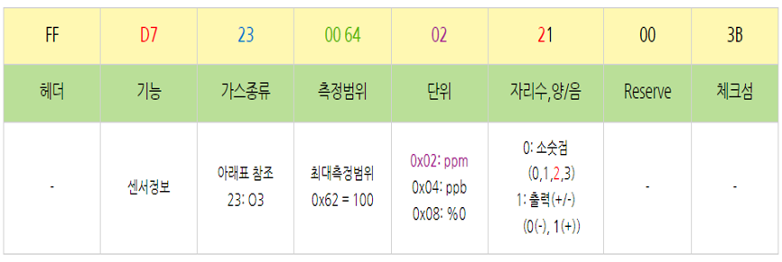
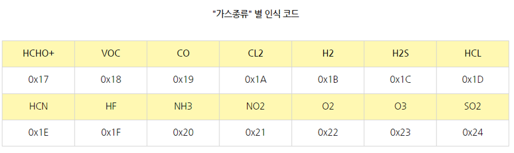
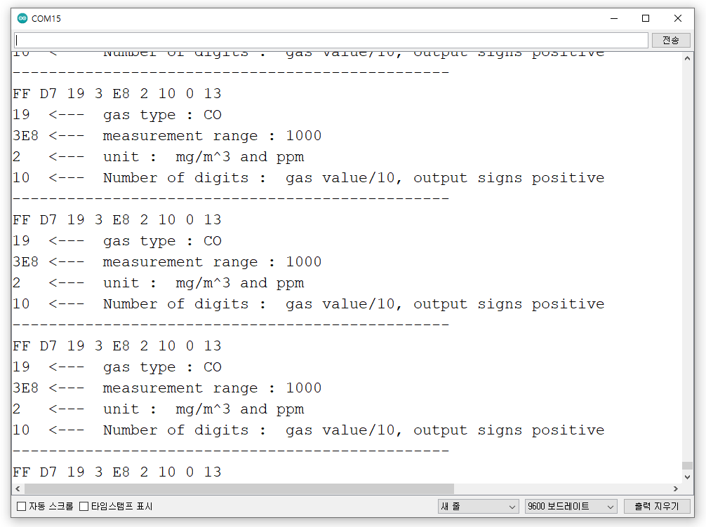

# 모듈 정보 읽기

## 모듈 정보 읽기

| 기 능      | Command (HEX) |
| -------- | ------------- |
| 모듈 정보 읽기 | D7            |

* 모듈 정보 읽기 응답

<figure><figcaption></figcaption></figure>

가스 값 자리수 예제:

※ 가스 값 응답 데이터는 가스 값 읽기 응답 참고

Ex) 01

\->정수로 표시

Ex) 11

\->가스 값 응답 데이터/10

Ex) 21

\->가스 값 응답 데이터/100

Ex) 31

\->가스 값 응답 데이터/1000

<figure><figcaption></figcaption></figure>

## 모듈 정보 읽기 Code



```cpp
#include <SoftwareSerial.h>
SoftwareSerial mySerial(12, 13); //Uno Rx Tx (13 12) = mySerial 
void setup() {
  Serial.begin(9600); //시리얼 통신 초기화
  delay(1000); 
  while(!mySerial){} //시리얼 통신 포트가 연결되기 전까지 대기
  mySerial.begin(9600);  
}
void loop() 
{
  unsigned char receive_data[9] = { 0x00, }; //모든 수를 양수로 값을 저장(0x00~0xFF)
  char Modlue_information_request = 0xD7;
  mySerial.write(Modlue_information_request); //데이터 요청 패킷 송신
  delay(500); //0.5초 지연
  int packetIndex = 0; //packetIndex 0으로 초기화
  while(mySerial.available()>0){ //수신받은 데이터가 0 초과, 즉 데이터가 존재한다면 코드수행
    int ch = mySerial.read(); //시리얼 데이터를 정수형 ch에 저장
        Serial.print(ch, HEX); //시리얼 모니터에 입력받은 데이터 출력
        Serial.print(' ');
    receive_data[packetIndex] = ch;
    packetIndex += 1;
  }
  // 패킷을 모두 수신 후 체크섬을 이용하여 데이터의 유효성을 체크
  if( (packetIndex == 9) &&
      (1 + (0xFF ^ (byte)(receive_data[1] + receive_data[2] + receive_data[3] + receive_data[4] + receive_data[5] + receive_data[6] + receive_data[7]))) == receive_data[8]) 
     { //체크섬=1~7자리 데이터를 더하여 8비트 데이터를 생성하고 각 비트를 반전시키고 끝에 1을 더함
      Serial.println(" ");
       Serial.print(receive_data[2],HEX); // 가스 종류 ex) co = 0x19 ("가스 종류"별 인식 코드 표 참고)
     Serial.print("  <---  gas type : ");
     unsigned char gas_type_flag = 0x00;
     unsigned char gas_type_compare = 0x24; 
     String gas_type = ""; 
     gas_type_flag = gas_type_compare - receive_data[2]; 
     switch (gas_type_flag){
     case 13: gas_type =  "HCHO+"; break; case 12: gas_type =  "VOC"; break;
     case 11: gas_type =  "CO"; break;    case 10: gas_type =  "CL2"; break;
     case 9: gas_type =  "H2"; break;     case 8: gas_type =  "H2S"; break;
     case 7: gas_type =  "HCL"; break;    case 6: gas_type =  "HCN"; break;
     case 5: gas_type =  "HF"; break;     case 4: gas_type =  "NH3"; break;
     case 3: gas_type =  "NO2"; break;    case 2: gas_type =  "O2"; break;
     case 1: gas_type =  "O3"; break;     case 0: gas_type =  "SO2"; break;
     default: break;
     }
       Serial.println(gas_type); // 측정 범위 상위 바이트 
       Serial.print(receive_data[3],HEX); // 측정 범위 상위 바이트 
       Serial.print(receive_data[4],HEX); // 측정 범위 하위 바이트
       Serial.print(" <---  measurement range : ");
       Serial.println((receive_data[3]*256) + receive_data[4]);
       Serial.print(receive_data[5]); // 단위
       Serial.print("   <---  unit : ");
       if(receive_data[5] == 2) Serial.println(" mg/m^3 and ppm ");
       else if(receive_data[5] == 4) Serial.println(" um/m^3 and ppb ");
       else if(receive_data[5] == 8) Serial.println(" 10g/m^3 and % ");
       Serial.print(receive_data[6],HEX); // 자리수, 양/음
       Serial.print("  <---  Number of digits : ");
        char digits_check; 
       digits_check = receive_data[6] >> 4; // HEX 값 십의 자리수(자리수)
        switch (digits_check)
        {
        case 0: Serial.print(" gas value expressed as an integer , ");       break;
        case 1: Serial.print(" gas value/10,");                           break;
        case 2: Serial.print(" gas value/100,");                          break;
        case 3: Serial.print(" gas value/1000,");                         break;               
        default: break;
        }
        char output_signs; 
        output_signs = receive_data[6] & 0x0f; // HEX 값 일의 자리 수(양/음)
        if(output_signs == 0)  Serial.println(" output signs positive");
        else if(output_signs == 1)  Serial.println(" output signs negative");
    }
    Serial.println("------------------------------------------------");
    delay(1000);
}

```

시리얼 모니터

<figure><figcaption></figcaption></figure>


