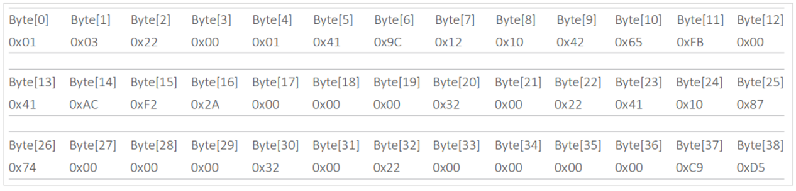
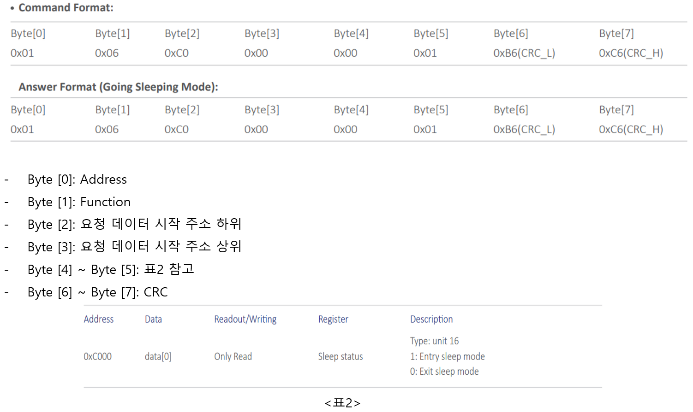
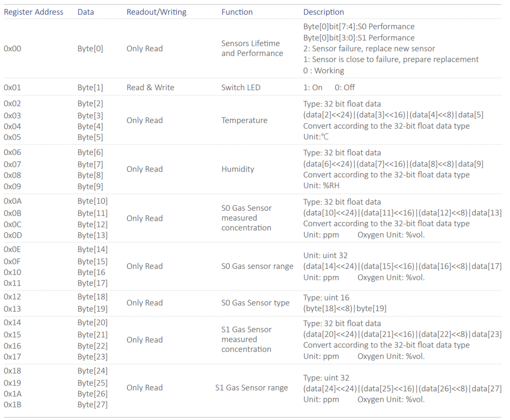
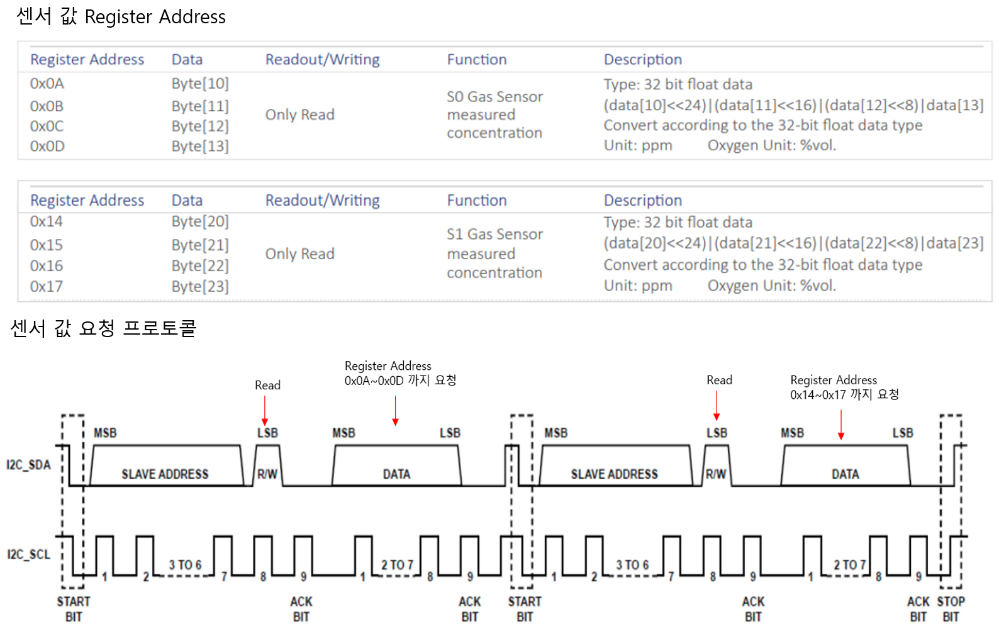

# DGM10

## 1.특징

* Digital Type
* 전기 화학식 더블 가스센서 모듈
* 지능형 알고리즘 계산
* 두 가지 가스 + 온도 + 습도 측정
* 실내 및 실외 환경에 적합하며 센서는 -40 \~ 55℃에서 동작
* I2C, UART(Modbus-RTUl), SPI 출력 인터페이스
* 공장에서 보정됨
* 센서 성능 및 수명 테스트 출력
* 응답시간이 빠르고 편차가 없는 안정된 영점
* 저전력 IoT 애플리케이션에 적합한 저전력 소비 및 절전 모드
* 센서 데이터 교정 인터페이스를 제공하여 사용자가 직접 개발하거나 센서 재교정을 할 때 편리합니다.
* 장수명 가스 센서, 중독 방지
* EMC 승인, 전자 회로 기판은 방진 및 부식 방지 코팅 보호 기능
* RoHS 승인
* 소형 26 x 26mm

## 2.애플리케이션

* 산업 안전 가스 측정
* 실내 공기질 모니터링
* 실외 환경 오염 모니터링
* 공기 교환 시스템 및 공기 청정기
* 음식 산업
* 의료 및 건강 관리
* 전문 가스 측정 기기

## 3.사양

<figure><figcaption></figcaption></figure>

## 제품 크기 및 핀 특성

<figure><figcaption></figcaption></figure>

<figure><figcaption><</figcaption></figure>

## 측정 가스 종류 및 측정 범위

<figure><figcaption></figcaption></figure>

<figure><figcaption></figcaption></figure>

## 4.통신 프로토콜

### UART설정 및 Modbus-RTU

* UART 설정

| PARAMETER      | TYP        |
| -------------- | ---------- |
| Signal Voltage | 3.3V       |
| Baud Rate      | 115200 bps |
| Data Bits      | 8          |
| Parity         | None       |
| Stop Bits      | 1          |

* 전송 모드: Modbus-RTU
* Slave address: 01
* 데이터 읽기 및 쓰기 interval : 1초 이상

통신 프로토콜 Function Command

| Function | Description |
| -------- | ----------- |
| 0x03     | 레지스터 읽기     |
| 0x06     | 단일 레지스터 쓰기  |
| 0x10     | 다중 레지스터 쓰기  |

### 모듈 Address 변경

\- 센서의 모듈의 주소를 변경할 경우 단일 제품의 주소를 하나씩 수정해야 됨

<figure><figcaption></figcaption></figure>

### 센서 값 읽기

* 센서 값 요청 Command

<figure><figcaption></figcaption></figure>

    - Byte \[0]: Address

    - Byte \[1]: Function

    - Byte \[2]: 요청 데이터 시작 주소 하위

    - Byte \[3]: 요청 데이터 시작 주소 상위

    - Byte \[4]: 요청 데이터 개수 하위

    - Byte \[5]: 요청 데이터 개수 상위

    - Byte \[6] \~ Byte \[7]: CRC

* 센서 값 요청 응답

<figure><figcaption></figcaption></figure>

    - Byte \[0]: Address

    - Byte \[1]: Function

    - Byte \[2]]: 데이터 개수

    - Byte \[4]\~ Byte \[36] : 하단 표 1 참고

    - Byte \[37] \~ Byte \[38]: CRC

<figure><figcaption></figcaption></figure>

### Sleep Mode

<figure><figcaption></figcaption></figure>

### I2C 통신 프로토콜

<figure><figcaption></figcaption></figure>

### I2C 전체 Register Address

<figure><figcaption></figcaption></figure>

<figure><figcaption></figcaption></figure>

### I2C 센서 값 읽기

<figure><figcaption></figcaption></figure>
