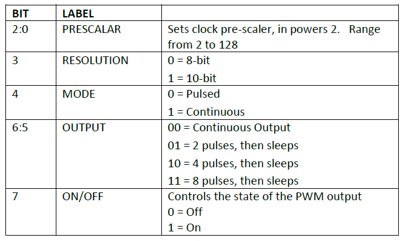
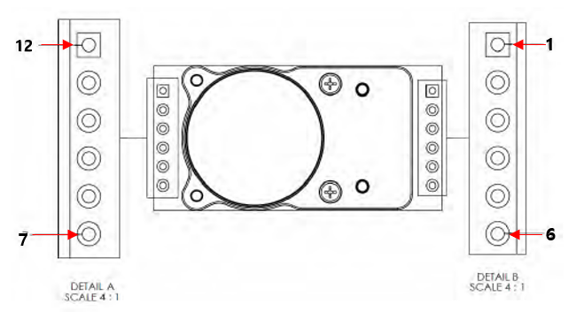
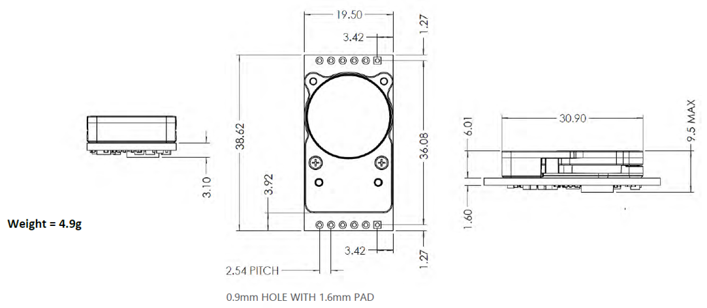

# CozIR-LP3

<figure><figcaption></figcaption></figure>

## Cozir-LP2에서 추가된 기능

* 알람 기능

\- 사용자 알람 값을 설정하였을 경우 알람 값에 도달 하면 디지털 출력으로 사용자에게 알려줌

* 알람 UART Command

| Command   | Description | Response  |
| --------- | ----------- | --------- |
| V #####\r | 알람 값 설정     | V #####\r |
| v\r       | 현재 알람 값 읽기  | v 15000\r |

\- 알람 값은 센서 전원을 껐다 켜도 유지됨

\- 초기에는 알람 설정이 꺼져있음

* PWM 기능

\- 통신 프로토콜을 이용하여 Prescalar, Resolution, mode, pulses setting, pwm on/off 설정 가능

* PWM UART Command

| Command | Description                                                  | Response |
| ------- | ------------------------------------------------------------ | -------- |
| J ###\r | PWM 설정( Prescalar, Resolution, mode, pulses setting, on/off) | J ###\r  |
| j\r     | 현재 PWM 값 읽기                                                  | j\r      |

* J ###\r\n Command

\- J ###\r\n에서 ### 은 Bit \[7:0] 까지 설정한 값이 들어감

<figure><figcaption></figcaption></figure>

* 센서 자기 진단 테스트

| Command | Description  | Response |
| ------- | ------------ | -------- |
| i\r     | 센서 자가 진단 테스트 | i ###\r  |

Response: ### = 170 - Sensor error

\### = 85 - no Sensor error

## 특징

* 최첨단 Solid-State LED 광학 기술 이용한 초 저전력 NDIR CO2 센서
* 디지털(UART) 및 I2C 출력
* 높은 CO2 측정 정확도
* 내장형 자동 영점 조정
* 30 ppm(일반) 정확도

## 애플리케이션

* 난방, 환기 및 공기 조절(HVAC)
* 건물 관리 시스템(BMS)
* 환기 조절 시스템(DCV)
* 차량 내 공기 질
* 무선 장비를 이용한 IoT 및 Smart Technology
* 실내 공기 질(IAQ)
* 계측
* 농업
* 항공우주

## 사양

<table><thead><tr><th align="center">항목</th><th align="center">내용</th><th align="center"></th><th data-hidden></th><th data-hidden></th></tr></thead><tbody><tr><td align="center">측정 범위</td><td align="center">
CozIR-LP3-2000: 0-2000ppm

CozIR-LP3-5000 0-5000ppm CozIR-LP3-1: 0-10,000ppm (1%)
</td><td align="center"></td><td></td><td></td></tr><tr><td align="center">센서 내부</td><td align="center">Solid-State, 가열된 필라멘트 없음</td><td align="center"></td><td></td><td></td></tr><tr><td align="center">통신 방식</td><td align="center">UART 또는 I²C</td><td align="center"></td><td></td><td></td></tr><tr><td align="center">전원 전압</td><td align="center">3.25-5.5V</td><td align="center"></td><td></td><td></td></tr><tr><td align="center">소모 전류</td><td align="center">측정 모드: 15mA 절전 모드: 0.01mA</td><td align="center"></td><td></td><td></td></tr><tr><td align="center">응답 시간</td><td align="center">30.5ms</td><td align="center"></td><td></td><td></td></tr><tr><td align="center">동작 온도</td><td align="center">0~50℃</td><td align="center"></td><td></td><td></td></tr><tr><td align="center">센서 치수 및 무게</td><td align="center">L x W x H(31mm x 19.5mm x 8.7mm), Weight(2.5g)</td><td align="center"></td><td></td><td></td></tr><tr><td align="center">센서 내구성</td><td align="center">진동 및 충격에 강하고 비가열성</td><td align="center"></td><td></td><td></td></tr><tr><td align="center">센서 교정</td><td align="center">자동 영점교정 기능 내장</td><td align="center"></td><td></td><td></td></tr><tr><td align="center">센서 수명</td><td align="center">15년</td><td align="center"></td><td></td><td></td></tr><tr><td align="center">헤더 핀 크기</td><td align="center">2.54mm</td><td align="center"></td><td></td><td></td></tr></tbody></table>

## 제품 크기 및 핀 특성

<figure><figcaption></figcaption></figure>

<table><thead><tr><th align="center">PIN</th><th align="center">NAME</th><th>Function</th><th data-hidden></th></tr></thead><tbody><tr><td align="center">1</td><td align="center">GND</td><td>VSS</td><td></td></tr><tr><td align="center">2</td><td align="center">VDD</td><td>Positive Supply</td><td></td></tr><tr><td align="center">5</td><td align="center">ALARM</td><td>ALARM Output</td><td></td></tr><tr><td align="center">7</td><td align="center">PWM_RS485</td><td>PWM or RS485 transceiver</td><td></td></tr><tr><td align="center">8</td><td align="center">I2C_ENABLE</td><td>Digital Input</td><td></td></tr><tr><td align="center">9</td><td align="center">I2C_SCL</td><td>I2C clock</td><td></td></tr><tr><td align="center">10</td><td align="center">I2C_SDA</td><td>I2C data</td><td></td></tr><tr><td align="center">11</td><td align="center">Tx_out</td><td>Digital Input</td><td></td></tr><tr><td align="center">12</td><td align="center">Rx_ In</td><td>Digital Output</td><td></td></tr></tbody></table>

<figure><figcaption></figcaption></figure>

## 디바이스 연결 방법


[Broken link](broken-reference)


## 통신 프로토콜


[undefined-1](cozir-lp3/undefined-1/)


