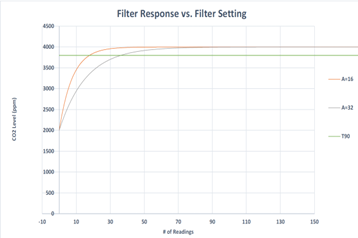
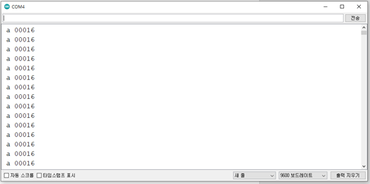
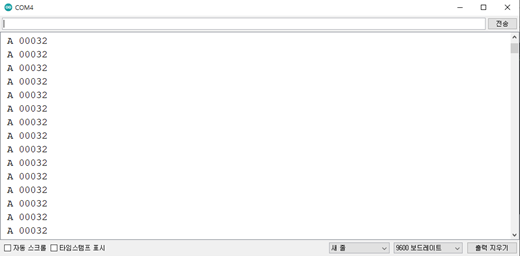

# CozIR-LP2


## 1.특징

* 최첨단 Solid-State LED 광학 기술 이용한 초 저전력 NDIR CO2 센서
* 디지털(UART) 및 I2C 출력
* 높은 CO2 측정 정확도 유지하면서 전력 소비 줄일 수 있음
* 내장형 자동 영점 조정
* 30 ppm(일반) 정확도

## 2.애플리케이션

* 난방, 환기 및 공기 조절(HVAC)
* 건물 관리 시스템(BMS)
* 환기 조절 시스템(DCV)
* 차량 내 공기 질
* 무선 장비를 이용한 IoT 및 Smart Technology
* 실내 공기 질(IAQ)
* 계측
* 농업
* 항공우주

## 3.사양

| 항목 | 내용 |
|------|------|
| 측정 범위 | CozIR-LP2-2000: 0-2000ppm<br>CozIR-LP2-5000: 0-5000ppm<br>CozIR-LP2-1: 0-10,000ppm (1%) |
| 센서 내부 | Solid-State, 가열된 필라멘트 없음 |
| 통신 방식 | UART 또는 I²C |
| 전원 전압 | 3.25-5.5V |
| 소모 전류 | 측정 모드: 15mA<br>절전 모드: 0.01mA |
| 응답 시간 | 30.5ms |
| 센서 치수 및 무게 | L x W x H(31mm x 19.5mm x 8.7mm), Weight(2.5g) |
| 센서 내구성 | 진동 및 충격에 강하고 비가열성 |
| 센서 교정 | 자동 영점교정 기능 내장 |
| 센서 수명 | 15년 |
| 헤더 핀 크기 | 1.27mm |

## 4.제품 크기 및 핀 특성

<figure><figcaption></figcaption></figure>

| PIN | Function |
|-----|----------|
| GND | VSS |
| VDD | Positive Supply |
| Rx_In | Digital Input |
| Tx_out | Digital Output |
| I2C_ENABLE | Digital Input |
| I2C_SCL | I2C clock |
| I2C_SDA | I2C data |

<figure><figcaption></figcaption></figure>


<!-- 중간점 -->

## 5.디바이스 연결 방법

### Connection DIAGRAM (UART)

<figure><figcaption></figcaption></figure>

### Connection DIAGRAM (I2C)

<figure><figcaption></figcaption></figure>

### 연결 예시



<figure><figcaption></figcaption></figure>

|  항목 | Arduino Uno | Cozir-LP2 |
| :-: | :---------: | :-------: |
| VCC |  5V or 3.3V |    VCC    |
| GND |     GND     |    GND    |
|  TX |      13     |     RX    |
|  RX |      12     |     TX    |



<figure><figcaption></figcaption></figure>

<table><thead><tr><th width="140" align="center">항목</th><th align="center">Arduino Uno</th><th align="center">Cozir-LP2</th></tr></thead><tbody><tr><td align="center">VCC</td><td align="center">5V or 3.3V</td><td align="center">VCC</td></tr><tr><td align="center">GND</td><td align="center">GND</td><td align="center">GND</td></tr><tr><td align="center">TX</td><td align="center">A5</td><td align="center">SCL</td></tr><tr><td align="center">RX</td><td align="center">A4</td><td align="center">SDA</td></tr></tbody></table>



<figure><figcaption></figcaption></figure>

|  항목 | Arduino MKR | Cozir-LP2 |
| :-: | :---------: | :-------: |
| VCC |  5V or 3.3V |    VCC    |
| GND |     GND     |    GND    |
|  TX |      13     |     RX    |
|  RX |      12     |     TX    |



<figure><figcaption></figcaption></figure>

<table><thead><tr><th width="140" align="center">항목</th><th align="center">Arduino MKR</th><th align="center">Cozir-LP2</th></tr></thead><tbody><tr><td align="center">VCC</td><td align="center">5V or 3.3V</td><td align="center">VCC</td></tr><tr><td align="center">GND</td><td align="center">GND</td><td align="center">GND</td></tr><tr><td align="center">TX</td><td align="center">D11</td><td align="center">SCL</td></tr><tr><td align="center">RX</td><td align="center">D12</td><td align="center">SDA</td></tr></tbody></table>



<figure><figcaption></figcaption></figure>

|  항목 |    ESP32   | Cozir-LP2 |
| :-: | :--------: | :-------: |
| VCC | 5V or 3.3V |    VCC    |
| GND |     GND    |    GND    |
|  TX |      5     |     RX    |
|  RX |      6     |     TX    |



<figure><figcaption></figcaption></figure>

<table><thead><tr><th width="140" align="center">항목</th><th align="center">ESP32</th><th align="center">Cozir-LP2</th></tr></thead><tbody><tr><td align="center">VCC</td><td align="center">5V or 3.3V</td><td align="center">VCC</td></tr><tr><td align="center">GND</td><td align="center">GND</td><td align="center">GND</td></tr><tr><td align="center">TX</td><td align="center">13</td><td align="center">SCL</td></tr><tr><td align="center">RX</td><td align="center">12</td><td align="center">SDA</td></tr></tbody></table>



<figure><figcaption></figcaption></figure>

|  항목 | ESP8266 | Cozir-LP2 |
| :-: | :-----: | :-------: |
| VCC |   3.3V  |    VCC    |
| GND |   GND   |    GND    |
|  TX |    15   |     RX    |
|  RX |    13   |     TX    |



<figure><figcaption></figcaption></figure>

<table><thead><tr><th width="140" align="center">항목</th><th align="center">ESP8266</th><th align="center">Cozir-LP2</th></tr></thead><tbody><tr><td align="center">VCC</td><td align="center">5V or 3.3V</td><td align="center">VCC</td></tr><tr><td align="center">GND</td><td align="center">GND</td><td align="center">GND</td></tr><tr><td align="center">TX</td><td align="center">D5</td><td align="center">SCL</td></tr><tr><td align="center">RX</td><td align="center">D6</td><td align="center">SDA</td></tr></tbody></table>



<!------------------------------------------------- 중간점 ------------------------------------------>

## 6.통신 환경 및 명령어

+ 통신 환경

|       PARAMETER       |  TYP |  UNIT  |
| :-------------------: | :--: | :----: |
|       Buad Rate       | 9600 | Bits/s |
|       Data Bits       |   8  |        |
|         Parity        | None |        |
|       Stop Bits       |   1  |        |
| Hardware Flow Control | None |        |

+  통신 명령어

| Command | Description | Response |
|---------|-------------|----------|
| K 0 | Command를 기다리는 상태, 측정 X | K 00000 |
| K 1 | 연속적으로 값을 측정 | K 00001 |
| K 2 | 센서 값 요청시에만 응답 | K 00002 |
| Z | 가장 최근에 측정한 CO2 필터 된 값 | Z 00521 |
| z | 가장 최근에 측정한 CO2 필터 되지 않은 값 | z 00521 |
| A ### | CO2 필터 값 설정 | A 00016 |
| a | CO2 필터 값 확인 | a 00016 |
| U | 질소를 사용하여 제로 교정 | U 33000 |
| u | 초기 설정 값으로 제로 교정 | u |
| G | Fresh Air를 사용하여 제로 교정 | G 33000 |
| X ##### | 현재 값으로 스팬 교정 | X 11000 |
| P 10###<br>P 11###  | Fresh Air에서 사용할 대기 중 농도를 설정 (default 400ppm) | Fresh Air에서 사용할 대기 중 농도를 설정 (default 400ppm)  |
| S ### | 고도 설정 | S 08192 |
| s | 고도 설정 값 확인 | s 08192 |
| M ### | 측정 데이터 문자열로 전송 | M 6 |

<!------------------------------------------------- 중간점 ------------------------------------------>

## 7.모드 설정 및 CO2 값 읽기

* COMMAND 모드: COMMAND를 기다리는 상태, 측정 X

* Streaming 모드(default):  연속적으로 값을 측정함(초당 2회 측정), 측정 외 다른 Command시 100ms delay가 필요함

* Polling 모드: 센서 값 요청 시에만 응답, 센서 값 요청하지 않을 때에는 백그라운드에서 계속 측정을 수행함

| Mode      | Command | Description          | Response |
|-----------|---------|----------------------|----------|
| Command   | K 0     | 명령어 기다리는 상태 | K 00000  |
| Streaming | K 1     | 연속적으로 값 측정   | K 00001  |
| Polling   | K 2     | 센서 값 요청 시에만 응답 | K 00002  |

### Streaming mode에서 CO2 값 읽기

```cpp
#include <SoftwareSerial.h>
SoftwareSerial mySerial(12, 13); //Uno Rx Tx (12 13) = SoftwareSerial
const char* Polling_mode = "K 2\r\n";
const char* Stream_mode = "K 1\r\n";
const char* Standby_mode = "K 0\r\n";  
bool tx_ready;
bool rx_ready; 
String str;
void setup() {
  Serial.begin(9600); //시리얼 통신 초기화
  mySerial.begin(9600); 
  while(!mySerial){} //시리얼 통신 포트가 연결되기 전까지 대기
  delay(14); // power on data ready
  mySerial.print(Stream_mode); //Polling 모드로 변경
  mySerial.print("Z\r\n");  //CO2값 읽기 명령
}                              
 
void loop() 
{
 if(rx_ready == 0) // overflow 처리
 {
   delay(31); // Measurement data ready
   if(mySerial.available()>0) //수신받은 데이터가 0 초과, 즉 데이터가 존재한다면
   { //버퍼에서 읽어드린 char의 데이터를 String 형태로 반환
    str = "";
    str = mySerial.readStringUntil('\n'); 
    Serial.println(str);
    rx_ready = 1;   
    tx_ready = 1;
   }
 }
 else if(tx_ready == 1)
  {
     mySerial.print("Z\r\n"); //CO2값 읽기 명령
     tx_ready = 0;
     rx_ready = 0;
  }
}
```

<figure><figcaption></figcaption></figure>

### Polling mode에서 CO2값 읽기

```cpp
#include <SoftwareSerial.h>
SoftwareSerial mySerial(12, 13); //Uno Rx Tx (12 13) = SoftwareSerial
const char* Polling_mode = "K 2\r\n";
const char* Stream_mode = "K 1\r\n";
const char* Standby_mode = "K 0\r\n";   
String str;
void setup() {
  Serial.begin(9600); //시리얼 통신 초기화
  mySerial.begin(9600); 
  while(!mySerial){} //시리얼 통신 포트가 연결되기 전까지 대기
  delay(14); // power on data ready
  mySerial.print(Polling_mode); //Polling 모드로 변경
}                              
 
void loop() 
{
 if(Serial.read() == 'R') 
 {
  mySerial.print("Z\r\n"); //CO2값 읽기 명령
 }
  if(mySerial.available()>0) //수신받은 데이터가 0 초과, 즉 데이터가 존재한다면
   { //버퍼에서 읽어드린 char의 데이터를 String 형태로 반환
    str = "";
    str = mySerial.readStringUntil('\n'); 
    Serial.println(str);
   }
}
```

* 시리얼 모니터에 'R' 입력 후 엔터

<figure><figcaption></figcaption></figure>

* 응답

<figure><figcaption></figcaption></figure>

<!------------------------------------------------- 중간점 ------------------------------------------>

## 8.UART,I2C CO2값 읽기

### I2C

```cpp
#include <Wire.h>
#define Slave_adddress 0x41
#define CO2_READ_command 0x34
#define CO2_READ_and_test_command 0x02

void setup() {
  Wire.begin();
  Serial.begin(9600);   
}
void loop() {    
int CO2_value = 0;
 Wire.beginTransmission(Slave_adddress); // transmit to slave address
 Wire.write(CO2_READ_and_test_command);  // transmit to register address
 Wire.endTransmission();    // stop transmitting
 Wire.requestFrom(Slave_adddress, 3); //from slave request 2byte  
  while ( Wire.available()) {
    int CO2_high_value = Wire.read();
    int CO2_low_value = Wire.read();
   /* CO2_Self_test value = 85(DEC) : Sensor is nominal , 
   CO2_Self_test value = 170(DEC): Sensor error */
    int CO2_self_test = Wire.read(); 
    CO2_high_value = CO2_high_value <<8;
    CO2_value = CO2_high_value + CO2_low_value;
    Serial.print("CO2_value : ");
    Serial.print(CO2_value);   //reading CO2 value  
    Serial.println(" PPM ");
  }   
  delay(1000);
}
```

### UART

```cpp
#include <SoftwareSerial.h>
SoftwareSerial mySerial(12, 13); //Uno Rx Tx (12 13) = SoftwareSerial
const char* Polling_mode = "K 2\r\n";
const char* Stream_mode = "K 1\r\n";
const char* Standby_mode = "K 0\r\n";  
bool tx_ready;
bool rx_ready; 
String str;
void setup() {
  Serial.begin(9600); //시리얼 통신 초기화
  mySerial.begin(9600); 
  while(!mySerial){} //시리얼 통신 포트가 연결되기 전까지 대기
  delay(14); // power on data ready
  mySerial.print(Stream_mode); //Polling 모드로 변경
  mySerial.print("Z\r\n");  //CO2값 읽기 명령
}                              
 
void loop() 
{
 if(rx_ready == 0) // overflow 처리
 {
   delay(31); // Measurement data ready
   if(mySerial.available()>0) //수신받은 데이터가 0 초과, 즉 데이터가 존재한다면
   { //버퍼에서 읽어드린 char의 데이터를 String 형태로 반환
    str = "";
    str = mySerial.readStringUntil('\n'); 
    Serial.println(str);
    rx_ready = 1;   
    tx_ready = 1;
   }
 }
 else if(tx_ready == 1)
  {
     mySerial.print("Z\r\n"); //CO2값 읽기 명령
     tx_ready = 0;
     rx_ready = 0;
  }
}
```

* I2C

<figure><figcaption></figcaption></figure>

* UART

<figure><figcaption></figcaption></figure>

<!------------------------------------------------- 중간점 ------------------------------------------>

## 9.Digital filter

* 필터(Filtered)된 값과 필터 되지 않은(Unfiltered) CO2 값의 차이는 아래 그림과 같음

<figure><figcaption></figcaption></figure>

* 필터된(Filtered) CO2 값은 노이즈를 제거하여 더 정확한 값을 제공함

### Digital filter 설정

* 필터 설정 범위: 1\~255( 1= Unfiltered)
* 필터의 설정 값이 증가하면 측정 출력 응답 시간이 늘어남

<figure><figcaption></figcaption></figure>

* A=필터 설정 값
* A = 32 가 A = 16(default) 보다 T90에 도달하는 시간이 늘어남

### Digital filter Command

| Command | Description       | Example | Response |
|---------|-------------------|---------|----------|
| A ###   | CO2 필터 값 설정  | A 16    | A 00016  |
| a       | CO2 필터 값 확인  | a       | a 00016  |

### 예제코드

* CO2 필터 값 확인

```cpp
#include <SoftwareSerial.h>
SoftwareSerial mySerial(12, 13); //Uno Rx Tx (12 13) = SoftwareSerial
const char* Polling_mode = "K 2\r\n";
const char* Stream_mode = "K 1\r\n";
const char* Standby_mode = "K 0\r\n";  
bool tx_ready;
bool rx_ready; 
String str;
void setup() {
  Serial.begin(9600); //시리얼 통신 초기화
  mySerial.begin(9600); 
  while(!mySerial){} //시리얼 통신 포트가 연결되기 전까지 대기
  delay(14); // power on data ready
  mySerial.print(Stream_mode); //Polling 모드로 변경
}                              
 
void loop() 
{
 if(rx_ready == 0) // overflow 처리
 {
   delay(31); // Measurement data ready
   if(mySerial.available()>0) //수신받은 데이터가 0 초과, 즉 데이터가 존재한다면
   { //버퍼에서 읽어드린 char의 데이터를 String 형태로 반환
    str = "";
    str = mySerial.readStringUntil('\n'); 
    Serial.println(str);
    rx_ready = 1;   
    tx_ready = 1;
   }
 }
 else if(tx_ready == 1)
  {
     mySerial.print("a\r\n"); //현재 설정된 필터 값 읽기 명령어
     tx_ready = 0;
     rx_ready = 0;
  }
}
```

* 시리얼 모니터

<figure><figcaption></figcaption></figure>

* CO2 필터 값 설정

```cpp
#include <SoftwareSerial.h>
SoftwareSerial mySerial(12, 13); //Uno Rx Tx (12 13) = SoftwareSerial
const char* Polling_mode = "K 2\r\n";
const char* Stream_mode = "K 1\r\n";
const char* Standby_mode = "K 0\r\n";  
bool tx_ready;
bool rx_ready; 
String str;
void setup() {
  Serial.begin(9600); //시리얼 통신 초기화
  mySerial.begin(9600); 
  while(!mySerial){} //시리얼 통신 포트가 연결되기 전까지 대기
  delay(14); // power on data ready
  mySerial.print(Stream_mode); //Polling 모드로 변경
}                              
 
void loop() 
{
 if(rx_ready == 0) // overflow 처리
 {
   delay(31); // Measurement data ready
   if(mySerial.available()>0) //수신받은 데이터가 0 초과, 즉 데이터가 존재한다면
   { //버퍼에서 읽어드린 char의 데이터를 String 형태로 반환
    str = "";
    str = mySerial.readStringUntil('\n'); 
    Serial.println(str);
    rx_ready = 1;   
    tx_ready = 1;
   }
 }
 else if(tx_ready == 1)
  {
     mySerial.print("A 32\r\n"); //필터 값 변경 명령어 
     tx_ready = 0;
     rx_ready = 0;
  }
}
```

* 시리얼 모니터

<figure><figcaption></figcaption></figure>

