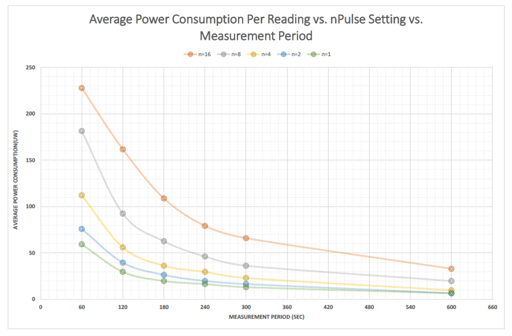
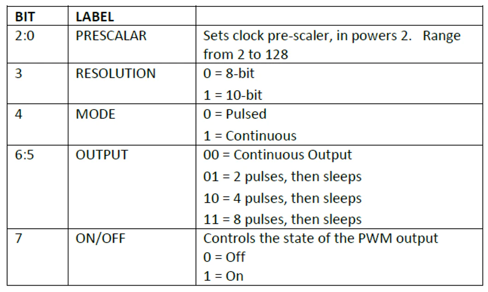

# 설명

영국에 본사를 두고 있는 Gas Sensing Solution은 Solid-State NDIR(비분산 적외선) LED 기반 가스 센서의 글로벌 리더입니다. LED와 함께 사용되는 광검출기는 MBE(분자 빔 에픽 택시) 기계를 통해 직접 제조 되며, 특허를 받은 모든 NDIR 확산 CO₂ 센서에 사용이 됩니다.

GSS는 광범위한 고체 NDIR CO₂ 가스 센서를 설계, 개발 및 제조하여 저전력, 고 정확도 및 고속 측정이 필요한 세계 최고의 고객들에게 혁신적인 제품을 제공합니다. GSS는 실내 공기 질 모니터 시스템, 헬스 케어, 우주 항공, 식품 모니터링 및 개인 안전 장비를 포함한 광범위한 시장에 제품을 공급 중입니다.

> [GSS 홈페이지](https://www.gassensing.co.uk/)

+ GSS는 디지털 출력인 UART가 공통적으로 포함되어 있고 0℃\~50℃의 온도 범위에서 측정할 수 있는 CO₂ 센서입니다.
+ GSS는 각 단계에 대해 새로운 하드웨어 모듈을 생성할 필요 없이 Arduino, PCB, Sensor만 갖추고 있으시다면 신속한 CO₂ 측정이 가능합니다.

+ CozIR는 3.3mW의 소비 전력을 갖춘 저전력 CO₂ 센서입니다.
+ SprintIR은 초 당 20회를 판독하는 고속 측정 CO₂ 센서입니다.
+ ExplorIR은 넓은 범위, 급격하게 변화하는 주변 환경에 맞는 CO₂ 센서입니다

## 응용분야

| 분야 | 설명 |
|------|------|
| **난방, 환기 및 공기 조절(HVAC)** | 난방, 환기 및 공기 조절 시스템은 쾌적한 실내 환경을 유지하고, 에너지 효율성을 높이며, 건강한 생활을 가능하게 합니다. |
| **건물 관리 시스템(BMS)** | 건물 내의 다양한 시스템과 장비를 중앙에서 통제하고 모니터링하여, 에너지 소비를 최적화하고 운영 비용을 절감합니다. |
| **환기 조절 시스템(DCV)** | 실내 공기의 질을 개선하고, 에너지 소비를 줄이며, 건물 사용자의 건강을 보호하는 데 필수적입니다. |
| **차량 내 공기 질** | 운전자와 승객의 건강에 직접적인 영향을 미치며, 특히 장거리 운전 시 중요합니다. |
| **무선 장비를 이용한 IoT 및 Smart Technology** | IoT와 스마트 기술은 무선 장비를 통해 우리의 생활을 더욱 편리하고 효율적으로 만들어줍니다. |
| **실내 공기 질(IAQ)** | 우리의 건강과 직결되어 있으며, 특히 도시 지역에서 중요한 이슈가 되고 있습니다. |
| **계측** | 정밀한 데이터를 수집하여 다양한 산업 분야에서 의사 결정을 지원합니다. |
| **농업** | 기술 혁신은 지속 가능한 식량 생산을 가능하게 하며, 세계 인구의 식량 안보를 강화합니다. |
| **항공우주** | 인류가 새로운 경계를 탐험하고, 우주 과학의 발전을 이끌어가는 중요한 분야입니다. |

## GSS CO2 센서 모델 분류

+ 영국에 본사를 두고 있는 Gas Sensing Solution은 Solid-State NDIR(비분산 적외선) LED 기반 가스 센서의 글로벌 리더입니다.
+ LED와 함께 사용되는 광검출기는 MBE(분자 빔 에픽 택시) 기계를 통해 직접 제조 되며, 특허를 받은 모든 NDIR 확산 CO₂ 센서에 사용이 됩니다.
+ 광범위한 고체 NDIR CO₂ 가스 센서를 설계, 개발 및 제조하여 저전력, 고 정확도 및 고속 측정이 필요한 세계 최고의 고객들에게 혁신적인 제품을 제공합니다.
+ 실내 공기 질 모니터 시스템, 헬스 케어, 우주 항공, 식품 모니터링 및 개인 안전 장비를 포함한 광범위한 시장에 제품을 공급 중입니다.

<!---처음에 이미지가 있으면 로딩 시간이 길어짐  --->

### SprintIR-R® CO2 Sensor



> 특징

SprintIR-R® 고속 CO₂ 센서는 전례 없는 고속 측정 기능을 제공하도록 설계된 다양한 CO₂ 센서의 일부입니다. SprintIR-R®은 초당 최대 50회 판독을 수행하므로 높은 반복률로 개별 측정이 필요하거나 CO₂ 농도가 빠르게 변하는 응용 분야에 이상적입니다.

SprintIR-R®에는 표준 플로우 스루 어댑터가 장착되어 있어 CO₂ 가스가 광학 센서를 통해 고속으로 통과할 수 있습니다. 설치 요구 사항에 따라 다른 맞춤형 어댑터도 사용할 수 있습니다.

SprintIR-R®은 특허받은 NDIR 솔리드 스테이트 LED 광학 기술을 사용하여 센서가 파라메트릭 성능을 손상시키지 않고 빠르게 변화하는 CO₂에 대응할 수 있도록 합니다.

* 초당 50회 판독
* 맞춤형 유량 어댑터(옵션)
* 저전력 CO₂ 센서
* 솔리드 스테이트 LED 광학 기술
* UART 데이터 인터페이스
* 내장 자동 보정

### ExplorIR®-M CO2 Sensor




> 특징

ExplorIR-M®은 최대 100 % 농도를 측정 할 수있는 소형 CO₂ 센서입니다. 컴팩트하고 견고한 설계로 가스 모니터링 및 감지 시스템에 쉽게 통합할 수 있습니다.

ExplorIR-M®은 극한의 환경 조건, 특히 압력, 온도 또는 진동 체제가 특히 가혹한 곳에서 센서가 안정적으로 작동해야하는 응용 분야를 위해 특별히 설계되었습니다.

ExplorIR-M®은 GSS 특허 받은 고체 광학 기술을 사용하여 센서가 연장된 수명 동안 고정밀 CO₂ 측정 기능을 제공할 수 있도록 합니다.

* 최대 100% CO₂ 농도 측정
* 저전력 CO₂ 센서
* 솔리드 스테이트 LED 광학 기술
* 진동 및 충격 방지
* UART 데이터 인터페이스
* 내장 자동 보정

### CozIR®-Blink CO2 Sensor




> 특징

CozIR-Blink®는 최첨단 솔리드 스테이트 LED 광학 기술을 사용하는 초저전력 NDIR CO₂ 센서입니다. 저전력 LED는 사내에서 제조되어 GSS가 CO₂ 센서 신호 체인을 완벽하게 제어할 수 있습니다.

CozIR-Blink®를 사용하면 CO₂ 측정의 전력 소비를 전례없는 수준으로 줄일 수 있습니다. CO₂ 센서의 전원을 껐다 켤 수 있어 사용자가 휴면 상태에서 장치를 깨우고 판독한 다음 다시 전원을 완전히 꺼서 전력 소비를 0으로 줄일 수 있습니다. 전력 순환 기능은 전력이 중요한 배터리 구동식 또는 무선 연결 인터페이스 응용 제품에서 특히 유용합니다.

CozIR-Blink®에는 제품 수명 기간 동안 CO₂ 측정 정확도를 유지하는 자동 보정 기능이 내장되어 있습니다.

* 초저전력 CO₂ 센서
* 30ppm(표준) 측정 정확도
* 솔리드 스테이트 LED 광학 기술
* UART 또는 I²C 제어 및 데이터 인터페이스
* 전원 순환 호환
* 내장 자동 보정
* 캘리포니아 건축 표준 코드, 타이틀 24 준수

> CozIR-LP Series와 차이점

* CozIR-Blink는 전원을 키고 co2 값을 측정 후 전원을 꺼서 전력 소비를 크게 줄일 수 있음

> 측정 주기 설정

* 측정 주기( nPULSE= pulses 당 읽는 횟수) 조절 하여 전력 소비를 크게 줄일 수 있음
* 측정 주기가 줄어들수록 전력 소비가 줄어듬
* 측정 주기가 늘어날수록 노이즈가 줄어들고 Resolution이 증가함
* 측정 주기 범위: 1\~ 32 (default = 16)

<figure><figcaption><p>gss co2 power</p></figcaption></figure>

> 측정 주기 Uart Command

| Command | Description   | Response |
| ------- | ------------- | -------- |
| A       | 측정 주기 설정      | 00016    |
| a       | 측정 주기 설정 값 읽기 | 00016    |
|         |               |          |

### SprintIR®-6S CO2 Sensor



> 특징

SprintIR-6S®는 전례 없는 고속 측정 기능을 제공하도록 설계된 다양한 CO2 센서의 일부입니다. SprintIR-6S®는 초당 최대 20 회 판독 할 수 있으므로 높은 반복률로 개별 측정이 필요하거나 CO₂ 농도가 빠르게 변하는 응용 분야에 이상적입니다.

SprintIR-6S®에는 표준 플로우 스루 어댑터가 장착되어 있어 CO₂ 가스가 광학 센서를 고속으로 통과할 수 있습니다. 설치 요구 사항에 따라 다른 맞춤형 어댑터도 사용할 수 있습니다.

SprintIR-6S®는 특허받은 NDIR 솔리드 스테이트 LED 광학 기술을 사용하여 센서가 파라메트릭 성능을 손상시키지 않고 빠르게 변화하는 CO₂에 대응할 수 있도록 합니다.

* 초당 20회 판독
* 맞춤형 유량 어댑터(옵션)
* 저전력 CO₂ 센서
* 솔리드 스테이트 LED 광학 기술
* UART 데이터 인터페이스
* 내장 자동 보정

### CozIR®-LP3 CO2 Sensor



> 특징

CozIR-LP3® CO₂ 센서는 독점적 인 솔리드 스테이트 LED 기술을 사용하여 타의 추종을 불허하는 저전력 소비를 달성하므로 배터리 구동 및 무선 연결 장치를 포함한 다양한 애플리케이션에 적합합니다.

CozIR-LP3®는 사용자에게 광범위한 유연성, UART 또는 I²C 제어 인터페이스 선택, 디지털 및 아날로그 CO₂ 측정 및 페일 세이프 디지털 경보 레벨 모니터를 제공합니다.

CozIR-LP3®에는 온보드 전원 관리 기능이 포함되어있어 사용자가 측정 중 및 센서가 비활성화 될 때 센서 전력 소비를 제어 할 수 있습니다. 사용자는 다른 센서로 전환하지 않고도 유효 전류 소비를 <1μA로 줄일 수 있습니다.

낮은 높이의 폼 팩터, 작은 설치 공간 및 유연한 장착 옵션으로 인해 CozIR-LP3®는 공간이 중요한 애플리케이션에 이상적입니다.

CozIR-LP3®는 자동 자체 점검 및 자동 영점 조정을 통해 완전히 자율적으로 실행되도록 설계되어 사용자 개입없이 센서가 장기간 작동 할 수 있습니다.

* 초저전력 CO₂ 센서, 평균 <3.5mW
* 30ppm(표준) 측정 정확도
* 솔리드 스테이트 LED 광학 기술
* UART 또는 I²C 제어 및 데이터 인터페이스
* 아날로그 및 디지털 CO₂ 측정 출력
* 기판 실장형 전력 관리, <3μW 대기
* 사용자 프로그래밍 가능 CO₂ 수준 경보
* 내장 자동 영점 조정 기능

> Cozir-LP2에서 추가된 기능

알람 기능

* 사용자 알람 값을 설정하였을 경우 알람 값에 도달 하면 디지털 출력으로 사용자에게 알려줌

알람 UART Command

| Command | Description | Response |
| ------- | ----------- | -------- |
| V ##### | 알람 값 설정     | V #####  |
| v       | 현재 알람 값 읽기  | v 15000  |

* 알람 값은 센서 전원을 껐다 켜도 유지됨
* 초기에는 알람 설정이 꺼져있음

PWM 기능

* 통신 프로토콜을 이용하여 Prescalar, Resolution, mode, pulses setting, pwm on/off 설정 가능

PWM UART Command

| Command | Description                                                  | Response |
| ------- | ------------------------------------------------------------ | -------- |
| J ###   | PWM 설정( Prescalar, Resolution, mode, pulses setting, on/off) | J ###    |
| j       | 현재 PWM 값 읽기                                                  | j        |

J ###\r\n Command

* J ###\r\n에서 ### 은 Bit \[7:0] 까지 설정한 값이 들어감

<figure><figcaption><p>gss co2 command</p></figcaption></figure>

센서 자기 진단 테스트

| Command | Description  | Response |
| ------- | ------------ | -------- |
| i       | 센서 자가 진단 테스트 | i ###    |

Response: ### = 170 - Sensor error

```
       ### = 85 - no Sensor error
```

### CozIR®-LP2 CO2 Sensor




> 특징

CozIR-LP2®는 최첨단 솔리드 스테이트 LED 광학 기술을 사용하는 초저전력 NDIR CO₂ 센서입니다. 저전력 LED는 사내에서 제조되어 GSS가 CO₂ 센서 신호 체인을 완벽하게 제어할 수 있습니다.

CozIR-LP2®를 사용하면 높은 CO₂ 측정 정확도를 유지하면서 전력 소비를 줄일 수 있습니다. 이 센서는 다양한 절전 모드를 통합하여 유효 및 대기 전류 소비를 타의 추종을 불허하는 낮은 수준으로 줄일 수 있습니다.

CozIR-LP2®에는 제품 수명 동안 CO₂ 측정 정확도를 유지하는 자동 보정 기능이 내장되어 있습니다.

* 초저전력 CO₂ 센서
* 30ppm(표준) 측정 정확도
* 솔리드 스테이트 LED 광학 기술
* UART 또는 I²C 제어 및 데이터 인터페이스
* 내장 자동 보정
* 캘리포니아 건축 표준 코드, 타이틀 24 준수


### 기타

> [올센싱 PCB 바로가기](https://allsensing.com/product/detail.html?product\_no=1171\&cate\_no=65\&display\_group=1)

<figure><figcaption>올센싱 CO2 확장 pcb</figcaption></figure>

+ 올센싱 PCB 사용시 GSS 제품 연결이 용이합니다.
+ 디바이스 연결 방법은 올센싱 PCB 사용 기준입니다.


> 이 포스팅은 각 주제에 대한 간략한 소개를 제공합니다. 각 섹션은 더 깊이 있는 분석과 정보를 위해 확장될 수 있습니다. 추가적인 내용이나 특정 주제에 대한 더 자세한 글이 필요하시면 알려주세요.