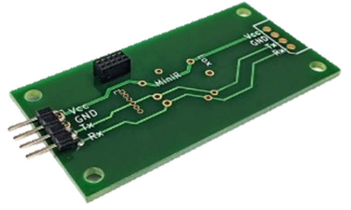

# 설명

영국에 본사를 두고 있는 Gas Sensing Solution은 Solid-State NDIR(비분산 적외선) LED 기반 가스 센서의 글로벌 리더입니다. LED와 함께 사용되는 광검출기는 MBE(분자 빔 에픽 택시) 기계를 통해 직접 제조 되며, 특허를 받은 모든 NDIR 확산 CO₂ 센서에 사용이 됩니다.

GSS는 광범위한 고체 NDIR CO₂ 가스 센서를 설계, 개발 및 제조하여 저전력, 고 정확도 및 고속 측정이 필요한 세계 최고의 고객들에게 혁신적인 제품을 제공합니다. GSS는 실내 공기 질 모니터 시스템, 헬스 케어, 우주 항공, 식품 모니터링 및 개인 안전 장비를 포함한 광범위한 시장에 제품을 공급 중입니다.

> [GSS 홈페이지](https://www.gassensing.co.uk/)

## 저전력 CO₂ 센서


[cozir\_blink.md](cozir\_blink.md)



[cozir-lp3.md](cozir-lp3.md)



[cozir-blink.md](cozir-blink.md)


## 고농도 CO₂ 센서


[co-explorir.md](co-explorir.md)


## 고속 측정 CO₂ 센서


[sprintir-w.md](sprintir-w.md)


**Explain**

: GSS는 디지털 출력인 UART가 공통적으로 포함되어 있고 0℃\~50℃의 온도 범위에서 측정할 수 있는 CO₂ 센서입니다. GSS는 각 단계에 대해 새로운 하드웨어 모듈을 생성할 필요 없이 Arduino, PCB, Sensor만 갖추고 있으시다면 신속한 CO₂ 측정이 가능합니다.

**Main Features**

* CozIR는 3.3mW의 소비 전력을 갖춘 저전력 CO₂ 센서입니다.
* SprintIR은 초 당 20회를 판독하는 고속 측정 CO₂ 센서입니다.
* ExplorIR은 넓은 범위, 급격하게 변화하는 주변 환경에 맞는 CO₂ 센서입니다

## 기타

> [올센싱 PCB 바로가기](https://allsensing.com/product/detail.html?product\_no=1171\&cate\_no=65\&display\_group=1)

<figure><figcaption>올센싱 CO2 확장 pcb</figcaption></figure>

* 올센싱 PCB 사용시 GSS 제품 연결이 용이합니다.
* 디바이스 연결 방법은 올센싱 PCB 사용 기준입니다.
