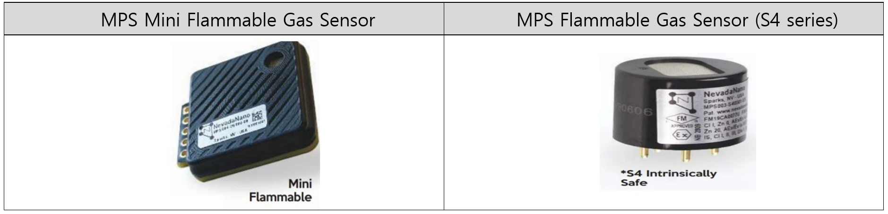
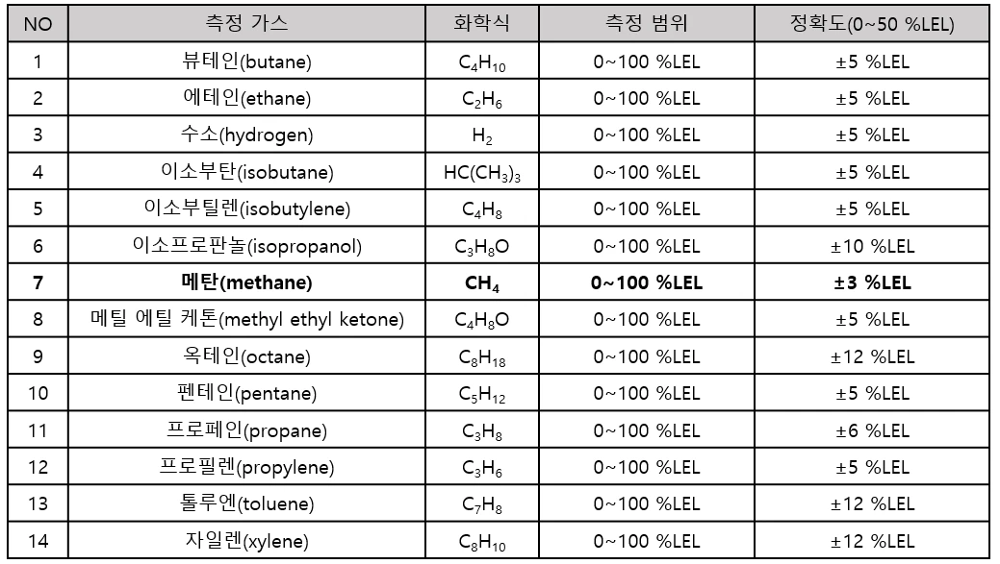
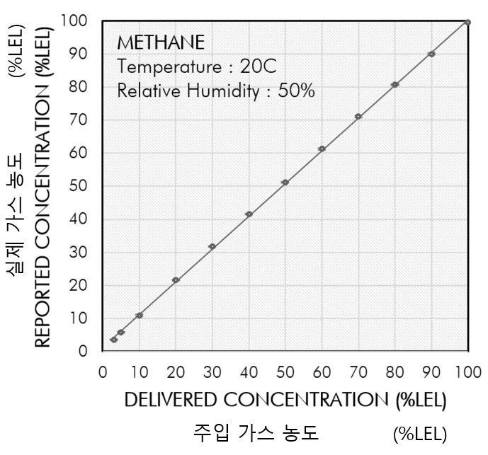
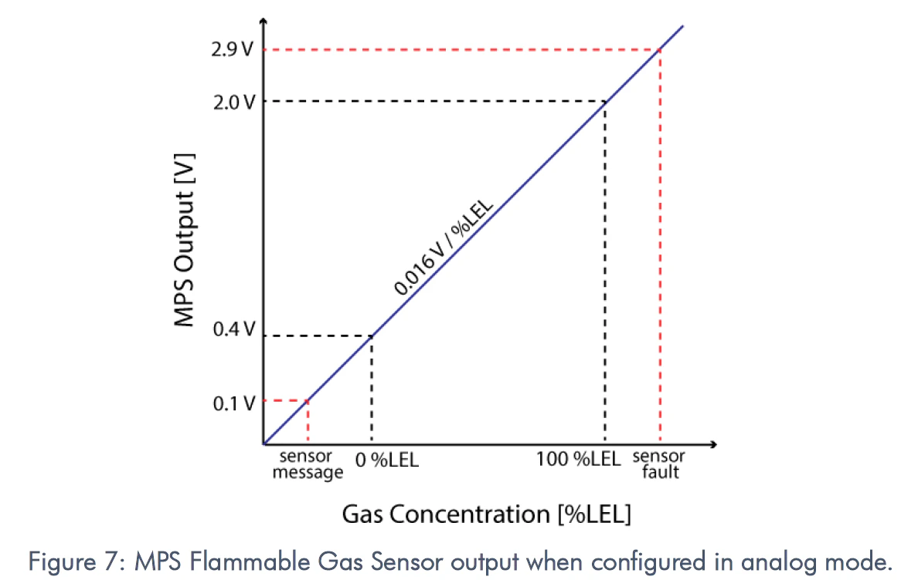
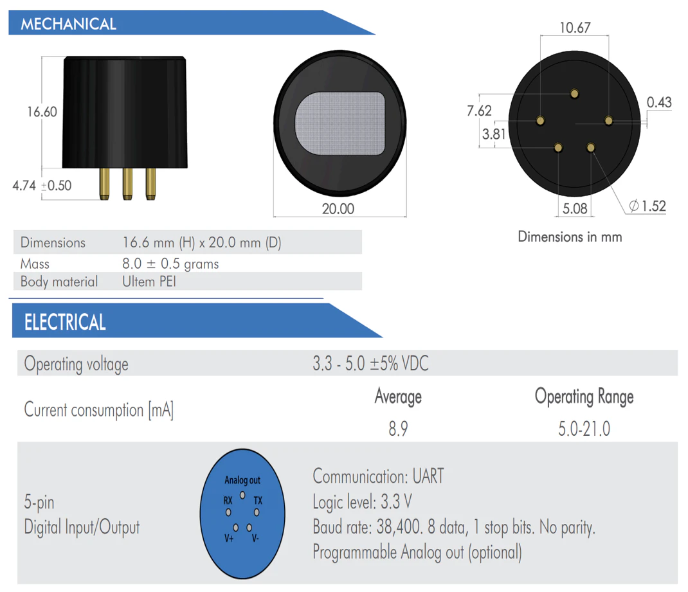
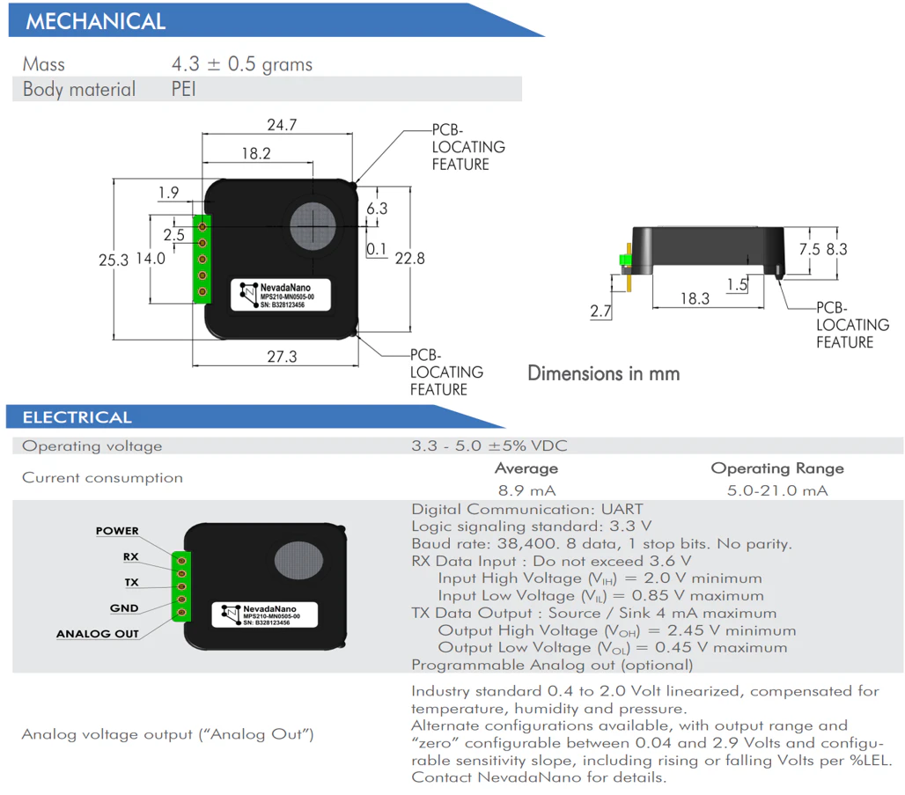
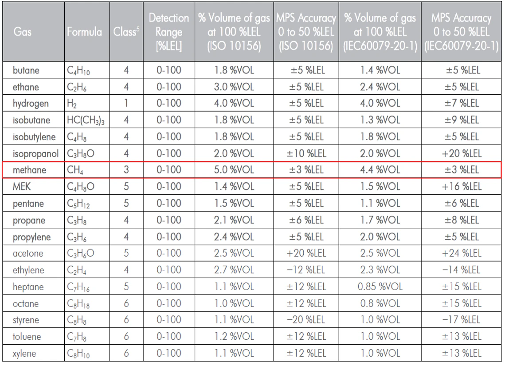
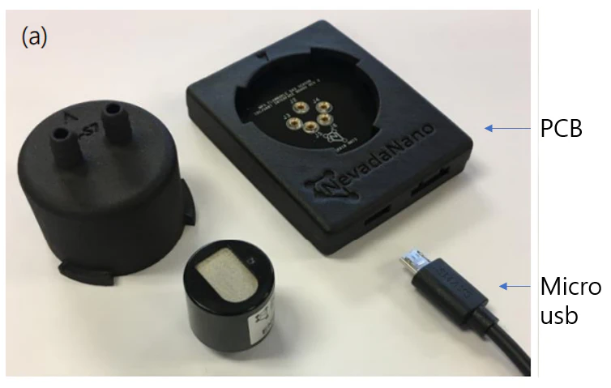
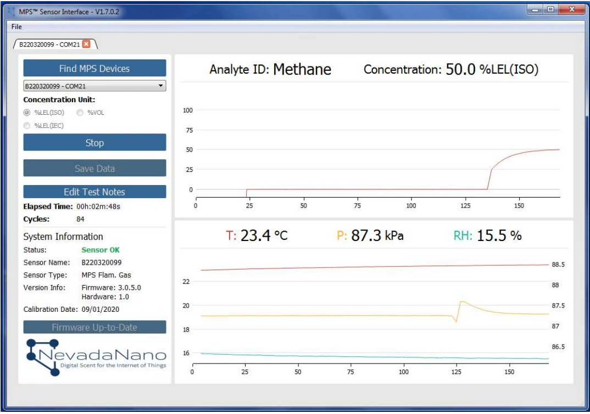

# 센서 특징

NevadaNano(NevadaNanotech Systems, Inc.)는 다양한 상업 및 정부 응용 제품을 위한 [**미세 전자 기계 시스템(MEMS) 기반 센서 모듈**](https://nevadanano.com/our-technology/) 및 하위 시스템을 개발 및 제조합니다. 당사의 제품은 시스템 통합업체 [파트너](https://nevadanano.com/partners/) 및 시스템 제조업체가 사용하는 이유는 센서의 고유한 특성, 즉 작은 크기, 저렴한 비용, 무인 작동 및 단일 표준 센서 구성으로 광범위한 위협을 탐지할 수 있는 기능의 이점을 누리기 때문입니다.

특허 받은 센서 기술은 [리노에 있는 네바다 대학교에서](https://www.unr.edu/) 개발되었습니다. 초기 R\&D는 DARPA, 국방부, 국토안보부의 지원을 받았습니다. 그 결과 NevadaNano는 2004년에 설립되었습니다. 회사는 이제 상용 애플리케이션, 특히 사물 인터넷(IOT)을 지원하는 분산 가스 감지에 초점을 맞추고 있습니다.


* [Nevadanano 홈페이지](https://nevadanano.com/)
* [Nevadanano 자료실](https://nevadanano.com/downloads/)


## 기능

<figure><figcaption>
NevadaNano sensor
</figcaption></figure>

* 수소, 메탄, 프로판, 부탄 등을 포함하여 12가지가 넘는 가장 일반적인 가연성 가스를 동시에 감지
* 드리프트, 부식 또는 독성이 없으며 수명 기간 동안 유지 관리 필요 없음
* 실시간으로 결함이 존재하는 지와 그 이유를 즉시 알려줌
* 실시간 환경 보상 내장
* 교정 불필요
* 자체 테스트 내장
* 저전력( 평균 29mW )
* 실시간 자동 가스 분류
* 유지보수 불필요
* 독성에 지속적으로 노출되어도 중독에 대한 면역
* 예상 수명 15년 이상(2년 보증)
* 아날로그 및 디지털 출력

## 응용 분야

* 메탄 누출 감지
* 가연성 가스 감지
* 실내 공기질
* 냉매 누출 감지

## 제품 기본 사양

* 측정 가스 센서 사양

| 항목             | 내용                     |
| -------------- | ---------------------- |
| 측정 범위          | 0\~100 %LEL            |
| 정확성            | ±3% (methane)          |
| 전원 전압          | + 3.3\~5 VDC           |
| 온도 범위          | -40\~70 °C             |
| 습도 범위          | 0\~100 %RH             |
| 압력범위           | 80\~120 kPa            |
| 전원 인가 후 30 초까지 | 21.1mA(+3.3V 기준)       |
| 평균 소비 전류       | 9.1mA (+3.3V 기준)       |
| 통신 방식          | Digital (UART), Analog |

* 전체 환경 범위에서 메탄에 정확도(Accuracy) 즉 전체 범위(full scale)에서 오차 범위 ±5 %LEL

<figure><figcaption>
NevadaNano sensor gas
</figcaption></figure>

<figure><figcaption>
NevadaNano sensor gas
</figcaption></figure>

> **Analog**\
> 아날로그 값 범위: 0.01V\~2.9V\
> 가스 농도 값 범위: 0.4 V (0 %LEL) to 2.0 V (100 %LEL)

<figure><figcaption>
NevadaNano sensor analog
</figcaption></figure>

## 제품 크기 및 핀 특성

<figure><figcaption>
NevadaNano sensor dimension
</figcaption></figure>

<figure><figcaption>
NevadaNano sensor dimension
</figcaption></figure>

## LEL 규격

**MPS sensor ISO 10156 규격과, IEC 60079-20-1 규격**

> MPS Gas sensor는 초기에 ISO 10156 기준으로 제조사에서 교정됨(ISO defualt)

> ISO (International Organization for Standardization) 국제 표준화 기구, IEC (International Electrotechnical Commission) 국제전기기술위원회

<figure><figcaption>
NevadaNano sensor iso/iec
</figcaption></figure>

* 가연성 가스의 % Vol, % LEL, PPM 사이의 관계: 5.0 % VOL=100 % LEL=50000PPM
* 메탄(methane)의 경우 ISO 10156 규격일 경우 100 %LEL일때 5.0 % VOL = 50000PPM
* IEC 60079-20-1 규격일 경우 100 %LEL일때 4.4 % VOL = 약 44014PPM

## 통신 프로토콜

⚠️ 통신 프로토콜 매뉴얼 [SM-UM-0002-24-MPS-Flammable-Gas-Sensor-User-Manual.pdf (nevadanano.com)](https://nevadanano.com/wp-content/uploads/2023/05/SM-UM-0002-24-MPS-Flammable-Gas-Sensor-User-Manual.pdf)

## Nevadanano 개발 키트

[SM-UM-0001-06-Flammable-Gas-Sensor-Evaluation-Unit-User-Manual.pdf (nevadanano.com)](https://nevadanano.com/wp-content/uploads/2021/11/SM-UM-0001-06-Flammable-Gas-Sensor-Evaluation-Unit-User-Manual.pdf)

<figure><figcaption>
NevadaNano sensor dev kit
</figcaption></figure>

<figure><figcaption>
NevadaNano sensor dev kit
</figcaption></figure>

## 아두이노와 연결

⚠️ 센서의 손상을 방지 하기 위하여 소켓을 사용 하여 연결

<figure><figcaption>
NevadaNano sensor arduino
</figcaption></figure>
