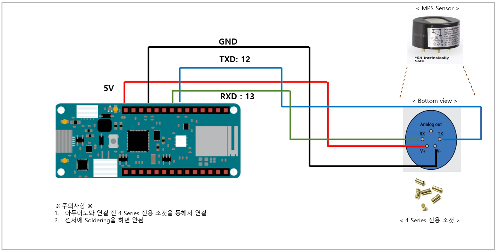
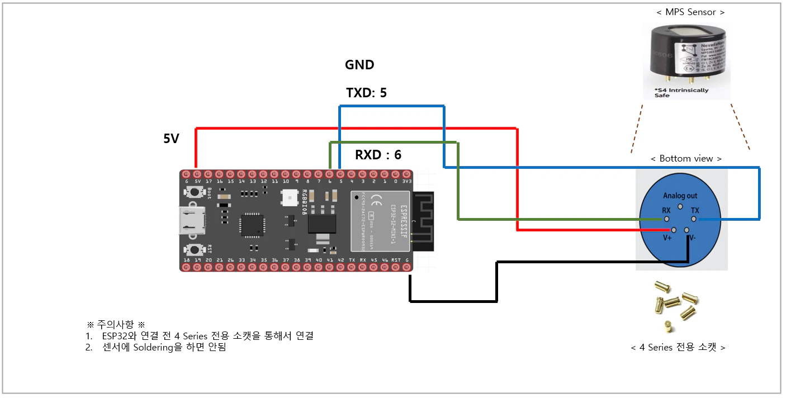
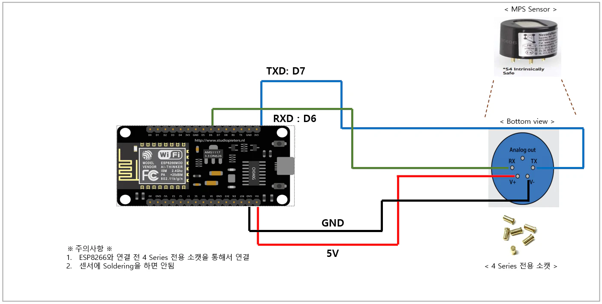

# 디바이스 연결 방법

* Arduino mkr 1010, esp32-s2, esp8266와 MPS Gas Sensor의 연결 방법&#x20;




<figure><figcaption>디바이스_MKR</figcaption></figure>



<figure><figcaption>디바이스_ESP32</figcaption></figure>



<figure><figcaption>디바이스_ESP8266</figcaption></figure>



