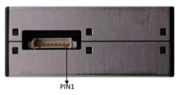

# Plantower

* 공기 질 센서의 R\&D, 생산 및 판매에 주력하는 하이테크 기업
* 2014년 베이징에 설립되었으며 정부 투자 유치로 2018년 장시성 난창으로 이전
* 수많은 혁신과 특허 및 전문적인 최고 R\&D 팀을 통해 Plantower 시리즈 센서는 이미 높은 정확도와 안정적인 특성으로 국내외 고객 사이에서 큰 관심과 인정을 받음
* Plantower 시리즈 센서는 공기질, 환경 모니터링, 자동차 전자 제품, 스마트 홈 등에 널리 사용됨

#### &#x20;배경지식

<figure><figcaption></figcaption></figure>

## 제품 특징

#### 공통점

* 측정 방식: 레이저 산란 방식
* 입력 전압: 5V
* 측정범위(PM): 0.3\~1.0㎛, 1.0\~2.5㎛, 2.5\~10㎛
* 통신 레벨: TTL (3.3 Level)
* 통신 프로토콜 (PMS 5003IB 제외)

#### 차이점

<figure><figcaption></figcaption></figure>

|     Pin Pitch     |                     센 서                     |
| :---------------: | :-----------------------------------------: |
|    1.25mm Pitch   | _PMS A003A, PMS A003C, PMS 7003, PMS 7003M_ |
| 1.27 mm Pitch (A) |                  _PMS 5003_                 |
| 1.27 mm Pitch (B) |           _PMS 5003IB, PMS 9003M_           |

※ 올센싱에서 먼지센서 구입시 센서 항목에 따라 커넥터나 케이블을 함께 보내 드립니다.

<figure><figcaption>
커넥터 1.27mm Pitch
</figcaption></figure>

<figure><figcaption>
케이블 1.25mm Pitch(A)
</figcaption></figure>

<figure><figcaption>
케이블 1.25mm Pitch(B)
</figcaption></figure>

#### Datasheet

* [PMS A003A](http://econarae1.cafe24.com/01\_Datasheet/13\_Particle\_sensor/PMSA003.pdf)
* [PMS A003C](http://econarae1.cafe24.com/01\_Datasheet/13\_Particle\_sensor/PMSA003.pdf)
* [PMS 5003](http://econarae1.cafe24.com/01\_Datasheet/13\_Particle\_sensor/PMS%205003.pdf)
* [PMS 5003IB](http://econarae1.cafe24.com/01\_Datasheet/13\_Particle\_sensor/PMS%205003IB%20series%20data%20manua%20English\_V1.0.pdf)
* [PMS 7003](http://econarae1.cafe24.com/01\_Datasheet/13\_Particle\_sensor/PMS7003.pdf)
* [PMS 7003M](http://econarae1.cafe24.com/01\_Datasheet/13\_Particle\_sensor/PMS7003.pdf)
* [PMS 9003M](http://econarae1.cafe24.com/01\_Datasheet/13\_Particle\_sensor/DS\_PMS\_9003M%20v1\_1.pdf)

## 특징

* 실시간 응답
* 정확한 데이터
* 입자 0.3 micrometer까지 식별 가능
* 6개의 특허 구조로 인한 측면 보호
* 공기 흡입구 및 배출구의 선택적 디자인 설계
* UART 디지털 출력, I2C(PMS5003IB)

## 애플리케이션

* 보건 의료
* 실내 공기 질(IAQ)
* 스포츠 과학
* 난방, 환기 및 공기 조절

## 샤양

|       항목      |                           내용                           |
| :-----------: | :----------------------------------------------------: |
|     동작 방식     |                       레이저 산란  방식                       |
|   측정 범위(PM)   |             0.3\~1.0㎛, 1.0\~2.5㎛, 2.5\~10㎛             |
|     통신 레벨     |                     3.3V TTL level                     |
|     작동 온도     |                        -10\~60℃                        |
|     작동 습도     |                         0\~99%                         |
|      응답시간     |                          <1sec                         |
|     전원 전압     |                       4.5-5.5VDC                       |
| 소모 전류(Active) |                         <= 100㎃                        |
|     측정 정밀도    | ±10% at 100\~500㎍/㎥, ±10㎍/㎥ at 0\~100㎍/㎥(PMS5003IB 제외) |
|     센서 수명     |                          3년 이상                         |

## &#x20;제품 크기 및 핀 특성

### _PMS A003A, PMS A003C, PMS 7003, PMS 7003M_

<figure><figcaption></figcaption></figure>

<figure><figcaption></figcaption></figure>

### &#x20;_PMS 5003_

<figure><figcaption></figcaption></figure>

<figure><figcaption></figcaption></figure>

### _PMS 5003IB, PMS 9003M_

<figure><figcaption></figcaption></figure>

<figure><figcaption></figcaption></figure>

## 디바이스 연결 방법


[undefined.md](undefined.md)


## 통신 프로토콜

## UART


[uart.md](undefined-1/uart.md)


## I2C


[i2c.md](undefined-1/i2c.md)


