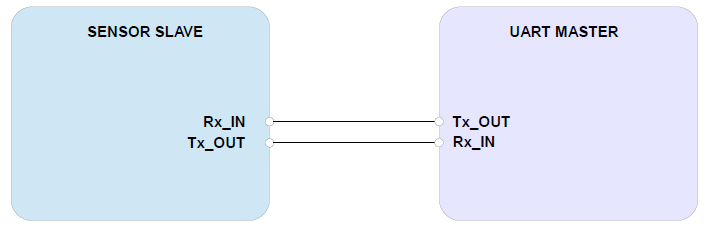

# 디바이스 연결 방법

## Connection DIAGRAM (UART)

<figure><figcaption></figcaption></figure>

## _PMS A003A, PMS A003C, PMS 7003, PMS 7003M_

[올센싱 PCB](https://allsensing.com/product/detail.html?product\_no=1171\&cate\_no=65\&display\_group=1)

* 올센싱 PCB 사용시 _PMS A003A, PMS A003C, PMS 7003, PMS 7003M_ 제품과 연결에 용이함 &#x20;

<figure><figcaption></figcaption></figure>

\- 아래 디바이스 연결 방법은 올센싱 PCB 사용 기준으로 작성



<figure><figcaption></figcaption></figure>

| 항목  | Arduino Uno | PMSA003A |
| --- | ----------- | -------- |
| VCC | 5V          | VCC      |
| GND | GND         | GND      |
| TX  | 12          | RX       |
| RX  | 13          | TX       |



<figure><figcaption></figcaption></figure>

| 항목  | Arduino MKR | PMSA003A |
| --- | ----------- | -------- |
| VCC | 5V          | VCC      |
| GND | GND         | GND      |
| TX  | 12          | RX       |
| RX  | 13          | TX       |



<figure><figcaption></figcaption></figure>

| 항목  | ESP32 | PMSA003A |
| --- | ----- | -------- |
| VCC | 5V    | VCC      |
| GND | GND   | GND      |
| TX  | 8     | RX       |
| RX  | 6     | TX       |



<figure><figcaption></figcaption></figure>

| 항목  | ESP8266 | PMSA003A |
| --- | ------- | -------- |
| VCC | 5V      | VCC      |
| GND | GND     | GND      |
| TX  | D7      | RX       |
| RX  | D6      | TX       |



## _PMS 5003, PMS 9003M_



<figure><figcaption></figcaption></figure>

| 항목  | Arduino Uno | PMS5003 |
| --- | ----------- | ------- |
| VCC | 5V          | VCC     |
| GND | GND         | GND     |
| TX  | 12          | RX      |
| RX  | 13          | TX      |



<figure><figcaption></figcaption></figure>

| 항목  | Arduino MKR | PMS5003 |
| --- | ----------- | ------- |
| VCC | 5V          | VCC     |
| GND | GND         | GND     |
| TX  | 12          | RX      |
| RX  | 13          | TX      |



<figure><figcaption></figcaption></figure>

| 항목  | ESP32 | PMS5003 |
| --- | ----- | ------- |
| VCC | 5V    | VCC     |
| GND | GND   | GND     |
| TX  | 5     | RX      |
| RX  | 6     | TX      |



<figure><figcaption></figcaption></figure>

| 항목  | ESP8266 | PMS5003 |
| --- | ------- | ------- |
| VCC | 5V      | VCC     |
| GND | GND     | GND     |
| TX  | D7      | RX      |
| RX  | D6      | TX      |



## _PMS 5003IB_



<figure><figcaption></figcaption></figure>

| 항목  | Arduino Uno | PMS5003IB |
| --- | ----------- | --------- |
| VCC | 5V          | VCC       |
| GND | GND         | GND       |
| SDA | A4          | SDA       |
| SCL | A5          | SCL       |



<figure><figcaption></figcaption></figure>

| 항목  | Arduino MKR | PMS5003 |
| --- | ----------- | ------- |
| VCC | 5V          | VCC     |
| GND | GND         | GND     |
| SDA | D12         | SDA     |
| SCL | D11         | SCL     |



<figure><figcaption></figcaption></figure>

| 항목  | ESP32 | PMS5003 |
| --- | ----- | ------- |
| VCC | 5V    | VCC     |
| GND | GND   | GND     |
| SDA | 12    | SDA     |
| SCL | 13    | SCL     |



<figure><figcaption></figcaption></figure>

| 항목  | ESP8266 | PMS5003 |
| --- | ------- | ------- |
| VCC | 5V      | VCC     |
| GND | GND     | GND     |
| SDA | D6      | SDA     |
| RX  | D5      | SCL     |



