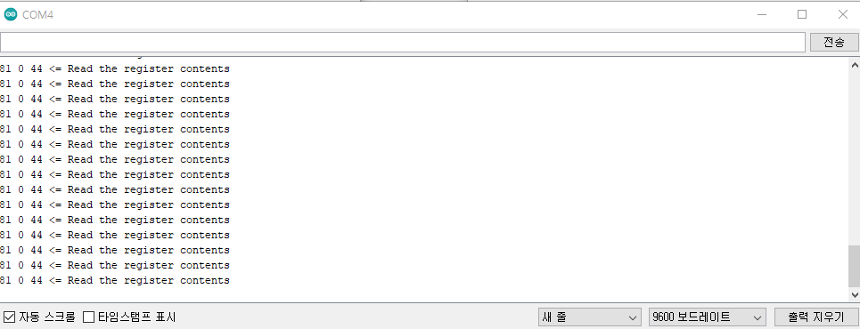

# Address 읽기 및 쓰기

**Step 0. ETH-01D I2C command 전송**

* Device에서 Command ((i2c Address+Write bit),0xA0, 0x00, 0x00)를 ETH-01D로 전송

<figure><figcaption></figcaption></figure>

**Step 1. Sensor Address 요청 Command**

* Device에서 Command ((i2c Address+Write bit),0x1C, 0x00, 0x00)를 ETH-01D로 전송

<figure><figcaption></figcaption></figure>

**Step 2. Address 응답**

* ETH-01D에서 상태 값과 Address 값 응답(3byte)

<figure><figcaption></figcaption></figure>

**Step 3. Sensor Address 쓰기 Command**

* Device에서 Command ((i2c Address+Write bit),0x5C, Register Value\[15:8], 변경할 address\[7:0]) 를 ETH-01D로 전송
* 변경할 address\[7:0] : Register value \[6:0] 만 변경

<figure><figcaption></figcaption></figure>

## 소스 코드



```cpp
#include <Wire.h>
#define slave_address 0x44
#define change_slave_address 0x44 // <- This address is subject to change
#define Sensor_power_port 6 // Arduino uno, Arduino mkr 1010, esp32
// #define Sensor_power_port 16   // esp8266
#define Power_enable digitalWrite(Sensor_power_port, HIGH)
#define Power_disable digitalWrite(Sensor_power_port, LOW)
#define Address_read_command  Wire.write(0x1C)
#define Address_write_command  Wire.write(0x5C)   

void setup()
{
  Wire.begin();// arduino uno,  Arduino mkr 1010
  //Wire.begin(7,8,5000); //esp32
  //Wire.begin(4,5,5000); //esp8266
  Serial.begin(9600);
  pinMode(Sensor_power_port, OUTPUT);
}
void loop()
{
  int Status;
  int RegisterValueHigh;
  int RegisterValueLow;

  //===Module Power Reset===
  Power_disable; //전원 끔
  delay(1);  
  Power_enable;
  delay(2);  //10msec 이내에 신호 전송되어야함

  // Step 1. ETH-01D I2C command 전송
  //프로그래밍 모드로 들어가기 위한 명령, 명령어 처리 시까지 120usec 시간이 소요됨.
  Wire.beginTransmission(slave_address);
  Wire.write(0xA0);
  Wire.write(0x00);
  Wire.write(0x00);
  Wire.endTransmission();
  delayMicroseconds(120);

  //Step 2. 온습도 Address 요청 Command
  Wire.beginTransmission(slave_address);
  Address_read_command;
  Wire.write(0x00);
  Wire.write(0x00);
  Wire.endTransmission();
  delay(1);

  //Step 3. 온습도 Address 응답  ex)81 00 44
  Wire.requestFrom(slave_address, 3);

  if (Wire.available()) {
    Status = Wire.read();
    RegisterValueHigh = Wire.read();
    RegisterValueLow = Wire.read();
    Serial.print(Status, HEX); // 0x81 = status succes
    Serial.print(" ");
    Serial.print(RegisterValueHigh,HEX);
    Serial.print(" ");
    Serial.print(RegisterValueLow, HEX);
    Serial.println(" <= Read the register contents");
  }
  // adress 읽은 뒤 [6:0] 비트만 변경 
  #if 0   // adress 읽은 뒤 #if 0 -> #if  1
  //Step 4. 온습도 Address 쓰기 Command, 데이터 기록시간은 14msec가 필요함
  Wire.beginTransmission(slave_address);
  Address_write_command;
  Wire.write(0x00);      
  Wire.write(change_slave_address);     // 변경 할 address write  
  Wire.endTransmission();
  delay(14);
  Serial.print(change_slave_address, HEX);
  Serial.println(" <= Write the register contents");
  #endif
 //Step 5. 프로그래밍 모드에서 일반 모드로 전환
  Wire.beginTransmission(slave_address);
  Wire.write(0x80);
  Wire.write(0x00);
  Wire.write(0x00);
  Wire.endTransmission();
  delay(1000);
}

```



Address 읽기 및 쓰기 시리얼 모니터

<figure><figcaption></figcaption></figure>
