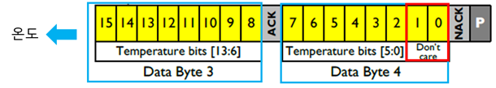
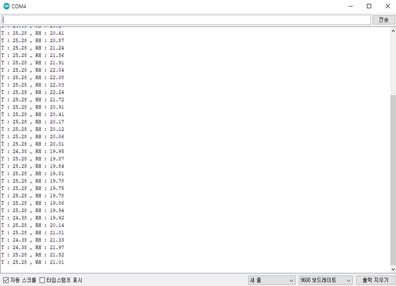

# 온·습도 읽기

### 온·습도 읽기 <a href="#_toc127806959" id="_toc127806959"></a>

<figure><figcaption><p>&#x3C; ETH-01D 온 습도 읽기 ></p></figcaption></figure>

`i2c Address는 0x44(7bit), Write bit는 0, Read bit는 1`

`Don’t care는 측정 데이터에 포함하지 않으며 사용하지 않음.`

**Step 1. 온·습도 데이터 요청**

* Device에서 i2c Address(0x44)를 ETH-01D로 전송

<figure><figcaption></figcaption></figure>

**Step 2-1. 습도 데이터 응답**

* 데이터 중 상위 1byte 15,14번째 데이터는 Don’t care
* 습도 값 = (습도 데이터 13\~0번째)/(2^14-1)\*100

**Ex) 습도 데이터 2byte = 0x4ec0**

* Data 상위 1Byte : 13\~8번째 데이터: 0x4e & 0x3f(Don’t care 데이터 버림) = 0xe00 = 3584
* Data 상위 1Byte + Data 하위 1Byte = 0xe00+0xc0 = 0xec0 = 3,776
* 습도 값 = 23.04 %RH

<figure><figcaption></figcaption></figure>

**Step 2-2. 온도 데이터 응답**

* 데이터 중 하위 1byte 0,1번째 데이터는 Don’t care
* 온도 값 =(온도 데이터 15\~2번째 데이터)/(2^14-1)\*165-40

**EX) 온도 데이터 2byte = 0x66ed**

* Data 상위 1Byte : 0x6600
* Data 하위 1Byte 7\~2번째 데이터 = 0xed & 0xfc(Don’t care 데이터 버림) = 0xec
* Data 상위 1Byte + Data 하위 1Byte = 0x6600 +0xec = 0x66ec
* Data 상위 1Byte + Data 하위 7\~2번째 데이터 = 0x66ec >>2(Don’t care bit 수만큼 이동) = 19BB = 6587
* 온도 = 26.34°C

<figure><figcaption></figcaption></figure>

## 소스 코드



```cpp
#include <Arduino.h>
#include <Wire.h>
#define slave_address 0x44
#define Sensor_power_port 6 // Arduino uno, Arduino mkr 1010, esp32
// #define Sensor_power_port 16 // esp8266
#define Power_enable digitalWrite(Sensor_power_port, HIGH)
#define Power_disable digitalWrite(Sensor_power_port, LOW)
void setup()
{
Wire.begin();// arduino uno, Arduino mkr 1010
//Wire.begin(7,8,5000); //esp32
//Wire.begin(4,5,5000); //esp8266
Serial.begin(9600);
pinMode(Sensor_power_port, OUTPUT);
Power_enable;
}
void loop()
{
int HumidH;
int HumidL;
int TemperH;
int TemperL;
Wire.beginTransmission(slave_address);
Wire.endTransmission();
delay(34);
Wire.requestFrom(slave_address, 4);
if(Wire.available())
{
HumidH = Wire.read();
HumidL = Wire.read();
TemperH = Wire.read();
TemperL = Wire.read();
HumidH = HumidH & 0x3f; // Don't care bit mask
// *********** Humidity & Temperature calculation code changed ***************************
double RealH = (double)((HumidH * 256 ) + HumidL ) * 100/16383;
double RealT = (double)(((TemperH * 256) + TemperL)/4) * 165/16383 - 40;
Serial.print("T : "); Serial.print(RealT, 2);
Serial.print(" , ");
Serial.print("RH : "); Serial.println(RealH, 2);
delay(1000);
}
}
```



* 온·습도 읽기 시리얼 모니터

<figure><figcaption></figcaption></figure>
