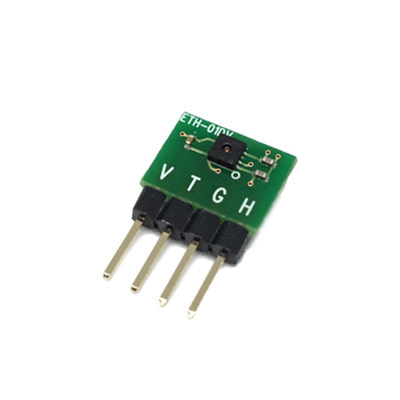
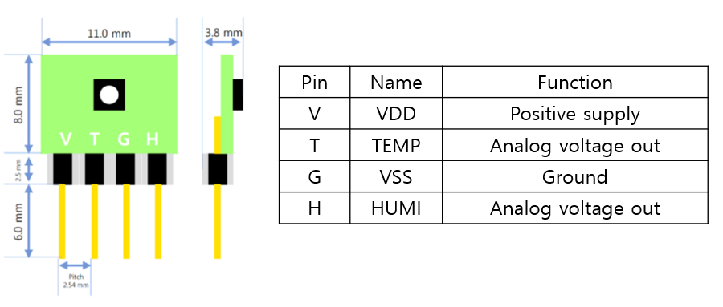
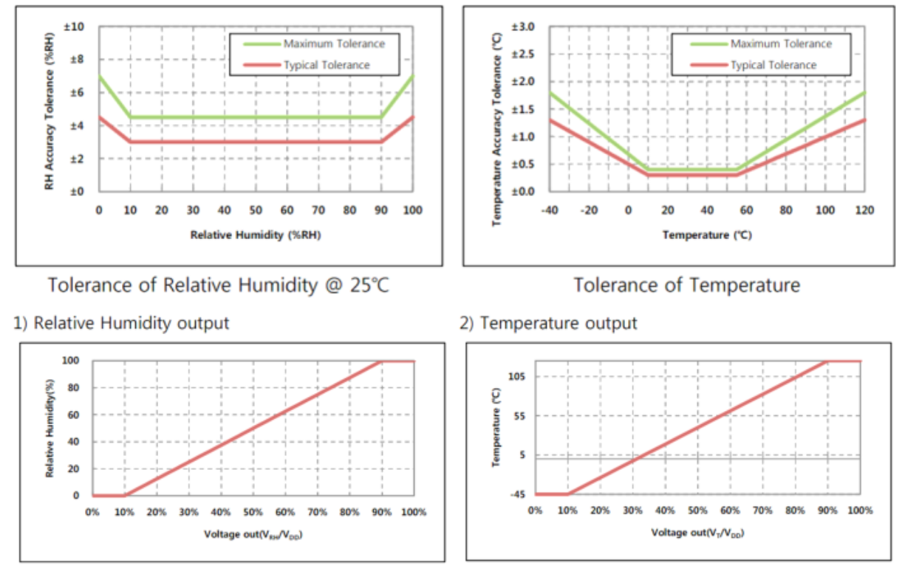
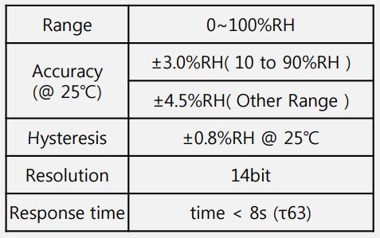
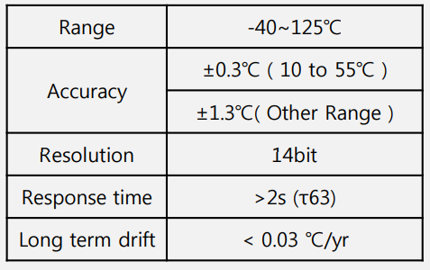
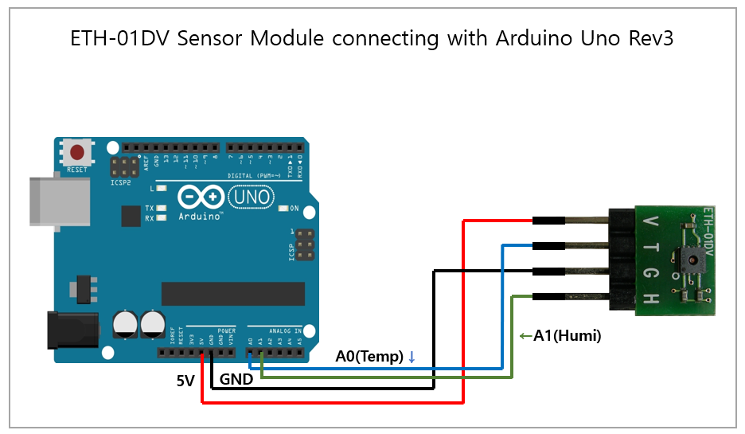
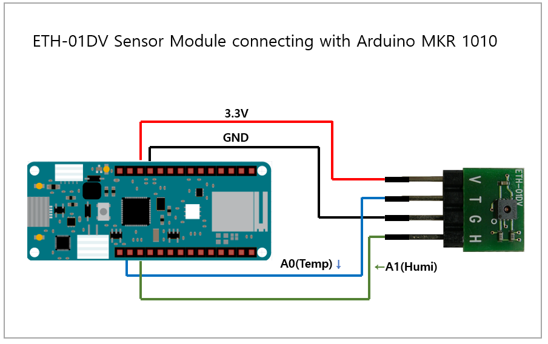
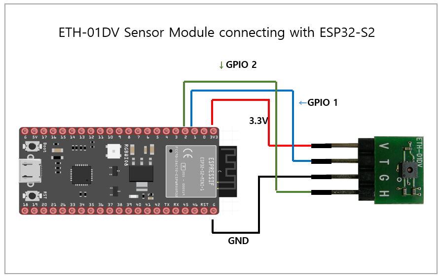
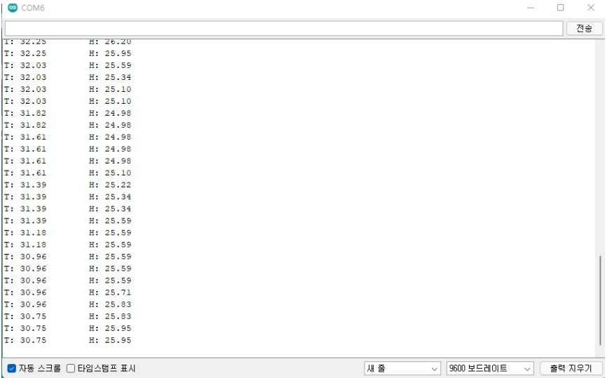

# ETH-01DV

<figure><figcaption></figcaption></figure>

## 특징

* 저전력으로 사용 가능한 디지털 출력의 온·습도 센서 모듈입니다.
* 2.54mm의 작은 헤더 핀이 부착되어 공간이 제한된 애플리케이션에도 설치가 용이합니다.
* 안정성 및 향상된 정확도 사양, 향상된 신호 처리

## **어플리케이션**

* 기상 관측
* 데이터로거
* 가전제품
* 냉난방 공조 시스템
* 자동차
* 습도계
* 의료
* 자동화기기

## **제품 사양**

| 항목             | 내용                                                              |
| -------------- | --------------------------------------------------------------- |
| 측정 범위          | <p>온도: -40~ 125℃</p><p>습도: 0~100%RH</p>                         |
| 습도 정확성(@ 25°C) | <p>10 to 90%RH : ±3.0%RH</p><p>&#x3C; 10 , 90%RH > : 4.5%RH</p> |
| 온도 정확성         | <p>10 to 55°C: ±0.3°C</p><p>&#x3C; 10, 55°C> :±1.3°C</p>        |
| 전원 전압          | 최소:2.4V 평균:3.3V 최대:5.5V                                         |
| 소모 전류          | 평균: 217㎂                                                        |
| 보관 온도          | -40 \~ 150°C                                                    |
| 응답 시간          | 17.3msec < 온 습도                                                 |
| 센서 치수          | L x W x H(16.5mm x 11mm x 3.8mm)                                |
| 헤더 핀           | 2.54mm                                                          |

## **제품 크기 및 핀 특성**

<figure><figcaption></figcaption></figure>

## 특성 그래프

<figure><figcaption></figcaption></figure>

## 온습도 특징

<figure><figcaption><p>&#x3C;습도></p></figcaption></figure>

<figure><figcaption><p>&#x3C;온도></p></figcaption></figure>

**출력 값 계산 식**

* 1\) Relative Humidity Output
* RH\[%] = -10/0.8 + 100/0.8 x VRH/VDD RH : Relative Humidity(%) VRH : Relative Humidity Voltage Out VDD : Supply Voltage
* 2\) Temperature Output
* T\[°C] = -45 - 17.5/0.8 + 175/0.8 x VT/VDD T : Temperature(°C) VT : Temperature Voltage Output VDD : Supply Voltage

## **디바이스 연결 방법**

* Arduino uno와 ETH-01D 연결

<figure><figcaption></figcaption></figure>

* Arduino MKR 1010와 ETH-01D 연결

<figure><figcaption></figcaption></figure>

* ESP32와 ETH-01DV 연결

<figure><figcaption></figcaption></figure>

## 소스코드



```cpp
void setup() {
  Serial.begin(9600);
}
 
void loop() {
  float T = analogRead(A0);
  float H = analogRead(A1);
 
  Serial.print("T: ");
  Serial.print( -66.875 + 218.75 * T / 1024);
  Serial.print("\tH: ");
  Serial.println( -12.5 + 125 * H / 1024);
  delay(1000);
}
```



```cpp
#include <Arduino.h>
#define GPIO_1  1
#define GPIO_2  2
void setup() {
  Serial.begin(115200);
  pinMode(GPIO_1, INPUT); 
  pinMode(GPIO_2, INPUT); 
  analogReadResolution(10); // set Resolution 10 bits
}
void loop() {
  int temp_value = analogRead(GPIO_1);
  int humi_value = analogRead(GPIO_2);
  Serial.print("temp: ");
  Serial.print( -66.875 - 33 + 218.75 * temp_value / 1024);
  Serial.print("humi: ");
  Serial.println( -12.5 + 125 * humi_value / 1024);
  delay(1000);  // delay in between reads for stability
}

```



**Serial Monitor**

<figure><figcaption></figcaption></figure>
