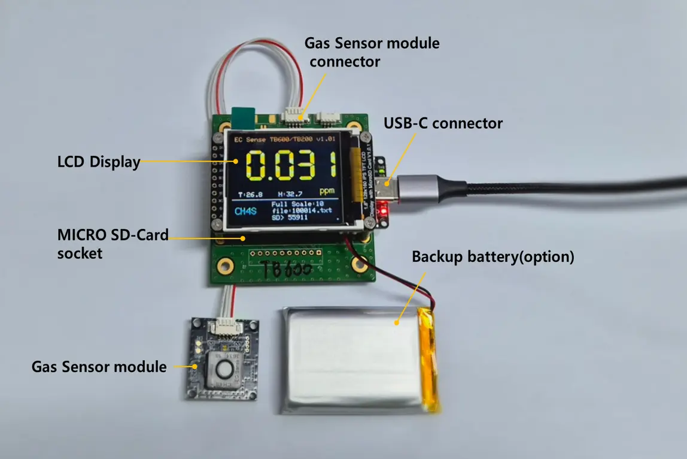
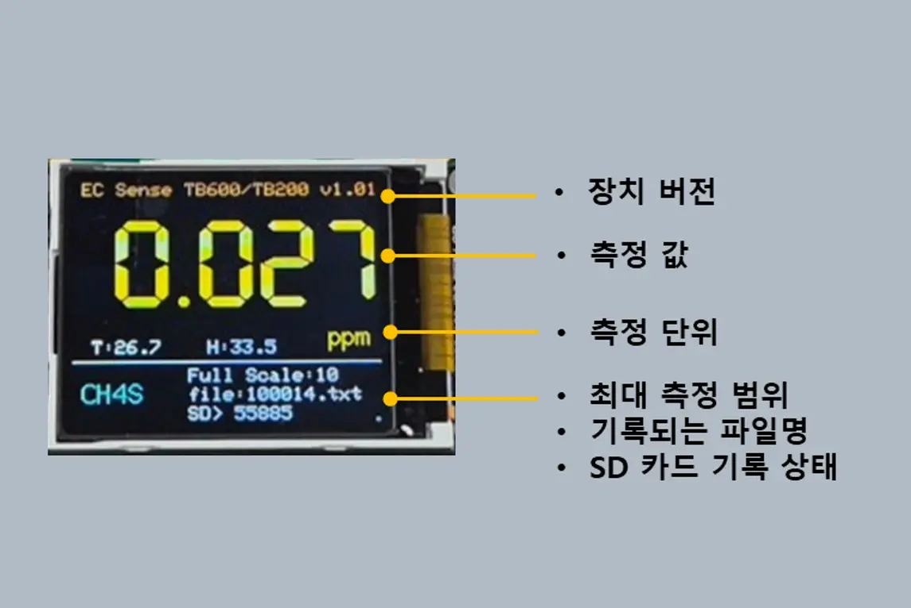

# 올센싱 가스센서 모듈

## 제품 사양 및 명칭

*   제품 사양

    <table><thead><tr><th width="166">항목</th><th>사양</th></tr></thead><tbody><tr><td>입력 전원</td><td>USB C 커넥터: +5.0VDC 백업 배터리: 3.7V 리튬 폴리머(USB 전원으로 충전 지원)</td></tr><tr><td>디스플레이</td><td>LCD 디스플레이</td></tr><tr><td>센서 모듈</td><td>센서 제조사의 모델에 따라 다름(문의 요청)</td></tr><tr><td>데이터 저장</td><td>SD Card(16GB권장), 최대 32GB</td></tr></tbody></table>
* 제품 명칭

<figure><figcaption>
Allsensing Sensor Module
</figcaption></figure>

## 사용 방법

> ⚠️ 확인 사항
>
> * 장착되는 가스 센서 모듈의 사양에 따라 온도, 습도는 표시 및 저장 되지 않을 수 있습니다.
> * 가스명은 제품명으로 표시 될수 있습니다.
> * SD 카드 데이터 저장 내용에 시간 값은 표시되지 않으며 1초 카운터 값으로 표시됩니다.
> * 백업 배터리는 옵션 사항입니다.

* 조립 순서
  * 가스센서 모듈을 가스 센서 모듈 커넥터에 연결
  * Micro SD Card 소켓에 Micro SD Cad 장착(16gb 권장(32GB까지 사용 가능), FAT32 포맷 지원)
    * 가스 센서 커넥터 연결 후 USB-C 커넥터 및 백업 배터리를 연결 하여 장치 구동
* 화면 구성

<figure><figcaption>
Allsensing Sensor Module
</figcaption></figure>
