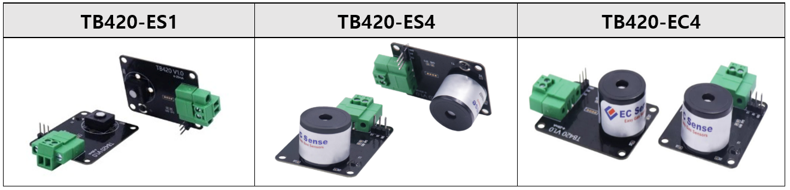
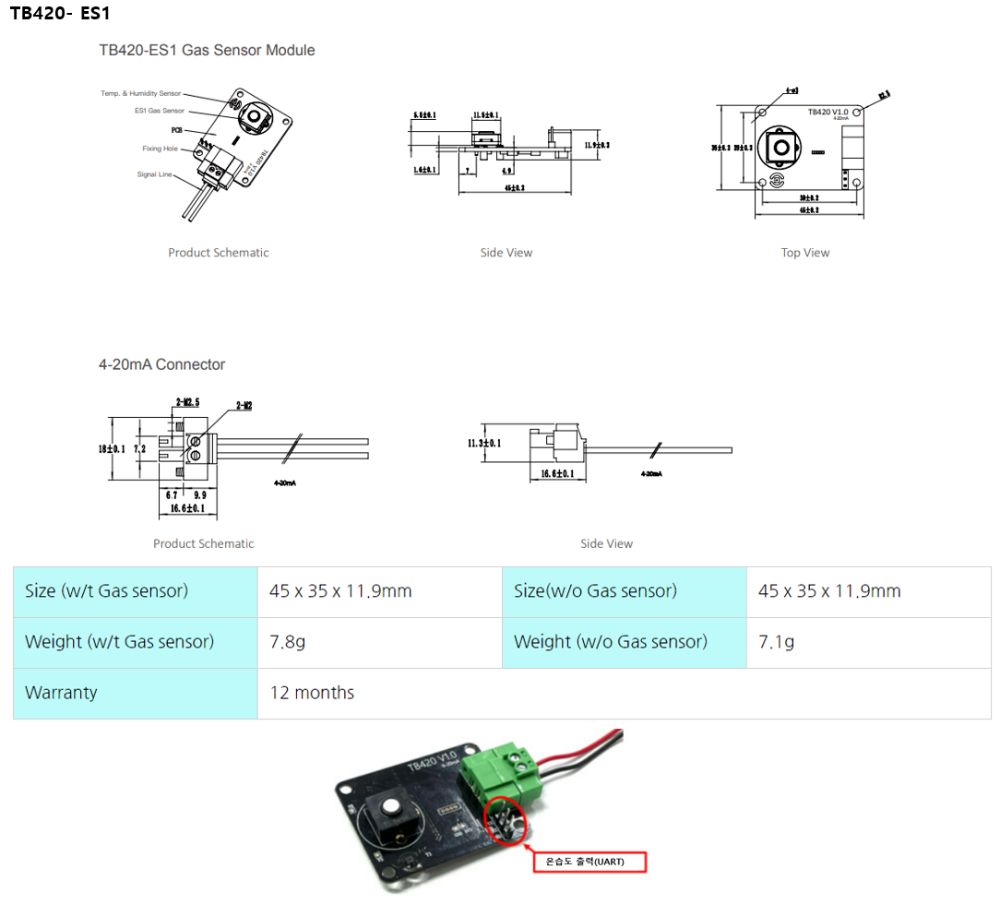
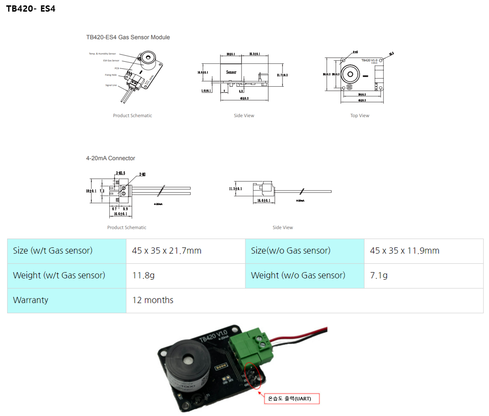
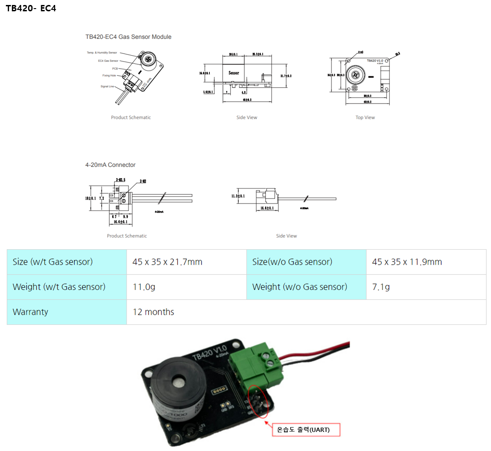
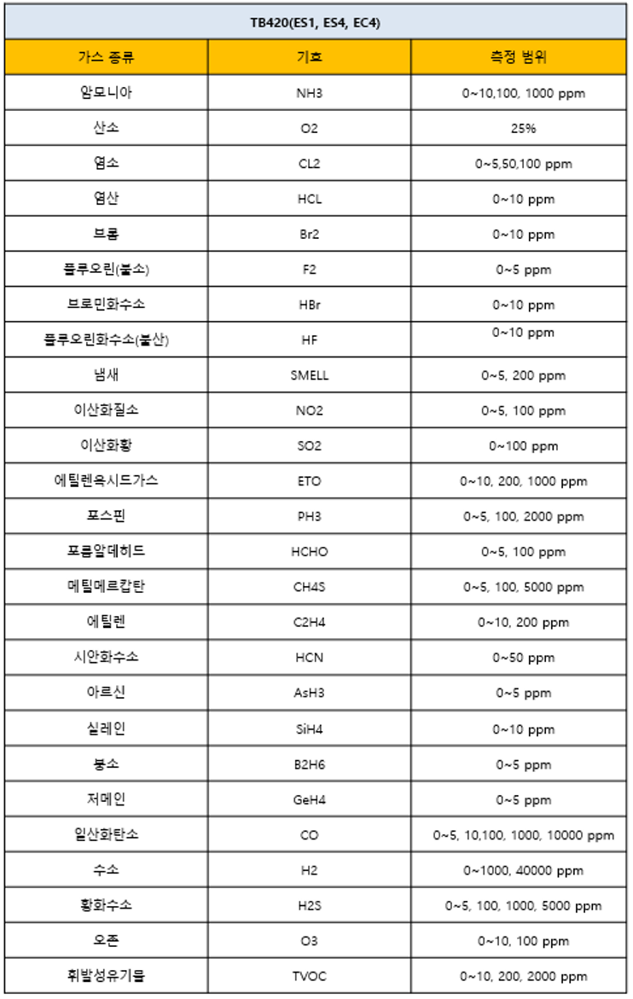

# TB420

#### TB420- (ES1, ES4, EC4)

<figure><figcaption></figcaption></figure>

## 특징

* 아날로그 출력 4-20mA, 표준 2선 출력, 24V DC. 전원
* 가스 + 온/습도 동시 측정 (단, 온습도는 digital 출력임)
* 빠른 안정화 시간
* 실내/외 환경에 적합한 센서로 -40 \~ 55℃ 작동가능
* 응답시간이 빠르고 안정적인 영점을 가지며, 전자파에 강함
* 긴 수명 가스 센서
* 통합 안전 보호 기능으로 폭발 가능성이 있는 환경에서 사용 가능
* 전자 회로 기판에 먼지 및 부식 방지 코팅 적용
* 작은 크기
* RoHS 승인

## 애플리케이션

* 산업용 가스 안전 모니터링
* 산업용 공정 가스 모니터링
* 반도체 가스 정화 모니터링
* 변압기 고장 및 전력실 환경 모니터링
* 누출 감지

## 사양

<table><thead><tr><th width="375">항 목</th><th>내 용</th></tr></thead><tbody><tr><td>출 력</td><td>정상: 4-20mA two-wires 신호 약함: 3.5mA 오류: 3mA</td></tr><tr><td>공급 전압</td><td>9~24V DC, 24V DC (default)</td></tr><tr><td>공급 전류</td><td>3-22mA</td></tr><tr><td>소모 전력</td><td>&#x3C; 0.6W</td></tr><tr><td>구동 온도</td><td>-40~55℃</td></tr><tr><td>구동 습도</td><td>15-95% RH</td></tr><tr><td>수명</td><td>> 3년</td></tr></tbody></table>

## 제품 크기 및 핀 특성

<figure><figcaption></figcaption></figure>

<figure><figcaption></figcaption></figure>

<figure><figcaption></figcaption></figure>

## 측정 가스 종류 및 측정 범위

<figure><figcaption></figcaption></figure>
