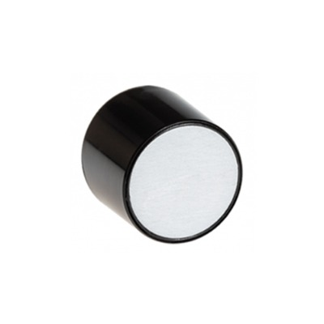
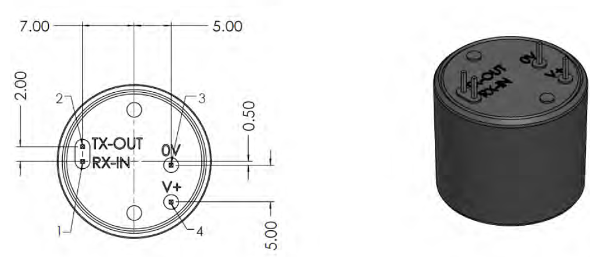

# ExplorIR

<figure><figcaption></figcaption></figure>

## 특징

* CO₂ 최대 100%까지 측정
* 작고 컴팩트한 센서를 이용하여 넓은 범위의 CO2를 안정적으로 측정
* 가혹하고 급격하게 변화는 주변환경과 불안정한 상황에 적합
* RoHS 준수
* 긴 수명, 낮은 유지 보수
* 70 ppm(일반) 정확도

## 애플리케이션

* 무선 장비를 이용한 IoT 및 Smart Technology
* 실내 공기 질(IAQ)
* 농업
* 보건 의료
* 안전
* 항공 우주
* 식품 포장
* 식품 보관 및 운송

## 사양

<table><thead><tr><th align="center">항목</th><th align="center">내용</th><th data-hidden></th><th data-hidden align="center"></th><th data-hidden></th></tr></thead><tbody><tr><td align="center">측정 범위</td><td align="center">
EXPLOR-M-5: 0-5%

EXPLOR-M-20: 0-20% EXPLOR-M-60: 0-60% EXPLOR-M-100: 0-100%
</td><td></td><td align="center"></td><td></td></tr><tr><td align="center">센서 내부</td><td align="center">Solid-State, 가열된 필라멘트 없음</td><td></td><td align="center"></td><td></td></tr><tr><td align="center">통신 방식</td><td align="center">UART</td><td></td><td align="center"></td><td></td></tr><tr><td align="center">전원 전압</td><td align="center">3.25-5.5V</td><td></td><td align="center"></td><td></td></tr><tr><td align="center">소모 전류</td><td align="center">측정 모드: 35mA 절전 모드: 0.01mA</td><td></td><td align="center"></td><td></td></tr><tr><td align="center">센서 내구성</td><td align="center">진동 및 충격에 강하고 비가열성</td><td></td><td align="center"></td><td></td></tr><tr><td align="center">센서 교정</td><td align="center">자동 영점교정 기능 내장</td><td></td><td align="center"></td><td></td></tr><tr><td align="center">센서 수명</td><td align="center">15년</td><td></td><td align="center"></td><td></td></tr><tr><td align="center">T90 까지 걸리는 시간</td><td align="center">22초</td><td></td><td align="center"></td><td></td></tr></tbody></table>

## 제품 크기 및 핀 특성

<figure><figcaption></figcaption></figure>

<table><thead><tr><th align="center">PIN</th><th align="center">NAME</th><th>Function</th><th data-hidden></th></tr></thead><tbody><tr><td align="center">1</td><td align="center">Rx_ In</td><td>Digital Output</td><td></td></tr><tr><td align="center">2</td><td align="center">Tx_out</td><td>Digital Input</td><td></td></tr><tr><td align="center">3</td><td align="center">GND</td><td>VSS</td><td></td></tr><tr><td align="center">4</td><td align="center">VDD</td><td>Supply vlotage</td><td></td></tr></tbody></table>

## UART 설정

|       PARAMETER       |  TYP |  UNIT  |
| :-------------------: | :--: | :----: |
|       Buad Rate       | 9600 | Bits/s |
|       Data Bits       |   8  |        |
|         Parity        | None |        |
|       Stop Bits       |   1  |        |
| Hardware Flow Control | None |        |

## 디바이스 연결 방법


[undefined.md](undefined.md)


## 통신 프로토콜


[undefined-1](undefined-1/)

