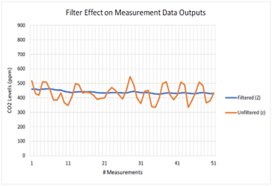
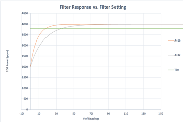
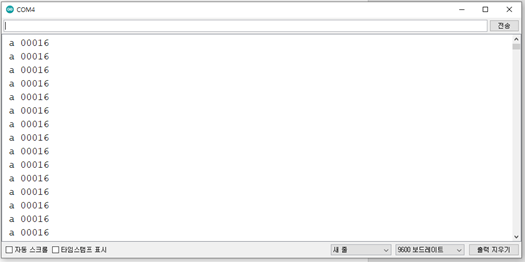
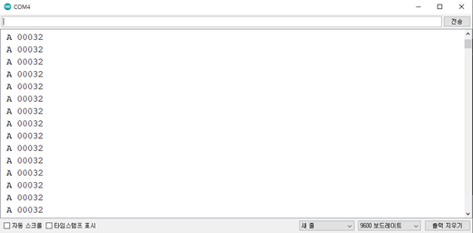

# Digital filter

* 필터(Filtered)된 값과 필터 되지 않은(Unfiltered) CO2 값의 차이는 아래 그림과 같음

<figure><figcaption></figcaption></figure>

* 필터된(Filtered) CO2 값은 노이즈를 제거하여 더 정확한 값을 제공함

Digital filter 설정

* 필터 설정 범위: 1\~255( 1= Unfiltered)
* 필터의 설정 값이 증가하면 측정 출력 응답 시간이 늘어남

<figure><figcaption></figcaption></figure>

* A=필터 설정 값
* A = 32 가 A = 16(default) 보다 T90에 도달하는 시간이 늘어남

Digital filter Command

<table><thead><tr><th width="159" align="center">Command</th><th width="205" align="center">Description</th><th width="148" align="center">Example</th><th align="center">Response</th></tr></thead><tbody><tr><td align="center">A ###\r</td><td align="center">CO2 필터 값 설정</td><td align="center">A 16\r</td><td align="center">A 00016\r</td></tr><tr><td align="center">a\r</td><td align="center">CO2 필터 값 확인</td><td align="center">a\r</td><td align="center">a 00016\r</td></tr></tbody></table>

## 소스코드

* CO2 필터 값 확인

```cpp
#include <SoftwareSerial.h>
SoftwareSerial mySerial(12, 13); //Uno Rx Tx (12 13) = SoftwareSerial
const char* Polling_mode = "K 2\r\n";
const char* Stream_mode = "K 1\r\n";
const char* Standby_mode = "K 0\r\n";  
bool tx_ready;
bool rx_ready; 
String str;
void setup() {
  Serial.begin(9600); //시리얼 통신 초기화
  mySerial.begin(9600); 
  while(!mySerial){} //시리얼 통신 포트가 연결되기 전까지 대기
  delay(14); // power on data ready
  mySerial.print(Stream_mode); //Polling 모드로 변경
}                              
 
void loop() 
{
 if(rx_ready == 0) // overflow 처리
 {
   delay(31); // Measurement data ready
   if(mySerial.available()>0) //수신받은 데이터가 0 초과, 즉 데이터가 존재한다면
   { //버퍼에서 읽어드린 char의 데이터를 String 형태로 반환
    str = "";
    str = mySerial.readStringUntil('\n'); 
    Serial.println(str);
    rx_ready = 1;   
    tx_ready = 1;
   }
 }
 else if(tx_ready == 1)
  {
     mySerial.print("a\r\n"); //현재 설정된 필터 값 읽기 명령어
     tx_ready = 0;
     rx_ready = 0;
  }
}
```

* 시리얼 모니터

<figure><figcaption></figcaption></figure>

* CO2 필터 값 설정

```cpp
#include <SoftwareSerial.h>
SoftwareSerial mySerial(12, 13); //Uno Rx Tx (12 13) = SoftwareSerial
const char* Polling_mode = "K 2\r\n";
const char* Stream_mode = "K 1\r\n";
const char* Standby_mode = "K 0\r\n";  
bool tx_ready;
bool rx_ready; 
String str;
void setup() {
  Serial.begin(9600); //시리얼 통신 초기화
  mySerial.begin(9600); 
  while(!mySerial){} //시리얼 통신 포트가 연결되기 전까지 대기
  delay(14); // power on data ready
  mySerial.print(Stream_mode); //Polling 모드로 변경
}                              
 
void loop() 
{
 if(rx_ready == 0) // overflow 처리
 {
   delay(31); // Measurement data ready
   if(mySerial.available()>0) //수신받은 데이터가 0 초과, 즉 데이터가 존재한다면
   { //버퍼에서 읽어드린 char의 데이터를 String 형태로 반환
    str = "";
    str = mySerial.readStringUntil('\n'); 
    Serial.println(str);
    rx_ready = 1;   
    tx_ready = 1;
   }
 }
 else if(tx_ready == 1)
  {
     mySerial.print("A 32\r\n"); //필터 값 변경 명령어 
     tx_ready = 0;
     rx_ready = 0;
  }
}
```

* 시리얼 모니터

<figure><figcaption></figcaption></figure>
