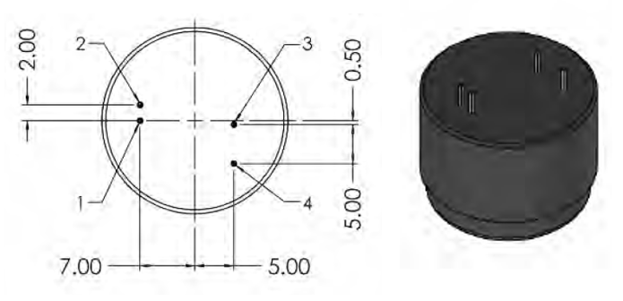

# SprintIR 6S

.jpg>)

## 특징

* CO₂ 최대 100%까지 측정
* 특허 받은 당사 고유의 LED 기술 플랫폼 및 광학 설계 내장
* SprintIR-6S는 초 당 최대 20회 판독을 수행하므로 높은 반복률에서 개별 측정이 필요하거나 CO₂ 농도가 빠르게 변화하는 장소에 최적화
* 70 ppm(일반) 정확도
* UART 디지털 출력

## 애플리케이션

* 보건 의료
* 식품 포장
* 스포츠 과학
* 난방, 환기 및 공기 조절
* 항공우주

## 사양

<table><thead><tr><th align="center">항목</th><th align="center">내용</th><th data-hidden></th></tr></thead><tbody><tr><td align="center">측정 범위</td><td align="center">
SPRINTIR-6S-5: 0-5%

SPRINTIR-6S-10: 0-10% SPRINTIR-6S-20: 0-20%

SPRINTIR-6S-60: 0-60% SPRINTIR-6S-100: 0-100%
</td><td></td></tr><tr><td align="center">센서 종류</td><td align="center">Type 1) Blank : 어댑터 커버 O Type 2) M : 어댑터 커버 X</td><td></td></tr><tr><td align="center">센서 내부</td><td align="center">Solid-State</td><td></td></tr><tr><td align="center">센서 응답 속도</td><td align="center">초 당 20회 판독(0-5%센서)</td><td></td></tr><tr><td align="center">통신 방식</td><td align="center">UART</td><td></td></tr><tr><td align="center">전원 전압</td><td align="center">3.25-5.5V</td><td></td></tr><tr><td align="center">전력 소비량</td><td align="center">3.5mW</td><td></td></tr><tr><td align="center">센서 치수 및 무게</td><td align="center">L x W x H(25mm x 40mm x 31mm), Weight(16g)</td><td></td></tr><tr><td align="center">센서 내구성</td><td align="center">진동 및 충격 방지</td><td></td></tr><tr><td align="center">센서 적용 애플리케이션</td><td align="center">보건의료, 식품 포장, 스포츠 과학</td><td></td></tr><tr><td align="center">센서 교정</td><td align="center">자동 교정 기능 내장</td><td></td></tr><tr><td align="center">센서 수명</td><td align="center">15년</td><td></td></tr><tr><td align="center">통신 프로토콜</td><td align="center">UART</td><td></td></tr><tr><td align="center">T90까지 걸리는 시간</td><td align="center">
unfilter: 3.6초

filter: 4.2초
</td><td></td></tr></tbody></table>

## 제품 크기 및 핀 특성

<figure><figcaption></figcaption></figure>

<table><thead><tr><th align="center">PIN</th><th align="center">NAME</th><th>Function</th><th data-hidden></th></tr></thead><tbody><tr><td align="center">1</td><td align="center">Rx_ In</td><td>Digital Output</td><td></td></tr><tr><td align="center">2</td><td align="center">Tx_out</td><td>Digital Input</td><td></td></tr><tr><td align="center">3</td><td align="center">GND</td><td>VSS</td><td></td></tr><tr><td align="center">4</td><td align="center">VDD</td><td>Supply vlotage</td><td></td></tr></tbody></table>

## UART 설정

|       PARAMETER       |  TYP |  UNIT  |
| :-------------------: | :--: | :----: |
|       Buad Rate       | 9600 | Bits/s |
|       Data Bits       |   8  |        |
|         Parity        | None |        |
|       Stop Bits       |   1  |        |
| Hardware Flow Control | None |        |

## 디바이스 연결 방법


[undefined.md](undefined.md)


## 통신 프로토콜


[undefined-1](undefined-1/)

