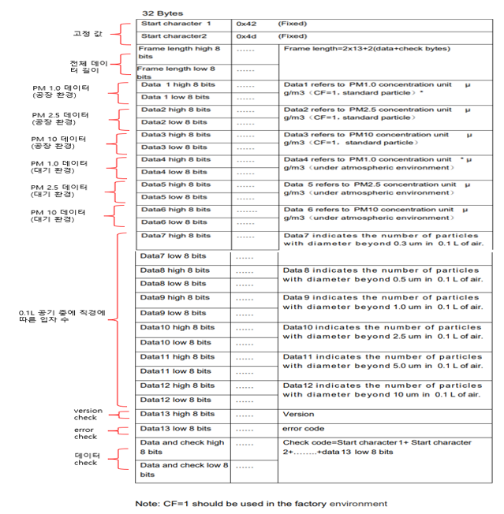
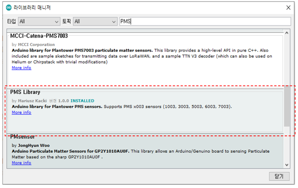
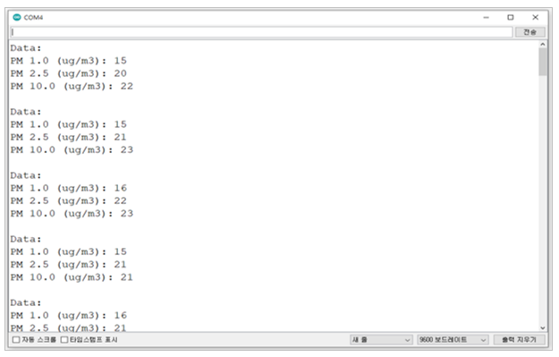
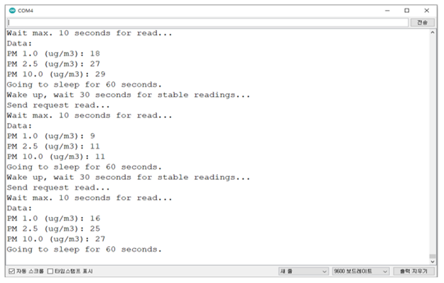

# UART

_UART 통신 프로토콜_

_적용 모델: PMS A003A, PMS A003C, PMS 7003, PMS 7003M, PMS 5003, PMS 9003M_

## UART 설정

|     PARAMETER     |    TYP   |
| :---------------: | :------: |
| Baud Rate (Fixed) | 9600 bps |
|     Data Bits     |     8    |
|       Parity      |   None   |
|     Stop Bits     |     1    |
|    Flow Control   |   None   |

## UART mode

| mode         | Description                 |
| ------------ | --------------------------- |
| Active mode  | 데이터를 연속적으로 보내주는 모드. 기본 설정 값 |
| Passive mode | 사용자의 요청이 있을 때만 데이터를 보내주는 모드 |
| Sleep mode   | 절전 모드                       |

## UART command

<table><thead><tr><th width="175">Command</th><th>Data 1</th><th>Data 2</th><th>Data 3</th><th>Data 4</th><th>Data 5</th><th>Data 6</th><th>Data 7</th></tr></thead><tbody><tr><td>Active</td><td>0x42</td><td>0x4d</td><td>0xe1</td><td>0x00</td><td>0x01</td><td>0x01</td><td>0x71</td></tr><tr><td>Passive</td><td>0x42</td><td>0x4d</td><td>0xe1</td><td>0x00</td><td>0x00</td><td>0x01</td><td>0x70</td></tr><tr><td><p>Data request</p><p>(Passive status)</p></td><td>0x42</td><td>0x4d</td><td>0xe2</td><td>0x00</td><td>0x00</td><td>0x01</td><td>0x71</td></tr><tr><td>sleep</td><td>0x42</td><td>0x4d</td><td>0xe4</td><td>0x00</td><td>0x00</td><td>0x01</td><td>0x73</td></tr><tr><td>Wake up</td><td>0x42</td><td>0x4d</td><td>0xe4</td><td>0x00</td><td>0x01</td><td>0x01</td><td>0x74</td></tr></tbody></table>

## Sensor response interface protocol

<figure><figcaption></figcaption></figure>

## 모드 설정 및 미세먼지 농도 읽기

* 사용 라이브러리: SoftwareSerial, PMS
* PMS7003을 사용하여 예제 code 작성

<figure><figcaption></figcaption></figure>



```cpp
#include "PMS.h"
#include <SoftwareSerial.h>
SoftwareSerial mySerial(12, 13); //Uno Rx Tx (12 13) = SoftwareSerial

PMS pms(mySerial);
PMS::DATA data;

void setup()
{
  Serial.begin(9600);
  mySerial.begin(9600);  
}

void loop()
{
  if (pms.read(data))
  {
    Serial.println("Data:");

    Serial.print("PM 1.0 (ug/m3): ");
    Serial.println(data.PM_AE_UG_1_0);

    Serial.print("PM 2.5 (ug/m3): ");
    Serial.println(data.PM_AE_UG_2_5);

    Serial.print("PM 10.0 (ug/m3): ");
    Serial.println(data.PM_AE_UG_10_0);

    Serial.println();
  }
}
```

* 시리얼 모니터

<figure><figcaption></figcaption></figure>



```cpp
#include "PMS.h"
#include <SoftwareSerial.h>
SoftwareSerial mySerial(12, 13); //Uno Rx Tx (12 13) = SoftwareSerial

PMS pms(mySerial);
PMS::DATA data;

void setup()
{
  Serial.begin(9600);   
  mySerial.begin(9600);  
  pms.passiveMode();    // Switch to passive mode
}

void loop()
{
  Serial.println("Wake up, wait 30 seconds for stable readings...");
  pms.wakeUp();
  delay(30000);

  Serial.println("Send request read...");
  pms.requestRead();

  Serial.println("Wait max. 10 seconds for read...");
  if (pms.read(data, 10000))
  {
    Serial.println("Data:");

    Serial.print("PM 1.0 (ug/m3): ");
    Serial.println(data.PM_AE_UG_1_0);

    Serial.print("PM 2.5 (ug/m3): ");
    Serial.println(data.PM_AE_UG_2_5);

    Serial.print("PM 10.0 (ug/m3): ");
    Serial.println(data.PM_AE_UG_10_0);
  }
  else
  {
    Serial.println("No data.");
  }

  Serial.println("Going to sleep for 60 seconds.");
  pms.sleep();
  delay(60000);
}

```

* 시리얼 모니터

<figure><figcaption></figcaption></figure>


