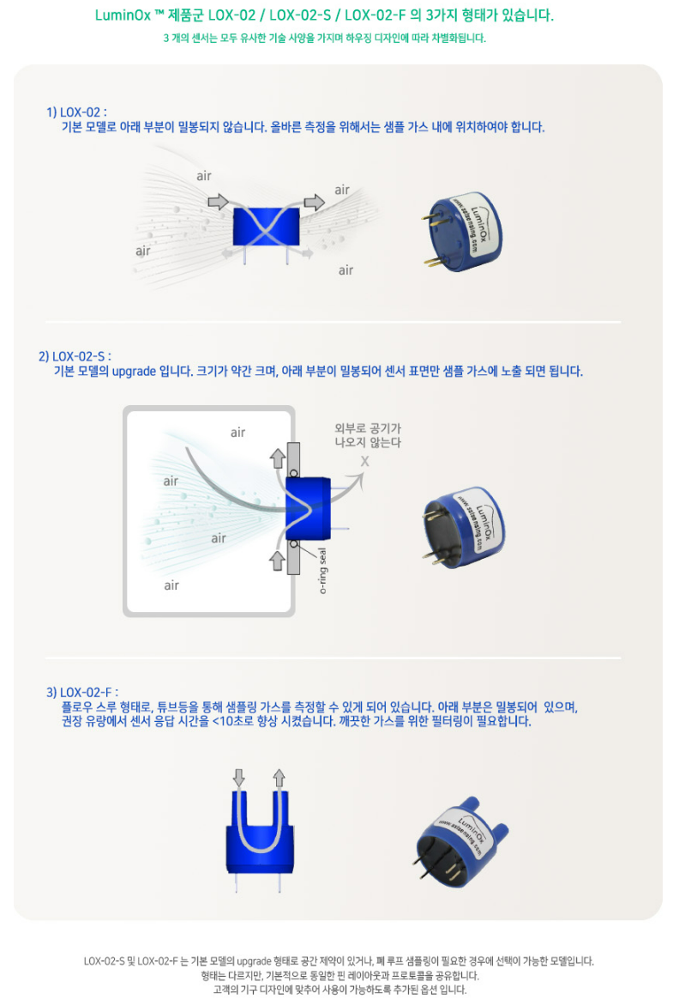
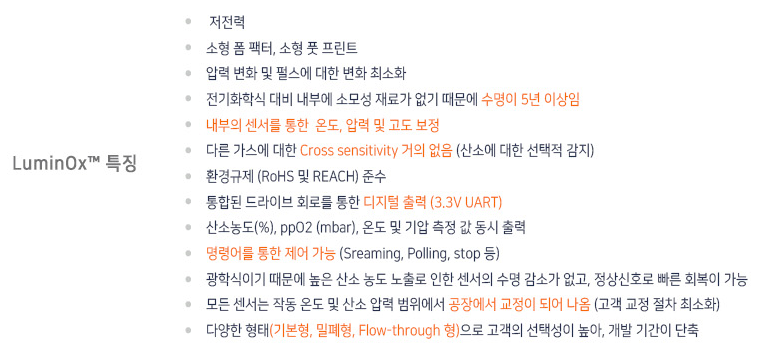
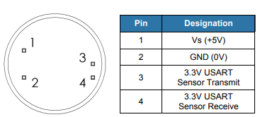
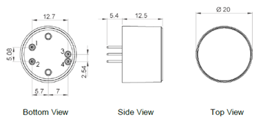

# SST

영국 스코틀랜드에 위치하고 있고 가스 및 액체를 위한 다양한 센서와 시스템을 설계, 제조 및 맞춤제작을 형성하고 있습니다.

SST는 5년 이상의 수명, 디지털 센서, REACH, RoHS를 공통적으로 갖추고 준수하고 있습니다. SST는 각 단계에 대해 새로운 하드웨어 모듈을 생성할 필요 없이 Arduino, PCB, Sensor만 갖추고 있으시다면 신속한 Gas 측정이 가능합니다.

| LOX-O2                                          | LOX-O2-S                                    | LOX-O2-F                                    |
| ----------------------------------------------- | ------------------------------------------- | ------------------------------------------- |
| ​​ | ​​ | ​​ |

<figure><figcaption></figcaption></figure>

## 특징

* 내장형 압력 센서, 디지털 출력이 있는 형광 기반의 소형 산소 센서
* 광범위한 환경 범위에서도 산소만 정확한 측정 및 작동
* 크기가 작아 공간이 제한된 애플리케이션에서도 이상적
* RoHS 및 REACH 준수
* 저전력 긴 수명

<figure><figcaption></figcaption></figure>

## 애플리케이션

* 교통
* 텔레콤
* 산업
* 비행
* 선박
* 의료

## 사양

<figure><figcaption></figcaption></figure>

## 제품 크기 및 핀 특성

<figure><figcaption></figcaption></figure>

<figure><figcaption></figcaption></figure>

#### [Datasheet](https://sstsensing.com/wp-content/uploads/2018/01/DS0144rev2\_LOX-02-S.pdf)

## 디바이스 연결 방법


[undefined.md](undefined.md)


## 통신 프로토콜


[undefined-1](undefined-1/)


## Thingspeak 활용 방법


[thingspeak.md](thingspeak.md)

