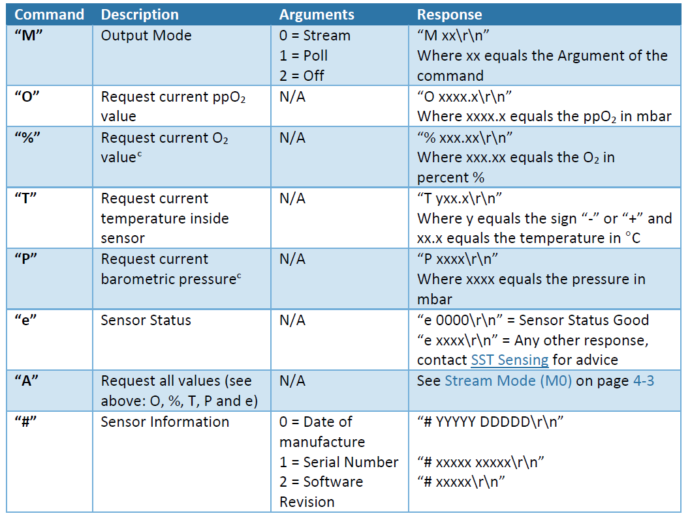
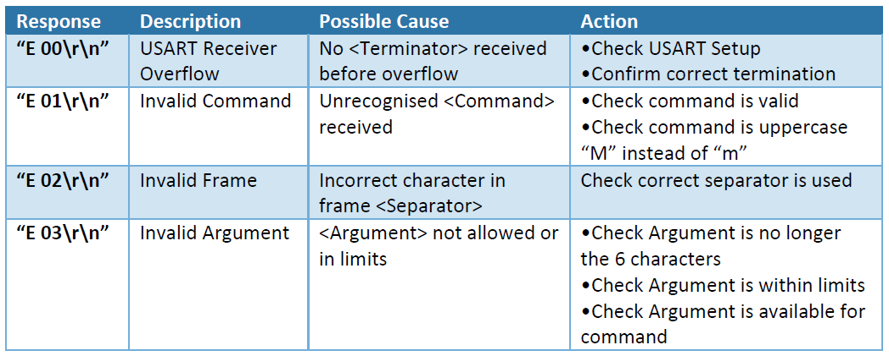

# 통신 프로토콜

* UART 설정

| PARAMETER         | TYP      |
| ----------------- | -------- |
| Baud Rate (Fixed) | 9600 bps |
| Data Bits         | 8        |
| Parity            | None     |
| Stop Bits         | 1        |
| Flow Control      | None     |

* UART Command

<figure><figcaption></figcaption></figure>

<figure><figcaption></figcaption></figure>
