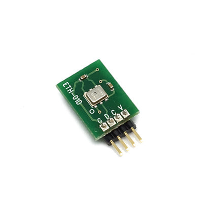
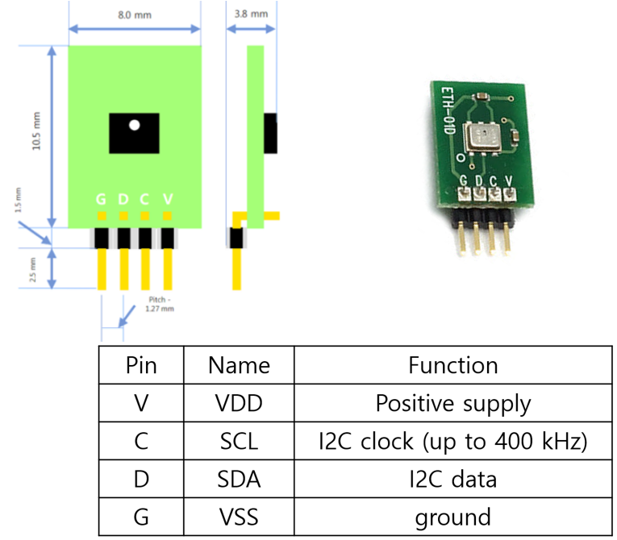
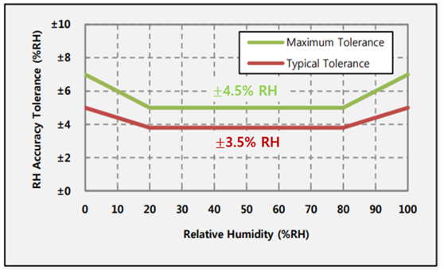

# ETH-01D

<figure><figcaption></figcaption></figure>

## 특징

* 저전력으로 사용 가능한 I2C 디지털 출력의 온·습도 센서 모듈
* 가격 대비 빠른 온 습도 측정 응답시간, 우수한 안정성, 높은 정확성(보정 시스템 내장)
* 1.27mm의 작은 헤더 핀이 부착되어 공간이 제한된 애플리케이션에 설치 용이
* 장기적 안정성 및 신뢰성(센서 내부 알고리즘은 정확한 반복 측정을 가능 하게함)

## 어플리케이션

* 기상 관측
* 데이터로거
* 냉난방 공조 시스템
* 가전제품
* 자동화기기
* 의료 장비
* 습도계
* 자동차

## 사양 

| 항목             | 내용                                          |
| -------------- | ------------------------------------------- |
| 측정 범위          | 
온도: -40 ~ 125℃

습도: 0 ~100%RH
   |
| 습도 정확성(@ 25°C) | ±3.8%RH (20 to 80%RH), ±5.0%RH(Other Range) |
| 온도 정확성         | ±0.3°C (0 to 70°C), ±0.5°C (Other Range)    |
| 전원 전압          | 최소 1.8V 평균:3.3V 최대:5.5V                     |
| 전원 전류          | Typ: 24.4㎂(14bit 분해능 기준)                    |
| 절전 상태 전류       | Typ: 0.6㎂(-40\~80℃기준)                       |
| 보관 온도          | -40 \~ 150°C                                |
| 응답 시간          | 34msec < 온 습도                               |
| 센서 치수          | L x W x H (14.5mm x 8mm x 3.8mm)            |
| 통신 프로토콜        | I2C                                         |
| 헤더 핀 크기        | 1.27mm                                      |

## 제품 크기 및 핀 특성 

<figure><figcaption></figcaption></figure>

## 온·습도 정확도 허용 오차 범위 

* 온도 0\~70°C 범위에서 ETH-01D의 온도의 정확도는 일반적으로 ±0.3°C , 최대 ±0.5°C 오차 허용
* 온도 0\~-40°C 범위를 제외한 나머지 범위에서는 정확도 허용 오차 범위가 증가합니다.(최대 2°C)

<figure><figcaption>
&#x3C; 온도 정확도 허용 오차 범위 그래프>
</figcaption></figure>

* 습도 20\~80%RH 범위에서 ETH-01D의 습도의 정확도는 일반적으로 3.5% RH , 최대 RH오차 허용
* 습도 20\~80%RH 범위를 제외한 나머지 범위에서는 정확도 허용 오차 범위가 증가함 최대 RH오차 허용

<figure><figcaption>
&#x3C; 상대 습도 허용 오차 범위 >
</figcaption></figure>

## 통신 프로토콜

### A) [온·습도 읽기](undefined/temp\_humi\_reading.md)


[temp\_humi\_reading.md](undefined/temp\_humi\_reading.md)


* 온·습도 데이터 요청 command
* 온· 데이터 응답

### B) [Address 읽기 및 쓰기](undefined/address.md)


[resolution.md](undefined/resolution.md)


* ETH-01D I2C command 전송
* 온·습도 Resolution 요청 Command
* 온·습도 Resolution 응답
* 온·습도 Resolution 쓰기 Command

### C) [Sensor ID 읽기](undefined/sensor\_id.md)


[sensor\_id.md](undefined/sensor\_id.md)


* ETH-01D I2C command 전송
* 상위 Sensor ID 요청 Command
* 상위 Sensor ID 응답
* 하위 Sensor ID 요청 Command
* 하위 Sensor ID 응답 C) Sensor Address 읽기 및 쓰기

### D) [Adress 읽기 및 쓰기](undefined/address.md)


[address.md](undefined/address.md)


* ETH-01D I2C command 전송
* Sensor Address 요청 Command
* Sensor Address 응답
* Sensor Address 쓰기 Command

## Thingspeka 활용 방법


[thingspeak.md](thingspeak.md)

