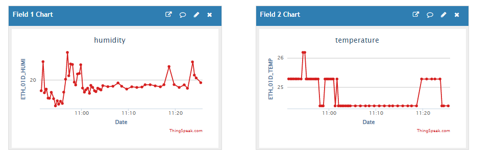
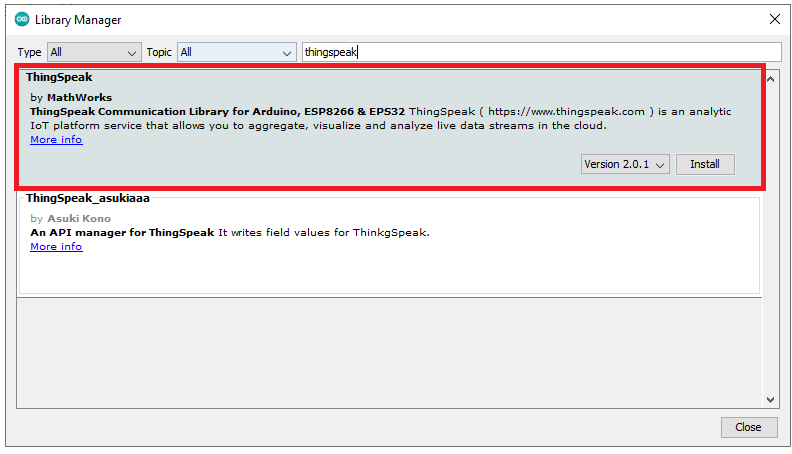

# Thingspeak 활용방법

## ESP32 ThingSpeak에 ETH-01D 값 게시

<figure><figcaption></figcaption></figure>



Step1. 아두이노 IDE에 Thingspeak 라이브러리 추가

<figure><figcaption></figcaption></figure>

Step2. Wi-Fi ssid, pass 확인 및 변경

* code Thingspeak ssid, password 부분 자신이 사용할 Wi-Fi ssid, pass로 변경

Step3. Thingpeak channelnumber 및 api key 확인

* Thingspeak -> channel -> my channel -> channel setting -> channel id 확인 후 code 변경
* Thingspeak -> channel -> my channel -> Api keys -> Write Api key -> key 확인 후 code 변경



```cpp
#include <Arduino.h>
#include "ThingSpeak.h"
#include <Wire.h>
#include <WiFi.h>
#define slave_address 0x44
#define Sensor_power_port 6 // Arduino uno, Arduino mkr 1010, esp32
// #define Sensor_power_port 16 // esp8266
#define Power_enable digitalWrite(Sensor_power_port, HIGH)
#define Power_disable digitalWrite(Sensor_power_port, LOW)
const char* ssid = "your network SSID";   // your network SSID (name) 
const char* password = "your network password";   // your network password
WiFiClient  client;
unsigned long myChannelNumber = your channel number;
const char * myWriteAPIKey = "your channel api key";
// Timer variables
unsigned long lastTime = 0;
unsigned long timerDelay = 10000;
float Temp_value[2]={0.00};
float Humi_value[2]={0.00};
void setup()
{
// Wire.begin();// arduino uno, Arduino mkr 1010
Wire.begin(7,8, 50000 ); //esp32
//Wire.begin(4,5,50000); //esp8266
Serial.begin(115200);
pinMode(Sensor_power_port, OUTPUT);
Power_enable;
  WiFi.mode(WIFI_STA);   
  ThingSpeak.begin(client);  // Initialize ThingSpeak
}
void loop()
{
    int HumidH;
    int HumidL;
    int TemperH;
    int TemperL;
    double RealH;
    double RealT;
    Wire.beginTransmission(slave_address);
    Wire.endTransmission();
    delay(34);
    Wire.requestFrom(slave_address, 4);
    if(Wire.available())
    {
        HumidH = Wire.read();
        HumidL = Wire.read();
        TemperH = Wire.read();
        TemperL = Wire.read();
        HumidH = HumidH & 0x3f; // Don't care bit mask
        // *********** Humidity & Temperature calculation code changed ***************************
        RealH = (double)((HumidH * 256 ) + HumidL ) * 100/16383;
        RealT = (double)(((TemperH * 256) + TemperL)/4) * 165/16383 - 40;
        Humi_value[0] = RealH;
        Humi_value[0] = floor(Humi_value[0]*100)/100;
        Temp_value[0] = RealT;
        Temp_value[0] = floor(Temp_value[0]*100)/100;
        Serial.print("T : "); Serial.print(RealT, 2);
        Serial.print(" , ");
        Serial.print("RH : "); Serial.println(RealH, 2);
        delay(1000);
    }
    if ((millis() - lastTime) > timerDelay) 
    {
        // Connect or reconnect to WiFi
        if(WiFi.status() != WL_CONNECTED)
        {
        Serial.print("Attempting to connect");
        while(WiFi.status() != WL_CONNECTED){
            WiFi.begin(ssid, password); 
            delay(2000);     
        } 
        Serial.println("\nConnected.");
        }
        // pieces of information in a channel.  Here, we write to field 1.
        ThingSpeak.setField(1, Humi_value[0]);
        ThingSpeak.setField(2, Temp_value[0]);
        int x = ThingSpeak.writeFields(myChannelNumber, myWriteAPIKey);
        if(x == 200){
        Serial.println("Channel update successful.");
        }
        else{
        Serial.println("Problem updating channel. HTTP error code " + String(x));
        }
        lastTime = millis();
   }
```


